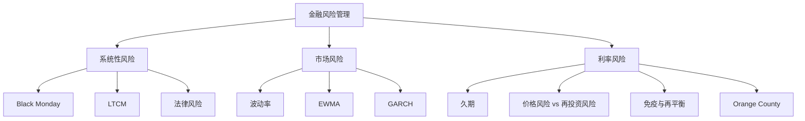

# Financial Risk Management（Topic 1）
> 资料来源：`Fin_Risk_Topic_1.pdf`  
> 主题：金融风险（Financial Risks）、市场风险对冲（Hedging of Market Risks）、利率风险对冲（Hedging of Interest Rate Risk）

## 一句话理解

Topic 1 讲的是：**金融风险管理的核心，不只是“识别风险有哪些”，而是理解这些风险如何通过波动率、杠杆、保证金、久期和再平衡机制，真正传导成损失。**

---

## 本 Topic 在整门课中的位置

这门课后续一共会按 6 个 Topic 整理。  
Topic 1 是整个系列的起点，重点不是某一种单独模型，而是先回答三个基础问题：

- 金融风险到底是什么
- 市场风险通常如何被测量和对冲
- 利率风险为什么会在固定收益投资中变成核心问题

这部分相当于后续信用风险、衍生品风险、组合风险和监管问题的共同基础。

---

## 本 Topic 讲了什么

从课件结构来看，Topic 1 可以整理成三部分：

| 模块 | 内容 |
| --- | --- |
| 1.1 | 金融风险与系统性风险（Systemic Risk）：Black Monday、LTCM、法律风险 |
| 1.2 | 市场风险对冲：波动率测量、EWMA、GARCH、动态对冲、最小方差对冲 |
| 1.3 | 利率风险对冲：久期（Duration）、持有期收益率（Horizon Rate of Return）、债券免疫（Immunization） |

如果只保留主线，就是：

> 风险管理要先看清“风险从哪里来”，再理解“风险如何被放大”，最后建立“怎样用对冲和久期匹配去控制风险”。

---

## 为什么重要

课件一开始就把风险定义为：

> 损失，或对不利结果的暴露。

更定量一点地说，风险常被理解为资产或负债价值中“意外结果”的波动性（volatility of unexpected outcomes），并且最好放在概率分布框架里看。

这一定义有两个重要含义：

- 风险不是单纯“亏钱了”才存在，而是未来可能出现不利偏离
- 风险管理不是追求完全没有风险，而是识别、度量、控制、分配风险

### 风险管理的基本定义

风险管理（Risk Management）是识别、测量并控制各种风险暴露的过程。

---

## 一、系统性风险：为什么个体理性可能导致整体失灵

### 1. 什么是系统性风险

系统性风险（Systemic Risk）指某个灾难性事件引发整个行业、金融系统甚至宏观经济崩塌的风险。

课件给出的典型例子包括：

- 1997 亚洲金融危机
- 1998 俄罗斯违约与全球冲击
- 2008 次贷危机与 Lehman Brothers 破产
- 2011 欧洲主权债务危机

### 一句话理解

**系统性风险不是“一家公司亏了很多钱”，而是“一个冲击通过关联网络扩散到整个系统”。**

---

## 二、Black Monday：流动性假设失效的经典案例

1987 年 10 月 19 日，美国股市单日暴跌 22.68%。  
课件强调，这不是传统意义上的宏观基本面冲击，而是交易机制本身放大了风险。

### 核心机制

- 程序化交易（program trading）原本是为了保护单个组合
- 一旦价格下跌触发阈值，程序自动卖出
- 越卖越跌，越跌越触发更多卖单
- 同时买方流动性消失

### 关键直觉

这说明：

> 个体层面看似合理的对冲行为，在全体同时执行时，可能反而成为最大的系统风险来源。

### 常见误区

**误区：只要每个机构都做了风险控制，系统就更安全。**

不一定。  
如果所有人采用相同规则、相同阈值、相同止损逻辑，风险控制本身也可能造成踩踏。

---

## 三、LTCM：收敛交易、杠杆与保证金危机

### 1. LTCM 的基本策略

Long-Term Capital Management（LTCM）著名的策略之一是收敛套利（Convergence Arbitrage）。

设两种高度相似的债券价格分别为 $X_t$ 和 $Y_t$，价差为

  $$
  S_t = X_t - Y_t.
  $$

如果价差满足均值回复结构，例如

  $$
  \Delta S_t = (\mu - S_t)\Delta t + M_t,
  $$

其中 $M_t$ 是鞅（Martingale）项，那么交易员会认为：

- 当 $S_t>\mu$ 时，价差未来会收敛，应做空贵的一边、做多便宜的一边
- 当 $S_t<\mu$ 时，反向操作

### 2. 为什么这不是无风险套利

因为均值回复只是期望，不是保证。  
在真正收敛之前，价差可能先进一步扩大，导致浮亏持续上升。

### 3. 杠杆如何放大问题

若资本金为 $C_t$、借款为 $B_t$，则杠杆会把 spread trade 的收益波动放大。  
课件给出资本收益率结构可写成：

  $$
  R_C = wR_S + (1-w)r\Delta t,
  $$

其中：

- $R_S$ 是价差交易本身的收益
- $w>1$ 表示对 spread 的放大权重
- $(1-w)<0$ 反映融资成本

### 4. LTCM 真正失败在哪里

LTCM 并不是简单“看错方向”，而是：

- 高杠杆
- 流动性骤降
- 保证金追缴（margin calls）
- 被迫平仓
- 平仓又进一步放大价格冲击

### 一句话理解

**LTCM 的失败不是“收敛没发生”，而是“在收敛发生之前，现金流已经撑不住了”。**

---

## 四、法律风险：风险并不只来自价格波动

课件还特别提到法律风险（Legal Risk）。

它常见于：

- 交易对手亏损后试图从法律上否认合约有效性
- 产品销售过程中存在误导、信息不对称或适当性问题

Lehman mini-bonds 就是一个典型例子。  
这里损失不只是市场价格变化带来的，还可能来自：

- 产品结构复杂
- 销售对象不适配
- 合规或信息披露不足

### 一句话理解

**金融风险管理不仅是市场变量管理，也包括制度、合规与契约执行风险。**

---

## 五、波动率：市场风险最基础的度量

### 1. 连续复利收益率

若第 $i$ 天末的市场变量价格为 $S_i$，则日连续复利收益率定义为

  $$
  u_i = \ln\left(\frac{S_i}{S_{i-1}}\right).
  $$

波动率（Volatility）可以理解为单位时间收益率的标准差。

### 2. 方差率与时间缩放

风险管理里经常直接看方差率（Variance Rate），因为：

- 标准差通常按 $\sqrt{T}$ 缩放
- 方差则按 $T$ 线性缩放

若一年按 252 个交易日计，则年化与日度波动率常用关系为：

  $$
  \sigma_{\text{year}} \approx \sqrt{252}\,\sigma_{\text{day}},
  \qquad
  \sigma_{\text{day}} \approx \frac{\sigma_{\text{year}}}{\sqrt{252}}.
  $$

### 3. 历史样本波动率

若使用过去 $m$ 个收益率样本，则样本波动率平方可写作

  $$
  \sigma_n^2
  =
  \frac{1}{m}\sum_{i=1}^m (u_{n-i}-\bar u)^2.
  $$

市场实践中常忽略 $\bar u^2$，近似写作

  $$
  \sigma_n^2 \approx \frac{1}{m}\sum_{i=1}^m u_{n-i}^2.
  $$

---

## 六、EWMA 与 GARCH：为什么近期数据更重要

### 1. 加权波动率思想

直觉上，最近发生的大波动，比很久以前的波动更能反映当前风险状态。  
这就引出加权方案。

### 2. EWMA 模型

指数加权移动平均（Exponentially Weighted Moving Average, EWMA）满足递推式：

  $$
  \sigma_n^2 = \lambda \sigma_{n-1}^2 + (1-\lambda)u_{n-1}^2,
  \qquad 0<\lambda<1.
  $$

含义很清楚：

- $\lambda$ 大：对旧信息更“黏”，波动率更新更平滑
- $\lambda$ 小：对新信息更敏感，但估计本身更跳

### 3. GARCH(1,1) 模型

GARCH(1,1) 的形式是：

  $$
  \sigma_n^2 = \omega + \alpha u_{n-1}^2 + \beta \sigma_{n-1}^2,
  $$

并满足

  $$
  \omega > 0,\qquad \alpha,\beta \ge 0.
  $$

它比 EWMA 多了一个长期均值回复结构，因此不仅能追踪近期波动，也能体现长期方差水平。

### 一句话理解

**EWMA 更像“快速更新的风险仪表盘”，GARCH 更像“既看近期冲击、又看长期稳态”的动态波动率模型。**

---

## 七、利率风险：价格风险与再投资风险的对冲

固定收益投资里，利率风险有两类常见来源：

- 价格风险（Price Risk）
- 再投资风险（Reinvestment Risk）

当利率上升时：

- 债券价格下跌，造成资本损失
- 但未来票息再投资收益提高

当利率下降时则相反。

真正关键的问题是：

> 能否找到一个持有期，使得这两种影响恰好抵消？

---

## 八、久期（Duration）与免疫（Immunization）

### 1. 久期的核心作用

久期（Duration）衡量债券价格对利率变化的敏感度。  
课件里强调的最关键关系是：

  $$
  \frac{\Delta B}{B} \approx -D\,\frac{\Delta i}{1+i},
  $$

其中：

- $B$ 是债券价格
- $D$ 是久期
- $i$ 是利率

### 2. 持有期收益率与久期匹配

若投资者目标持有期为 $H$，则当

  $$
  H = D,
  $$

价格风险与再投资风险会相互抵消。  
这正是债券免疫（Bond Immunization）的核心思想。

### 3. 课件里的数学结论

若在初始利率 $i_0$ 下选择 horizon $H$，并研究 horizon wealth

  $$
  F_H = B(i)(1+i)^H,
  $$

则当 $H=D$ 时，$F_H$ 在 $i=i_0$ 处达到局部最小值。  
这意味着无论利率向上还是向下小幅变动，最终 horizon value 都不会更差。

### 一句话理解

**久期匹配不是让债券价格不变，而是让“到目标时点的最终财富”对利率变化尽量不敏感。**

---

## 九、组合免疫与再平衡

### 1. 资产久期等于负债久期

若负债在未来某一时点支付，其久期可直接求出。  
资产组合久期则是各资产久期的加权平均。

免疫的基本条件是：

  $$
  D_{\text{assets}} = D_{\text{liabilities}}.
  $$

### 2. 为什么需要动态再平衡

久期不是固定不变的。  
随着时间流逝、利率变化、现金流发生：

- 投资 horizon 会缩短
- 债券久期也会变化
- 但二者变化速度通常不完全一致

所以免疫不是一次性操作，而是动态过程（dynamic immunization）。

### 3. 课件中的直觉

即使利率不变，一年过去之后：

- horizon 会减少整整一年
- 债券久期通常不会正好减少一年

因此必须重新调整组合权重。

---

## 十、Orange County：久期、杠杆与保证金的现实教训

Orange County 的案例说明：

- 做多长期债券本身未必一定错误
- 真正致命的是高杠杆和保证金追缴机制

当利率持续下降时，杠杆会把收益放大；  
但一旦利率快速上升：

- 债券市值大幅下跌
- 账面损失触发保证金要求
- 被迫变现，纸面亏损转为真实亏损

### 关键教训

**“持有到期就没风险”这句话，在高杠杆和流动性约束存在时往往是错的。**

因为你未必能活到“持有到期”的那一天。

---

## Topic 1 结构图

---

## 常见误区

### 误区 1：风险就是价格下跌

不完整。  
风险更本质上是未来结果分布中的不利暴露，价格风险只是其中一种。

### 误区 2：分散化一定能消除风险

只能较好消除部分个体风险，系统性风险无法靠简单分散完全消失。

### 误区 3：只要策略最终会收敛，中间亏损就不重要

对高杠杆策略来说，中间亏损非常重要，因为它可能触发保证金、融资约束和强平。

### 误区 4：债券持有到期就没有利率风险

若没有杠杆、也不关心中途估值，结论可能部分成立；  
但现实里机构要面对净值、抵押品、保证金和流动性约束，利率风险依然非常关键。

### 误区 5：久期匹配做完一次就结束

不对。  
免疫是动态过程，需要持续再平衡。

---

## 本 Topic 小结

### 这篇笔记真正建立了什么

- 理解金融风险管理的基本定义与范围
- 理解系统性风险如何通过交易机制与杠杆放大
- 理解 Black Monday 与 LTCM 的共性教训
- 掌握波动率、EWMA、GARCH 的基本角色
- 理解利率风险中的价格风险与再投资风险
- 理解久期匹配为什么能实现免疫
- 理解再平衡为什么是免疫策略不可分割的一部分

### 一句话总结

**Topic 1 的核心结论是：真正危险的往往不是单一风险本身，而是“波动 + 杠杆 + 流动性约束 + 统一行为”共同作用后的放大机制。**

---

## 可继续思考的问题

1. 如果所有机构都用类似的风险模型和对冲规则，风险管理本身会不会成为系统性风险来源？
2. EWMA 与 GARCH 在风险监控中的适用场景有何不同？
3. 为什么“持有到期”这句看似合理的话，在高杠杆固定收益策略中常常会失效？
4. 免疫策略在现实里最脆弱的假设是什么：平行利率变动、流动性充足，还是可以持续再平衡？
