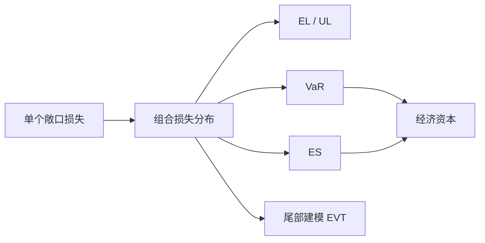

# Financial Risk Management（Topic 2）

> 资料来源：`Fin_Risk_Topic_2.pdf`  
> 主题：损失分布（Loss Distribution）、风险价值（Value at Risk, VaR）、预期短缺（Expected Shortfall, ES）

## 一句话理解

Topic 2 讨论的是：**风险管理不能只问“平均会亏多少”，更要问“在坏情形下会亏到什么程度”，以及“极端尾部到底有多厚”。**

---

## 本 Topic 在整门课里的位置

Topic 1 先回答了“金融风险从哪里来、为什么会被放大”；  
Topic 2 则开始进入更定量的框架：**如何把单个资产、单个借款人或整个信用组合的损失写成随机变量，并进一步提炼成可汇报、可监管、可配置资本的风险指标。**

这一讲是后续信用风险建模、资本计量和尾部风险方法的基础。

---

## 本 Topic 讲了什么

从课件结构看，这一讲可以整理成四条主线：

| 模块 | 内容 |
| --- | --- |
| 2.1 | 单名义损失（Single-name loss）与组合损失分布（Portfolio Loss Distribution） |
| 2.2 | 期望损失（Expected Loss, EL）与非预期损失（Unexpected Loss, UL） |
| 2.3 | 风险价值（VaR）与预期短缺（ES）的定义、解释与局限 |
| 2.4 | 极值理论（Extreme Value Theory, EVT）与尾部拟合 |

如果只保留主线，就是：

> 先把“损失”随机化，再把“损失分布”压缩成少数关键指标，最后专门处理最危险的尾部区域。

---

## 为什么重要

在风险管理里，平均损失往往不够用。

- 银行关心的不只是“正常年份平均会亏多少”，还关心“压力情景下会不会一下子亏穿资本”
- 监管关心的也不是点估计，而是高置信水平下的尾部风险
- 组合管理关心的不只是总风险，还关心“是谁贡献了风险”

所以这一讲的核心，不只是定义几个公式，而是建立下面这个框架：

---

## 一、单名义信用损失怎么写成随机变量

在信用风险里，最基础的问题是：**一个借款人的损失到底由什么决定？**

课件里把单名义损失写成

  $$
  \tilde L = EAD \cdot SEV \cdot 1_D,
  $$

其中：

- `EAD`：违约风险暴露（Exposure at Default）
- `SEV`：损失严重度（Severity）
- `1_D`：违约事件指示变量，违约时取 1，否则取 0

如果把损失率记作 `LGD = E[SEV]`，违约概率记作 `DP = P(D=1)`，那么期望损失就是

  $$
  EL = E[\tilde L] = E[EAD] \cdot LGD \cdot DP.
  $$

### 一句话理解

**信用损失不是一个固定数字，而是“敞口大小 × 违约是否发生 × 违约后能回收多少”的共同结果。**

---

## 二、期望损失和非预期损失分别在说什么

### 1. 期望损失不是“最坏情形”

期望损失（Expected Loss, EL）更像长期平均水平。  
它适合：

- 贷款定价
- 拨备计提
- 业务平均损失预算

但它不能回答“极端年份会发生什么”。

### 2. 非预期损失刻画波动和资本压力

课件把非预期损失（Unexpected Loss, UL）理解为损失分布的标准差，也就是：

  $$
  UL = \sqrt{\mathrm{Var}(\tilde L)}.
  $$

在简化情形下，若 `EAD` 给定、`SEV` 与违约指标独立，则方差可写成

  $$
  \mathrm{Var}(\tilde L)
  =
  EAD^2
  \left[
    \mathrm{Var}(SEV)\cdot DP
    +
    LGD^2 \cdot DP(1-DP)
  \right].
  $$

这个表达式很有直觉：

- `SEV` 越不稳定，损失波动越大
- `DP` 越高，不确定性通常越大
- 即使 `LGD` 固定，只要违约是随机事件，也会有二项型波动

### 常见误区

**误区：EL 大就一定更危险。**

不一定。  
有些资产 `EL` 不高，但尾部很厚、`UL` 很大，真正消耗资本的反而是这种资产。

---

## 三、组合损失分布为什么是风险管理的核心对象

单个头寸的损失只是起点，机构真正关心的是整个组合：

  $$
  \tilde L_P = \sum_{i=1}^n \tilde L_i.
  $$

组合期望损失满足可加性：

  $$
  EL_P = E[\tilde L_P] = \sum_{i=1}^n EL_i.
  $$

但组合方差不再只是单项相加，因为还会受到相关性的影响：

  $$
  \mathrm{Var}(\tilde L_P)
  =
  \sum_{i=1}^n \mathrm{Var}(\tilde L_i)
  +
  2\sum_{i<j}\mathrm{Cov}(\tilde L_i,\tilde L_j).
  $$

这就是为什么“分散化（Diversification）”有时有效、有时失效。

### 一句话理解

**组合风险不只取决于每一项有多危险，还取决于它们会不会在坏时候一起坏。**

---

## 四、相关性为什么是信用组合里最危险的变量

课件里给出了更紧凑的矩阵表达。若记每个头寸的非预期损失为向量 `L`，相关矩阵为 `\rho`，则组合风险可以写成

  $$
  P^2 = L^\top \rho L.
  $$

其中 `P` 可以理解为组合层面的风险规模。

这个公式的意义非常大：

- 如果相关性低，分散化能明显降低组合风险
- 如果相关性在危机中同步上升，原本看起来分散的组合会突然变得集中

这也是为什么信用风险管理里，**估计相关性** 往往和估计违约概率一样重要。

---

## 五、风险贡献：谁在“吃掉”资本

风险管理不只关心总风险，也关心每个头寸对总风险的贡献。  
课件里的风险贡献（Risk Contribution）写法可以整理为

  $$
  RC_i
  =
  \ell_i \frac{\partial P}{\partial \ell_i}
  =
  \ell_i \frac{\sum_j \rho_{ij}\ell_j}{P}.
  $$

这里的直觉是：

- 一个头寸本身波动大，贡献会更高
- 即使它自身不大，但如果和其他大风险头寸高度同向，也会贡献很多

### 为什么重要

风险贡献直接影响：

- 资本分配
- 风险限额
- 业务线绩效考核
- 风险调整后收益（Risk-adjusted Return）评价

---

## 六、为什么有时要用 Beta 分布近似损失分布

真实损失分布可能很复杂，尤其在组合层面很难写成闭式解。  
课件提到一个常见思路：**用前两阶矩匹配（moment matching）的方法，用 Beta 分布近似损失率分布。**

若损失率服从 `Beta(\alpha,\beta)`，则其均值和方差为

  $$
  \mu = \frac{\alpha}{\alpha+\beta},
  \qquad
  \sigma^2 =
  \frac{\alpha\beta}{(\alpha+\beta)^2(\alpha+\beta+1)}.
  $$

它的优点是：

- 定义在 `[0,1]` 上，很适合描述损失率
- 可以用均值和方差反推出参数
- 在教学和快速近似中很方便

但缺点也要记住：

- 只能匹配前两阶矩时，偏度（Skewness）和峰度（Kurtosis）可能刻画不足
- 对尾部风险的描述可能不够准确

### 常见误解

**误解：只要均值和方差对上，分布就“差不多”。**

不对。  
在风险管理里，真正关键的往往恰恰是尾部，而不是中间区域。

---

## 七、VaR：高分位数上的“最坏损失门槛”

风险价值（Value at Risk, VaR）本质上是一个分位数（Quantile）。  
课件中的定义可整理为

  $$
  VaR_\alpha(X)
  =
  \inf\{x: P(X \le x)\ge \alpha\}.
  $$

这其实就是损失分布的广义逆（Generalized Inverse）。

### 直觉解释

若 `\alpha = 99\%`，那么 `VaR_{99\%}` 表示：

> 在 99% 的概率下，损失不会超过这个门槛；但剩下 1% 的更坏情形，它并没有进一步说明。

### 历史模拟法（Historical Simulation）

课件也讨论了历史模拟法，步骤很直观：

1. 收集历史收益或损失数据  
2. 按今天的组合映射成一组情景损失  
3. 将这些损失从小到大排序  
4. 取对应分位点作为 VaR

它的优点是简单、少做分布假设；缺点是：

- 极端样本太少
- 结果依赖历史窗口
- 难以稳定描述超尾部风险

---

## 八、ES：为什么只知道 VaR 还不够

预期短缺（Expected Shortfall, ES）关心的是：**一旦已经落入最坏尾部，平均会亏多少。**

  $$
  ES_\alpha(X)
  =
  E[X \mid X > VaR_\alpha(X)].
  $$

这一定义比 VaR 多了一层信息，因为它不只告诉你门槛，还告诉你门槛之外的平均损失。

### VaR 与 ES 的区别

| 指标 | 回答的问题 | 局限 |
| --- | --- | --- |
| VaR | “亏损门槛在哪” | 看不到门槛之外有多惨 |
| ES | “一旦超过门槛，平均还会亏多少” | 对尾部估计更敏感，需要更多数据 |

### 一句话理解

**VaR 告诉你“悬崖边在哪”，ES 告诉你“掉下去后平均有多深”。**

---

## 九、为什么 ES 常被认为比 VaR 更合理

课件提到一致风险度量（Coherent Risk Measure）的思想。  
一个关键性质是次可加性（Subadditivity）：

> 组合在一起的风险，不应该比各自单独风险之和更大。

VaR 在某些离散分布或非线性尾部分布下可能不满足这个性质，于是会出现：

- 表面上鼓励分拆风险
- 无法稳定反映分散化的真实效果

而 ES 通常满足一致风险度量的要求，因此在监管和实践里越来越重要。

---

## 十、经济资本：从风险指标走向资本配置

机构最终不是为了报一个 VaR 或 ES 数字，而是为了决定资本要留多少。  
课件把经济资本（Economic Capital, EC）写成

  $$
  EC = q_\alpha - EL_P,
  $$

其中 `q_\alpha` 是高置信水平下的损失分位数。

这个式子的含义是：

- `EL_P`：平均损失，通常应由定价、拨备或日常收益覆盖
- `EC`：超出平均损失之上的资本缓冲，用来抵御异常但合理可想象的坏情形

---

## 十一、VaR / ES 的贡献分解为什么重要

总风险指标只能回答“组合整体有多危险”，但管理上还要知道：

- 哪个业务条线在拖高尾部风险
- 哪个资产是资本消耗大户
- 如果要压缩风险，优先砍哪里

因此课件继续延伸到 VaR contribution 和 ES contribution。  
它们的思想和前面的方差贡献类似：**把总风险边际地分配回单个头寸。**

这一步通常用于：

- 风险归因
- 资本分摊
- 限额管理
- 组合优化

---

## 十二、极值理论：专门研究最坏尾部

普通样本方法在中间区域通常表现还可以，但到了极端尾部，数据天然稀少。  
这时课件引入了极值理论（Extreme Value Theory, EVT），特别是广义帕累托分布（Generalized Pareto Distribution, GPD）。

若超过阈值 `u` 的超额损失 `Y = X-u` 近似服从 `GPD(\xi,\beta)`，则其分布函数可以写成

  $$
  G_{\xi,\beta}(y)
  =
  1 -
  \left(1+\xi \frac{y}{\beta}\right)^{-1/\xi}.
  $$

进一步地，尾部概率近似为

  $$
  P(V>x)
  \approx
  \frac{n_u}{n}
  \left(1+\xi\frac{x-u}{\beta}\right)^{-1/\xi},
  $$

其中：

- `u`：阈值
- `n_u`：超过阈值的样本个数
- `n`：总样本量
- `\xi`：尾指数，控制尾部厚度
- `\beta`：尺度参数

---

## 十三、EVT 下的 VaR 和 ES

课件进一步给出了尾部拟合后的 VaR 近似：

  $$
  VaR_q
  =
  u + \frac{\beta}{\xi}
  \left[
    \left(\frac{n}{n_u}(1-q)\right)^{-\xi} - 1
  \right].
  $$

对应的 ES 近似可写成

  $$
  ES_q
  =
  \frac{VaR_q + \beta - \xi u}{1-\xi}.
  $$

### 为什么这个方法重要

它允许我们：

- 不依赖整段分布都拟合得很好
- 只把精力放在真正重要的尾部
- 用有限极端样本去外推更高置信度下的风险

### 但也要小心

- 阈值 `u` 选得太低，会破坏 EVT 近似前提
- 选得太高，又会让样本太少
- 尾部参数估计对结果非常敏感

---

## 常见误区

### 误区 1：VaR 就是“最大可能损失”

不是。  
VaR 只是某个分位点的损失门槛，不是上界，也不是最极端损失。

### 误区 2：只要分散化，VaR 一定下降

不一定。  
如果资产在尾部高度相关，或者 VaR 本身不满足次可加性，分散化效果可能被高估。

### 误区 3：ES 一定“更准”

也不能这么说。  
ES 在概念上更完整，但它对尾部估计更敏感，数据不足时同样会很不稳定。

### 误区 4：历史模拟没有模型假设，所以最可靠

历史模拟只是把假设从“参数分布”转成了“未来像过去”。  
如果历史窗口里没有足够极端事件，它照样会低估风险。

---

## Topic 2 小结

### 这一讲真正建立了什么

- 把信用损失写成随机变量
- 区分平均损失（EL）与波动性资本压力（UL）
- 理解组合损失为什么离不开相关性
- 掌握 VaR 与 ES 的定义和直觉差异
- 理解经济资本与尾部风险指标的关系
- 认识 EVT 为什么是尾部风险的常见工具

### 一句话总结

**Topic 2 的核心不是“记住几个风险指标”，而是学会从损失分布出发，区分平均情形、波动风险和极端尾部，并把它们连接到资本管理。**

---

## 可继续思考的问题

1. 在信用组合里，违约概率估错和相关性估错，哪一种对尾部风险更致命？
2. 如果两个组合有相同的 EL 和 VaR，但 ES 不同，我们应当更信哪一个指标？
3. 为什么监管体系越来越重视 ES，而不是只看 VaR？
4. EVT 的难点究竟在公式本身，还是在阈值选择与参数稳定性？
