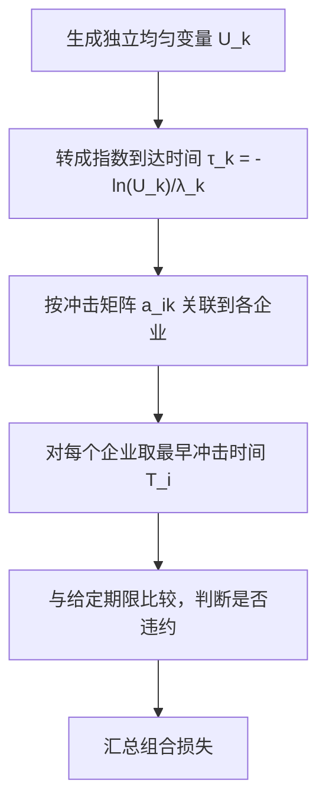

# Financial Risk Management（Topic 3）

> 资料来源：`Fin_Risk_Topic_3.pdf`  
> 主题：违约强度（Default Intensity）、信用利差（Credit Spread）、联合违约指数模型（Exponential Model of Joint Defaults）

## 一句话理解

Topic 3 讨论的是：**市场价格里的信用利差，如何被解释成违约强度；而多个企业的违约，又如何通过“共同冲击 + 个体冲击”的到达模型联系起来。**

---

## 本 Topic 在整门课里的位置

Topic 2 主要在回答“损失分布是什么、如何用 `VaR / ES` 描述尾部风险”；  
Topic 3 则更进一步，进入信用风险建模的核心对象之一：**违约时间（Default Time）本身该如何建模。**

这一讲的意义在于把三个层面串起来：

- 市场可观测的信用利差
- 风险中性下的生存概率与违约强度
- 多个主体之间的联合违约结构

---

## 本 Topic 讲了什么

从课件结构看，这一讲可以整理成四条主线：

| 模块 | 内容 |
| --- | --- |
| 3.1 | 信用收益率曲线（Credit Yield Curves）与违约概率的市场隐含 |
| 3.1 | 违约强度（Hazard Rate / Default Intensity）与生存函数（Survival Function） |
| 3.2 | 两主体联合违约的指数模型 |
| 3.2 | 多主体扩展与模拟算法 |

如果只保留主线，就是：

> 先从债券价格反推出单个主体“多久会出事”的概率结构，再设计一个冲击模型，解释“为什么很多主体会在坏时候一起出事”。

---

## 为什么重要

信用风险管理里，很多问题最终都落到这两个变量上：

- 某个主体什么时候违约
- 多个主体会不会在同一时期集中违约

如果只用历史违约率，很难反映市场的前瞻看法；  
如果只看单个主体，又解释不了系统性信用事件。

所以这一讲本质上是在搭建下面这个桥梁：

---

## 一、信用利差到底在补偿什么

企业债价格不只反映无风险利率，还包含对违约风险的补偿。  
课件强调，信用利差（Credit Spread）通常至少混合了：

- 违约风险
- 流动性风险（Liquidity Risk）
- 有时还包含嵌入期权等结构因素

如果记

- `y(T)`：到期为 `T` 的风险债收益率
- `y^*(T)`：对应无风险零息债收益率

那么 `T` 年期信用利差就是

  $$
  \text{credit spread}(T) = y(T) - y^*(T).
  $$

### 一句话理解

**信用利差不是纯粹的“违约概率”，而是市场对信用不确定性的价格化结果。**

---

## 二、生存概率与累计违约概率

令 `\tau_{\mathrm{def}}` 表示违约时刻（default time），则：

- 累计违约概率：`P[\tau_{\mathrm{def}} \le t]`
- 生存概率：`S(t) = P[\tau_{\mathrm{def}} > t]`

二者关系非常直接：

  $$
  S(t) = 1 - P[\tau_{\mathrm{def}} \le t].
  $$

课件还特别区分了：

- 累计违约概率（cumulative default probability）
- 条件远期违约概率（conditional forward default probability）

例如，第二年内违约、且第一年末还没违约的概率可以写成：

  $$
  P[\tau_{\mathrm{def}} \le 2 \mid \tau_{\mathrm{def}} > 1]
  =
  \frac{P[\tau_{\mathrm{def}} \le 2] - P[\tau_{\mathrm{def}} \le 1]}
       {P[\tau_{\mathrm{def}} > 1]}.
  $$

### 为什么这一步重要

因为市场通常给你的不是“每一年单独违约多少”，而是某些期限上的价格或累计违约信息；  
我们需要把它们转成逐段的条件违约结构，才能做动态建模。

---

## 三、零回收假设下，信用利差如何隐含违约概率

先看最简单的情形：**违约后零回收（zero recovery）**。

风险债零息债价格为

  $$
  100e^{-y(T)T},
  $$

无风险零息债价格为

  $$
  100e^{-y^*(T)T}.
  $$

若到期前违约则价值归零，到期前不违约则支付 100，则风险中性下有

  $$
  100e^{-y(T)T}
  =
  100[1-Q(T)]e^{-y^*(T)T},
  $$

其中 `Q(T)` 是到 `T` 时刻前累计违约概率。于是得到

  $$
  S(T) = 1-Q(T) = e^{-[y(T)-y^*(T)]T}.
  $$

### 一句话理解

**在零回收近似下，信用利差乘以期限，基本上就是“生存概率衰减”的速度。**

---

## 四、为什么这里得到的是风险中性违约概率

课件特别强调：从债券价格反推出的违约概率，属于**风险中性概率（Risk-neutral Probability）**，不是历史真实概率（Actual / Physical Probability）。

原因是：

- 这些概率是从交易价格反推出来的
- 价格不仅反映客观违约频率，也包含投资者要求的风险补偿

这也是为什么：

- 市场隐含违约强度通常高于历史平均违约强度
- 高评级债券尤其明显，因为流动性、跳违约风险、相关性溢价都更显著

---

## 五、违约强度是什么

违约强度（Hazard Rate / Default Intensity）定义为：  
在已经存活到 `t` 的条件下，接下来一个极短时间段 `\Delta t` 内违约的条件概率速率。

  $$
  P[\tau_{\mathrm{def}} \le t+\Delta t \mid \tau_{\mathrm{def}} > t]
  = \lambda(t)\Delta t.
  $$

如果生存函数为 `S(t)`，则有

  $$
  \frac{dS(t)}{S(t)} = -\lambda(t)\,dt,
  \qquad S(0)=1.
  $$

积分后得到

  $$
  S(t) = \exp\left(-\int_0^t \lambda(u)\,du\right).
  $$

### 直觉解释

如果把 `S(t)` 看成“还活着的比例”，那 `\lambda(t)` 就是它瞬时衰减的速度。  
这和放射性衰变模型的结构非常像，所以课件也专门做了这个类比。

---

## 六、无条件违约密度和违约强度的关系

如果 `q(t)` 表示无条件违约密度（unconditional default density），那么

  $$
  q(t) = S(t)\lambda(t).
  $$

这个关系非常重要，因为它把两种常见视角统一起来了：

- `q(t)`：从时间 0 往前看，“在 `t` 附近违约”的总体概率
- `\lambda(t)`：条件在“尚未违约”的前提下，当前瞬时有多危险

### 一句话理解

**无条件违约密度 = 活到现在的概率 × 现在这一下子的条件违约速率。**

---

## 七、有限回收率为什么会显著改变违约概率反推

如果回收率为 `R`，则风险债不再是“违约即归零”。  
在简化设定下，课件给出的关系可以整理为

  $$
  Q(T)
  =
  \frac{1 - e^{-[y(T)-y^*(T)]T}}{1-R}.
  $$

进一步，当利差较小时，可以用近似

  $$
  \lambda(T) \approx \frac{y(T)-y^*(T)}{1-R}.
  $$

这告诉我们：**同样的债券价格差，在高回收率假设下，会对应更高的隐含违约概率。**

### 常见误区

**误区：有了信用利差，就能直接读出违约概率。**

不行。  
回收率假设一变，推出来的违约概率就会明显变化。

---

## 八、市场隐含违约强度为什么常常高于历史违约强度

课件列了几个重要原因：

- 企业债通常不如国债流动
- 投资者要求对“跳违约风险（jump-to-default risk）”获得补偿
- 信用风险之间存在相关性，不能被完全分散

所以从债券价格反推的强度，通常高于基于历史违约数据估计的真实强度，尤其在高评级债券上更明显。

### 一句话理解

**价格里看到的是“违约风险 + 风险溢价 + 流动性溢价”的综合结果，不是纯频率统计。**

---

## 九、为什么要建联合违约模型

单主体模型能告诉我们一家企业多久违约，但真正的系统性信用风险来自：

- 很多主体在同一时期一起恶化
- 某个宏观冲击同时打击多个行业或地区

因此课件进入 Topic 3 的后半部分：**指数型联合违约模型（Exponential Models of Joint Defaults）**。

---

## 十、二元联合违约模型：共同冲击 + 个体冲击

设有三个独立泊松过程（Poisson Processes）：

- `N_1(t)`：企业 1 的个体冲击，强度 `\lambda_1`
- `N_2(t)`：企业 2 的个体冲击，强度 `\lambda_2`
- `N(t)`：同时影响两家的宏观共同冲击，强度 `\lambda`

企业 `i` 的违约时间定义为

  $$
  \tau_i = \inf\{t\ge 0: N_i(t) + N(t) > 0\},
  \qquad i=1,2.
  $$

于是企业 `i` 的总违约强度就是

  $$
  \lambda_i + \lambda,
  $$

生存函数为

  $$
  S_i(t) = P[\tau_i > t] = e^{-(\lambda_i+\lambda)t}.
  $$

### 一句话理解

**一个主体不是只有“自己倒下”这一条路径，也可能是被系统性冲击一起击倒。**

---

## 十一、两主体联合生存概率怎么写

如果企业 1 存活到 `t_1`，企业 2 存活到 `t_2`，则共同冲击必须在 `\max(t_1,t_2)` 前没有到达。  
因此联合生存函数为

  $$
  S(t_1,t_2)
  =
  e^{-\lambda_1 t_1 - \lambda_2 t_2 - \lambda \max(t_1,t_2)}.
  $$

也可写成

  $$
  S(t_1,t_2)
  =
  e^{-(\lambda_1+\lambda)t_1-(\lambda_2+\lambda)t_2+\lambda\min(t_1,t_2)}.
  $$

这个式子清楚地展示了依赖结构：  
`min(t_1,t_2)` 项正是共同冲击带来的联动来源。

---

## 十二、违约相关性为什么会随共同冲击强度上升

课件把违约相关性写成违约指示变量的相关系数。  
若 `P_i(t)` 表示 `i` 到时刻 `t` 的累计违约概率，`S_i(t)` 表示生存概率，则：

  $$
  \rho\bigl(1_{\{\tau_1<t\}},1_{\{\tau_2<t\}}\bigr)
  =
  \frac{S(t,t)-S_1(t)S_2(t)}
       {\sqrt{P_1(t)S_1(t)P_2(t)S_2(t)}}.
  $$

直觉上：

- `\lambda` 越大，共同冲击越强，违约相关性越高
- 时间拉得越长，相关性不一定一直升，因为边际违约概率和联合生存项会一起变化

---

## 十三、多主体扩展：用冲击矩阵描述谁会被谁影响

当企业数扩展到 `n` 个时，课件引入一个 `a_{ik}` 矩阵：

- `a_{ik}=1`：第 `k` 个冲击会导致第 `i` 个企业违约
- `a_{ik}=0`：不会影响该企业

于是第 `i` 个企业的违约时间定义为

  $$
  \tau_i
  =
  \inf\left\{
    t\ge 0:
    \sum_{k=1}^m a_{ik}N_k(t) > 0
  \right\}.
  $$

在独立冲击假设下，第 `i` 个企业的生存函数为

  $$
  S_i(t)
  =
  \exp\left(
    -\sum_{k=1}^m a_{ik}\lambda_k t
  \right).
  $$

而联合生存函数则为

  $$
  S(t_1,\dots,t_n)
  =
  \exp\left(
    -\sum_{k=1}^m \lambda_k
    \max(a_{1k}t_1,\dots,a_{nk}t_n)
  \right).
  $$

### 为什么这个结构好用

- 可以灵活区分个体、行业、地区、国家、系统性冲击
- 依赖关系不是直接指定相关系数，而是通过“共享冲击”自然生成
- 很适合做信用组合模拟

---

## 十四、联合违约模型的模拟算法

课件给出了非常清晰的模拟步骤。  
若第 `k` 个冲击的到达时间 `\tau_k` 服从参数 `\lambda_k` 的指数分布，则可由均匀分布反推：

  $$
  \tau_k = -\frac{1}{\lambda_k}\ln U_k,
  \qquad U_k \sim \text{Uniform}(0,1).
  $$

然后，对每个企业 `i`，取所有会打到它的冲击中最早发生的一个：

  $$
  T_i = \min\{\tau_k : a_{ik}=1\}.
  $$

### 模拟流程图

### 一句话理解

**先模拟“冲击什么时候来”，再看“这个冲击会打到谁”，违约时间就自然出来了。**

---

## 十五、给定一般违约强度函数时，如何模拟违约时刻

如果违约强度不是常数，而是时间函数 `\lambda(t)`，课件给了一个非常经典的做法。

先取一个参数为 1 的指数随机变量 `E_1`，定义累计强度函数

  $$
  G(t) = \int_0^t \lambda(u)\,du.
  $$

违约时刻定义为

  $$
  \tau
  =
  \inf\left\{
    t: \int_0^t \lambda(u)\,du \ge E_1
  \right\}.
  $$

于是有

  $$
  P[\tau \le t]
  =
  1 - e^{-\int_0^t \lambda(u)\,du}.
  $$

如果 `G` 可逆，那么模拟形式可进一步写成

  $$
  \tau = G^{-1}(E_1).
  $$

这一步其实是 Topic 1 里逆变换法（Inverse Transform Method）在违约时间建模中的一个非常漂亮的应用。

---

## 常见误区

### 误区 1：信用利差就等于真实违约概率

不对。  
信用利差隐含的是风险中性视角下的违约强度，还混有流动性和风险溢价。

### 误区 2：回收率只是次要参数

不是。  
回收率假设会显著影响由债券价格反推出的违约概率或违约强度。

### 误区 3：联合违约只要设一个相关系数就够了

太粗糙了。  
相关系数是结果，不是机制。共享冲击模型提供的是更可解释的结构来源。

### 误区 4：历史违约率比市场隐含违约率更“真实”，所以一定更好

不能这么说。  
历史数据更接近真实世界频率，但市场价格包含前瞻信息；两者服务的目标不同。

---

## Topic 3 小结

### 这一讲真正建立了什么

- 理解信用利差与生存概率之间的基本关系
- 掌握违约强度 `\lambda(t)` 与生存函数 `S(t)` 的联系
- 区分风险中性违约概率与历史违约概率
- 理解有限回收率如何影响违约概率反推
- 掌握共享冲击下的联合违约指数模型
- 会写出并模拟多主体违约时间

### 一句话总结

**Topic 3 的核心，是把“债券价格里的信用信息”转成“违约时间模型”，再把单主体扩展到多主体，从而为组合信用风险模拟搭起动态骨架。**

---

## 可继续思考的问题

1. 为什么高评级债券的市场隐含违约强度往往比历史违约强度高得更多？
2. 如果共同冲击很多、个体冲击很少，组合信用风险会出现什么特征？
3. 在联合违约建模里，为什么“共享冲击”往往比直接指定相关系数更有解释力？
4. 如果回收率本身也是随机的，这一套从价格反推违约概率的公式要怎么改？
