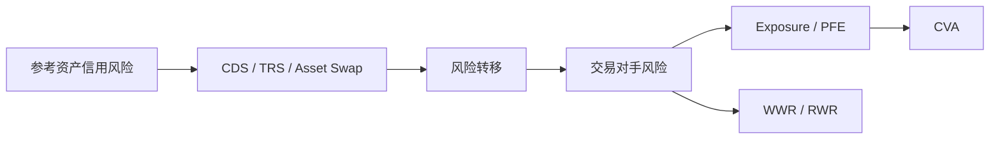

# Financial Risk Management（Topic 4）

> 资料来源：`Fin_Risk_Topic_4.pdf`  
> 主题：信用衍生品（Credit Derivatives）、信用违约互换（Credit Default Swap, CDS）、交易对手风险（Counterparty Risk）、信用估值调整（Credit Value Adjustment, CVA）

## 一句话理解

Topic 4 讨论的是：**信用风险不仅能被“持有”或“规避”，还可以被拆分、转移、重新打包；但当风险被转移到衍生品合约里以后，新的交易对手风险又会出现。**

---

## 本 Topic 在整门课里的位置

Topic 3 讲的是如何从信用利差和违约强度去建模单主体与多主体违约；  
Topic 4 则进入这些模型在市场中的具体承载工具：

- 如何用 `CDS` 等合约转移信用风险
- 如何从 hazard rate 出发定价信用衍生品
- 为什么“把信用风险卖掉”之后，还会冒出交易对手风险

这一讲是信用风险建模和实际交易结构真正接轨的地方。

---

## 本 Topic 讲了什么

从课件结构看，这一讲可以整理成五条主线：

| 模块 | 内容 |
| --- | --- |
| 4.1 | 信用违约互换（CDS）与保费、赔付、融资套利 |
| 4.1 | Synthetic CDO 与信用风险分层转移 |
| 4.2 | Asset Swap、Repo、Total Return Swap 等基于风险债的利息互换结构 |
| 4.3 | Hazard rate 与信用衍生品定价、CDS 公允利差 |
| 4.4 | Counterparty Risk、PFE、EE / EPE / EEPE、CVA、WWR |

如果只保留主线，就是：

> 先理解信用衍生品如何把违约风险“切出来交易”，再理解这些合约本身为什么又制造了新的信用暴露。

---

## 为什么重要

Topic 4 有一个很现实的提醒：

- 信用风险不是只存在于贷款和债券里
- 它也会藏在互换、回购、担保、分层证券和场外衍生品里

所以机构在做风险管理时，不能只看“参考资产会不会违约”，还要看：

- 保护卖方会不会违约
- 净敞口会不会随市场波动而扩大
- 交易结构是否存在错误方向风险（Wrong Way Risk, WWR）

---

## 一、CDS 本质上交易的是什么

信用违约互换（Credit Default Swap, CDS）里：

- 保护买方（Protection Buyer）定期支付保费
- 保护卖方（Protection Seller）在信用事件发生时支付损失补偿

它本质上是在交易：

> “某个参考资产在合约期限内发生违约所带来的损失风险”。

### 现金流结构

- 平时：保护买方支付固定 CDS spread
- 违约时：保护卖方支付补偿，通常为 `(1 - recovery rate) × notional`

### 两种常见交割方式

| 方式 | 含义 |
| --- | --- |
| Physical settlement | 保护买方把违约债券交给保护卖方，换回面值 |
| Cash settlement | 按市场决定的损失率现金赔付 |

### 一句话理解

**CDS 就像把债券里的“违约腿”单独切下来卖。**

---

## 二、为什么 CDS 对买方和卖方都可能有吸引力

### 对保护买方

它可以：

- 对冲贷款或债券的违约风险
- 不卖掉现券就实现风险转移
- 保留客户关系或税务安排上的好处

课件里的银行例子很典型：

- 银行给企业贷款，赚 `L + 65bps`
- 同时买 CDS，支付 `50bps`
- 银行自身资金成本若是 `L - 10bps`

那么净收益提升为

  $$
  65 - 50 + 10 = 25 \text{ bps}.
  $$

### 对保护卖方

它可以：

- 收取稳定保费
- 不用直接持有风险债，也能获得信用敞口
- 利用自身资金结构或风险承受能力赚取价差

---

## 三、融资套利（Funding Cost Arbitrage）为什么会出现

课件强调：不同机构的资金成本不同，因此谁来当 Protection Buyer / Seller，会影响交易是否有套利空间。

核心逻辑是：

- 高评级机构融资更便宜
- 低评级机构若直接买入风险债，资金成本可能太高
- 但它可以通过“卖保护”的方式，合成拿到信用利差

### 一句话理解

**有时真正被交易的，不只是违约风险本身，还有“谁更便宜地持有这份风险”。**

---

## 四、CDS 不是完美对冲，因为还有交易对手风险

如果参考债违约，而 CDS 保护卖方也违约，那么保护买方并不能完整收到赔付。  
这就是 CDS 里的交易对手风险（Counterparty Risk）。

课件提醒，保护买方面对的并不是单一事件，而是联合事件：

- 参考实体违约
- 保护卖方在赔付时也出问题

所以：

**CDS 把参考资产风险转移掉的同时，也把问题改写成“参考实体 + 保护卖方”的联合信用风险。**

---

## 五、CDS 的定价：公允保费由哪两条腿平衡决定

CDS 的公允保费率 `s`，由两部分现值平衡决定：

- Premium leg：保护买方持续支付保费
- Contingent leg：保护卖方在违约时支付赔偿

### 1. Premium leg

若在 `T_n` 存活时支付 `\delta_{n-1}s`，则 premium leg 现值是

  $$
  s \sum_{n=1}^N \delta_{n-1} B(0,T_n),
  $$

其中 `B(0,T_n)` 是带有生存条件的风险折现因子。

### 2. Contingent leg

若恢复率为 `\pi`，则违约赔付腿现值为

  $$
  (1-\pi)\sum_{n=1}^N e(0,T_{n-1},T_n)
  =
  (1-\pi)\sum_{n=1}^N \delta_{n-1}H(0,T_{n-1},T_n)B(0,T_n).
  $$

令两条腿相等，就得到公允 CDS spread：

  $$
  s
  =
  \frac{
    (1-\pi)\sum_{n=1}^N \delta_{n-1}H(0,T_{n-1},T_n)B(0,T_n)
  }{
    \sum_{n=1}^N \delta_{n-1}B(0,T_n)
  }.
  $$

### 一句话理解

**CDS spread 的本质，就是“预期赔付现值”均摊到“存活时持续支付的保费现值”上。**

---

## 六、恢复率为什么会显著影响 CDS spread

因为 Protection Seller 实际赔的就是损失率，也就是 `1 - R`。  
恢复率 `R` 越低，违约后的赔付越大，所以要求的保费 `s` 越高。

课件里还提到一个对比：

- 普通 CDS 的 spread 依赖恢复率估计
- Binary CDS 在违约时支付固定名义本金，因此保费主要取决于违约概率，而不依赖恢复率

### 常见误区

**误区：CDS spread 只由违约概率决定。**

不对。  
恢复率、支付频率、违约时点假设、折现结构都会影响 CDS 定价。

---

## 七、为什么 par floater 的 par spread 近似等于 CDS spread

课件给出一个很经典的复制思路：

- 组合 1：持有 defaultable par floater + 买入 CDS
- 组合 2：持有对应的无风险 floating bond

忽略违约时小的应计利息误差后，这两个组合的现金流几乎相同，因此可得

  $$
  s_{\text{par}} \approx s_{\text{CDS}}.
  $$

这个结果很重要，因为它说明：

- 债券市场里的信用利差
- CDS 市场里的保费率

在理想条件下应彼此一致，至少近似一致。

---

## 八、固定票息债、Asset Swap、TRS、Repo 的共同直觉

虽然课件这一讲覆盖了多种结构，但它们的共同逻辑其实一致：

- 把资产的现金流拆分
- 把利率风险和信用风险重新组合
- 让不同偏好的投资者各自拿走自己想要的部分

### 可以用一句话区分

| 工具 | 一句话理解 |
| --- | --- |
| Asset Swap | 把固定票息债转成浮动利率敞口 |
| Repo | 以证券为抵押获得短期融资 |
| Total Return Swap | 转移“价格变动 + 利息收入”的总回报 |
| CDS | 只转移违约损失部分 |

---

## 九、Synthetic CDO 的本质是什么

合成担保债务凭证（Synthetic CDO）不是靠真正持有一篮子债券，而是通过信用衍生品把一篮子信用风险打包，然后再分层（tranching）。

它的经济逻辑包括：

- 把同一组合的损失分配给不同风险偏好的投资者
- 制造监管资本套利（Regulatory Capital Relief）
- 让贷款等本来不太流动的风险更容易被转移

### 但风险也很明显

- 违约相关性被低估时，分层结构会非常脆弱
- 表面上“分散”的产品，可能高度依赖相同尾部事件
- AIG 案例说明：卖出大量保护不等于真正消除了风险

---

## 十、交易对手风险到底是什么

交易对手信用风险定义为：

> 合约还没最终结算时，对手方先违约，导致本来对自己有价值的未来现金流无法按约收到的风险。

它和普通贷款信用风险不同：

- 贷款通常是单边风险（unilateral）
- OTC 衍生品常常是双边风险（bilateral）

因为合约市值会随市场变化而变化，所以任意时刻谁暴露、暴露多少，都可能变化。

---

## 十一、交易对手暴露（Exposure at Default）怎么写

若某个时刻对手方违约，而合约对我方的市值为 `MtM(\tau)`，则违约暴露写成

  $$
  EAD = \max(MtM(\tau), 0).
  $$

如果是和同一个对手方的一组合约，在没有净额结算协议时，

  $$
  EAD = \sum_{i=1}^n \max(MtM_i(\tau), 0).
  $$

若存在全局净额结算（global netting），则

  $$
  EAD = \max\left(\sum_{i=1}^n MtM_i(\tau), 0\right).
  $$

因此总有

  $$
  \max\left(\sum_{i=1}^n MtM_i(\tau), 0\right)
  \le
  \sum_{i=1}^n \max(MtM_i(\tau), 0).
  $$

### 一句话理解

**净额结算的价值就在于：让“有赚有亏”的头寸先内部抵消，再看剩下多少真正暴露。**

---

## 十二、PFE、EE、EPE、EEE、EEPE 分别在看什么

课件把未来暴露分成几个常见指标：

### 1. 潜在未来暴露（Potential Future Exposure, PFE）

定义未来时点 `t` 的正向暴露：

  $$
  e(t) = \max(MtM(0;t), 0).
  $$

### 2. 峰值暴露（Peak Exposure, PE）

如果 `F_{[0,t]}` 是暴露分布函数，则 `\alpha` 分位点峰值暴露为

  $$
  PE_\alpha(t) = F_{[0,t]}^{-1}(\alpha).
  $$

### 3. 期望暴露（Expected Exposure, EE）

  $$
  EE(t) = E[e(t)].
  $$

### 4. 期望正向暴露（Expected Positive Exposure, EPE）

  $$
  EPE(0;t) = \frac{1}{t}\int_0^t EE(s)\,ds.
  $$

### 5. 有效期望暴露（Effective Expected Exposure, EEE）

  $$
  EEE(t) = \sup_{s\le t} EE(s).
  $$

### 6. 有效期望正向暴露（Effective EPE, EEPE）

  $$
  EEPE(0;t) = \frac{1}{t}\int_0^t EEE(s)\,ds.
  $$

### 一句话理解

**这些指标的区别，本质上就是：看某个时点、看某个分位点，还是看一段时间的平均或最坏轨迹。**

---

## 十三、为什么利率互换的暴露常常是钟形的

课件提到对利率互换等产品，暴露常常呈 bell-shaped curve。  
背后是两个反向力量：

- Diffusion effect：时间越长，不确定性越大，暴露倾向上升
- Amortization effect：剩余现金流越来越少，暴露倾向下降

所以暴露不会无限上升，而通常先升后降。

---

## 十四、CVA 到底在调整什么

信用估值调整（Credit Value Adjustment, CVA）定义为：

> 风险中性无违约价值，与考虑交易对手违约后的风险价值之间的差额。

也可以理解为未来交易对手违约带来的预期贴现损失。

课件写成

  $$
  CVA = E_t[\Pi(t,T)] - E_t[\Pi^D(t,T)].
  $$

在单边情形（只考虑对手方违约）下，若 `LGD` 为给定损失率，则

  $$
  CVA
  =
  LGD \cdot E\left[
    1_{\{\tau \le T\}} D(0,\tau) (V(\tau))^+
  \right].
  $$

这里：

- `\tau`：对手方违约时刻
- `D(0,\tau)`：折现因子
- `V(\tau)`：违约时的 close-out value

### 一句话理解

**CVA 不是“多收一点手续费”，而是把未来可能收不到的钱，今天先折价扣掉。**

---

## 十五、Wrong Way Risk 为什么特别危险

错误方向风险（Wrong Way Risk, WWR）指的是：

> 当对手方信用质量恶化时，我对它的暴露反而变得更大。

这会让独立性假设严重低估风险。

课件里的例子包括：

- 对手方拿自己的债券做抵押品
- 或拿与自己高度相关行业、地区的资产做抵押

这时一旦对手方接近违约：

- 暴露变大
- 抵押品价值也可能一起下跌

属于典型“双杀”。

### 与之相对的是 Right Way Risk（RWR）

如果对手方越危险，暴露反而越小，就是 RWR。  
例如某银行卖出本行股票看涨期权时，若它自身信用恶化，股价下跌，期权价值也会下降，从而暴露减少。

---

## 常见误区

### 误区 1：买了 CDS 就等于完全没有信用风险

不对。  
你只是把参考资产风险换成了“参考资产 + 保护卖方”的联合风险。

### 误区 2：交易对手风险只在违约那一刻才重要

不对。  
它是一个会随着市场价值动态变化的过程，所以需要全路径地看暴露分布。

### 误区 3：有净额结算就几乎不用担心暴露

不一定。  
净额结算能降低暴露，但不能消除所有暴露，尤其在部分净额、跨产品组合和高波动情形下。

### 误区 4：CVA 只是一个会计调整项

不是。  
CVA 直接影响交易报价、资本占用和真实利润，因此是交易和风险管理共同关心的价格调整。

---

## Topic 4 小结

### 这一讲真正建立了什么

- 理解 CDS 的保费腿与赔付腿
- 掌握 CDS spread 的基本定价逻辑
- 理解 par spread 与 CDS spread 的近似关系
- 认识 Synthetic CDO 等信用风险重打包工具
- 掌握交易对手暴露与净额结算的基本框架
- 区分 `PFE / EE / EPE / EEE / EEPE`
- 理解 CVA 的定义与单边公式
- 认识 WWR / RWR 的风险本质

### 一句话总结

**Topic 4 的核心，是理解信用风险可以通过衍生品被转移、拆分和定价，但风险不会消失，它会以交易对手暴露和 CVA 的形式重新出现。**

---

## 可继续思考的问题

1. 如果 CDS 的保护卖方和参考实体高度相关，CDS 还算是有效对冲吗？
2. 为什么监管和交易台会同时高度关注 CVA，而不仅仅是名义本金？
3. 在有净额结算和抵押品的情况下，交易对手风险还会剩下哪些部分？
4. Synthetic CDO 的“分层”到底是在分散风险，还是在重新分配尾部风险？
