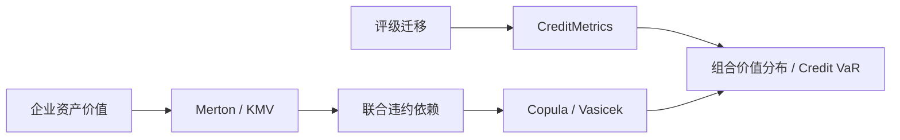

# Financial Risk Management（Topic 6）

> 资料来源：`Fin_Risk_Topic_6.pdf`  
> 主题：结构化违约模型（Structural Models of Defaults）、CreditMetrics、Copula、Vasicek、Merton 模型、KMV / mKMV

## 一句话理解

Topic 6 讨论的是：**信用风险不只可以从“违约概率”出发建模，也可以从企业资产价值、信用迁移和依赖结构本身出发建模。**

---

## 本 Topic 在整门课里的位置

前 5 个 Topic 已经搭好了三条主线：

- 损失分布与风险度量
- 强度模型与信用衍生品
- 混合模型与组合损失计算

Topic 6 则把课程收束到一类非常经典的框架：**结构化信用风险模型（Structural Credit Models）**。  
它把企业违约与资产价值、资本结构、评级迁移、相关资产收益这些变量直接联系起来。

这一讲本质上是在回答：

- 信用迁移如何生成组合 `Credit VaR`
- 违约相关性如何用 copula 写出来
- 企业为什么会违约，能不能从资产负债表和股价中“推”出来

---

## 本 Topic 讲了什么

从课件结构看，这一讲可以整理成三条主线：

| 模块 | 内容 |
| --- | --- |
| 6.1 | CreditMetrics：评级迁移、组合重估与 Credit-VaR |
| 6.2 | Copula 模型：Gaussian Copula、广义 Gaussian Copula、Vasicek |
| 6.3 | Merton 结构模型与工业实现 KMV / mKMV |

如果只保留主线，就是：

> 先用评级迁移去重估债券组合，再用 copula 描述联合违约，最后回到底层企业资产价值，解释“违约为什么会发生”。 

---

## 为什么重要

这一讲几乎把现代信用风险建模的三个代表性世界都串起来了：

- 迁移矩阵世界：用评级变化驱动组合价值变化
- Copula 世界：用边缘分布 + 依赖结构构造联合违约
- 结构模型世界：用企业资产价值和资本结构解释违约

---

## 一、CreditMetrics：它到底在做什么

CreditMetrics 的核心思想不是只看“会不会违约”，而是看：

> 在给定风险期限内，债券或贷款的信用评级会怎么迁移，从而组合价值会怎么变化。

因此它关心的不仅是 default，还关心 downgrade / upgrade 带来的 spread risk。

### CreditMetrics 的关键输入

1. 评级体系（rating system）  
2. 一年期评级迁移矩阵（transition matrix）  
3. 各评级对应的远期贴现曲线（forward risky discount curves）  
4. 回收率假设（recovery rate）  
5. 资产收益相关矩阵（asset return correlation matrix）

---

## 二、为什么信用迁移会直接改变债券价值

若债券一年后仍是原评级，价值用对应评级的 forward risky curve 贴现；  
若被 downgrade，则未来现金流要用更高信用利差贴现，因此价格下跌；  
若被 upgrade，则贴现率下降，价格上升。

课件里的 BBB 债券例子展示得很清楚：

- 保持 BBB：价格大致维持在中间水平
- 降到 BB / B / CCC：价格显著下降
- Default：价值主要取决于 recovery

### 一句话理解

**信用风险不只表现为“0 或 1”的违约，也表现为“还没违约但价格已经先掉了”。**

---

## 三、CreditMetrics 如何得到单个债券的一年远期价值分布

设某只债券当前是 BBB，课件中它在一年后的价值取决于年末评级状态。  
对每个可能评级状态：

- 用迁移矩阵给出概率
- 用对应 forward curve 计算一年后的债券价格

例如留在 BBB 的 forward value 为

  $$
  V_{\text{BBB}}
  =
  6
  + \frac{6}{1+\tilde f_{[1,2]}}
  + \frac{6}{(1+\tilde f_{[1,3]})^2}
  + \frac{6}{(1+\tilde f_{[1,4]})^3}
  + \frac{106}{(1+\tilde f_{[1,5]})^4}.
  $$

对所有评级状态重复这个过程，就能得到一条离散的一年后价值分布。

---

## 四、Credit VaR 在 CreditMetrics 里怎么读

有了未来价值分布，就能直接取分位数。  
比如课件通过插值求出了 5% 分位点对应的债券价值大约为某个数值，于是：

> 以 95% 置信度看，一年后债券价值不会低于这个门槛。

这里的 `Credit VaR` 本质上不是“违约损失 VaR”，而是：

**由评级迁移和违约共同导致的未来组合价值分位数。**

---

## 五、CreditMetrics 如何把评级迁移转成潜变量阈值

课件中最经典的一步，是把每个评级迁移概率映射到标准正态上的阈值区间。  
令某 obligor 的信用质量变量 `R` 服从标准正态，则：

- 落入不同区间，对应不同评级结果
- 最左边尾部对应 default threshold

例如，某评级在一年内 default 的概率若为 `p`，则 default threshold `d` 满足

  $$
  P[R \le d] = p.
  $$

也就是

  $$
  d = N^{-1}(p).
  $$

### 一句话理解

**迁移矩阵给的是每个状态的概率，阈值法把这些概率翻译成一条连续潜变量轴上的切片。**

---

## 六、为什么要引入相关资产收益

若我们只单独模拟每个 obligor 的评级迁移，就得不到组合层面的联合分布。  
CreditMetrics 的做法是：

- 用 equity / asset return correlation 作为 proxy
- 假设潜在信用质量变量联合正态

这样，不同 obligor 的迁移事件就通过共同相关结构联系起来。

课件中的二元联合密度写成：

  $$
  f(r_1,r_2;\rho)
  =
  \frac{1}{2\pi\sqrt{1-\rho^2}}
  \exp\left(
    -\frac{r_1^2 - 2\rho r_1r_2 + r_2^2}{2(1-\rho^2)}
  \right).
  $$

这一步其实已经把 CreditMetrics 和 Gaussian Copula 接起来了。

---

## 七、CreditMetrics 的 Monte Carlo 模拟怎么做

课件给出的流程非常标准：

1. 根据迁移矩阵求每个评级的阈值  
2. 估计 obligor 之间的资产收益相关矩阵 `\Sigma`  
3. 生成相关标准正态样本  
4. 根据样本落入的阈值区间决定每个 obligor 的新评级  
5. 用对应评级曲线重估组合价值  
6. 重复多次得到未来价值分布

### 生成相关正态样本

若 `x` 是独立标准正态向量，`\Sigma = AA^\top` 是 Cholesky 分解，则

  $$
  \varepsilon = Ax
  $$

满足

  $$
  E[\varepsilon \varepsilon^\top] = \Sigma.
  $$

### 一句话理解

**先造“相关的信用状态冲击”，再看每个 obligor 在这个冲击下掉到哪个评级桶里。**

---

## 八、Copula 模型在信用风险里解决什么问题

课件在 6.2 中把问题明确拆成两部分：

1. 单个 obligor 的边缘违约分布  
2. 多个 obligor 的依赖结构

Copula 的作用正是：

> 在不改变单个边缘分布的前提下，单独指定联合依赖结构。

如果 `X` 的分布函数是 `F`，那么 `U=F(X)` 服从 `[0,1]` 上均匀分布。  
反过来，若 `U \sim U[0,1]`，则 `X = F^{-1}(U)` 服从 `F`。

这就是 copula 建模的基础。

---

## 九、Gaussian Copula 为什么在信用模型里这么常见

Gaussian Copula 的核心流程是：

1. 先生成一个相关标准正态向量  
2. 用标准正态分布函数 `N(\cdot)` 把它变成相关 uniform 变量  
3. 再通过各自边缘分布的逆函数映射成默认时间或默认事件

这使得：

- 单体违约概率可单独指定
- 联合依赖通过相关矩阵集中控制

课件里也指出：  
**CreditMetrics 其实就可以被理解成 Gaussian Copula 在评级迁移上的一种实现。**

---

## 十、违约相关性和资产相关性不是一回事

课件明确区分：

- `\rho`：资产收益或潜变量的相关性
- `corr(DEF_1, DEF_2)`：违约指示变量的相关性

若 `d_1,d_2` 是 default thresholds，则联合违约概率为

  $$
  P(\mathrm{DEF}_1,\mathrm{DEF}_2)
  =
  N_2(d_1,d_2;\rho),
  $$

对应默认相关系数为

  $$
  \mathrm{corr}(\mathrm{DEF}_1,\mathrm{DEF}_2)
  =
  \frac{P(\mathrm{DEF}_1,\mathrm{DEF}_2)-P_1P_2}
       {\sqrt{P_1(1-P_1)P_2(1-P_2)}}.
  $$

### 一句话理解

**潜变量可以有 20% 相关，但映射成稀有默认事件后，默认相关性往往会小得多。**

---

## 十一、Vasicek 模型：一因子 Gaussian Copula 的监管版本

虽然课件正文这里只展开了部分推导，但它指向的就是经典一因子结构：

- 每个 obligor 的潜变量由“系统因子 + 特质噪声”组成
- 默认在潜变量低于阈值时发生

其典型形式可写为

  $$
  X_i = \sqrt{\rho}\,F + \sqrt{1-\rho}\,\epsilon_i,
  $$

其中 `F,\epsilon_i` 都是独立标准正态。

给定系统因子 `F` 后，违约条件概率为

  $$
  p(F)
  =
  N\left(
    \frac{N^{-1}(PD)-\sqrt{\rho}\,F}{\sqrt{1-\rho}}
  \right).
  $$

它正是 Basel IRB 资本公式背后的数学原型。

---

## 十二、Merton 模型：把企业违约看成期末资产不够还债

Merton 模型的核心思想非常漂亮：

> 企业的债权和股权，都是写在企业资产上的索取权；违约发生在到期时资产价值低于债务面值。

设企业资产 `A_t` 服从几何布朗运动：

  $$
  \frac{dA_t}{A_t} = \mu_A dt + \sigma dZ_t.
  $$

若到期债务面值为 `F`，则债权人到期支付为

  $$
  \min(A_T,F)
  =
  F - \max(F-A_T,0).
  $$

这说明：

- 风险债 = 无风险债 - 一份 put
- 股权 = 一份 call

---

## 十三、为什么说股东相当于拿着公司的看涨期权

根据资产负债恒等式：

- 企业资产价值 = 债务价值 + 股权价值

若风险债价值为 `V(A,\tau)`，则股权价值为

  $$
  E(A,\tau)=A - V(A,\tau).
  $$

代入 Merton 结构后，股权价值正好等于一个欧式 call。  
直觉上非常合理：

- 如果到期 `A_T > F`，股东拿走剩余价值 `A_T-F`
- 如果 `A_T \le F`，股东“弃权”，债权人接管企业

### 一句话理解

**股东的有限责任，本质上就让股权变成了公司资产上的看涨期权。**

---

## 十四、Merton 模型下风险债怎么定价

课件给出风险债价值的分解：

  $$
  V(A,\tau)=Fe^{-r\tau}-p(A,\tau),
  $$

其中 `p(A,\tau)` 是执行价 `F` 的欧式 put 价值：

  $$
  p(A,\tau)
  =
  Fe^{-r\tau}N(-d_2) - AN(-d_1),
  $$

  $$
  d_1
  =
  \frac{\ln(A/F)+(r+\sigma^2/2)\tau}{\sigma\sqrt{\tau}},
  \qquad
  d_2=d_1-\sigma\sqrt{\tau}.
  $$

这说明风险债价值就是：

- 先拿一张无风险零息债
- 再扣掉由于违约权利带来的 put value

---

## 十五、信用利差在 Merton 模型里如何出现

若定义风险债收益率 `Y(\tau)` 满足

  $$
  V(A,\tau)=Fe^{-Y(\tau)\tau},
  $$

则信用利差就是 `Y(\tau)-r`。

课件的一个核心结论是：

- 高杠杆企业：短期限利差可能很高，曲线更偏 downward-sloping
- 中等杠杆企业：利差曲线常常 hump-shaped
- 低杠杆企业：利差曲线可能 upward-sloping

### 一句话理解

**信用利差的期限结构，不只是“期限越长越危险”，还取决于企业当前离违约边界有多近。**

---

## 十六、Merton 模型的优点和短板

### 优点

- 有清晰经济含义
- 把资本结构、波动率、企业资产价值统一进一个框架
- 与期权定价理论完全一致

### 短板

- 默认只能在到期发生，缺乏“突然违约”
- 对短期限利差解释偏弱
- 没有纳入流动性溢价等现实因素
- 对不同优先级债务的刻画较粗糙

课件也指出，很多扩展正是为了修补这些问题：

- jump-diffusion
- Black-Cox 提前违约边界
- 随机利率
- 偏离绝对优先规则

---

## 十七、KMV / mKMV：把结构模型做成工业化 default signal

KMV 的关键思想是继承 Merton，但做了更贴近实务的改造：

- 默认不必只在到期发生
- 用市场股价信息持续更新 firm value
- 用经验数据库把 distance to default 映射成真实违约频率（EDF）

### 三个核心步骤

1. 估计企业资产价值 `V` 与资产波动率 `\sigma_V`  
2. 计算违约距离（distance to default, DD）  
3. 用历史数据库把 DD 映射成 EDF（Expected Default Frequency）

---

## 十八、KMV 的 default point 和 distance to default

课件中，默认点通常取为

  $$
  d^* = \text{short-term debt} + \frac{1}{2}\times \text{long-term debt}.
  $$

若终值资产满足对数正态过程，则违约概率可写成某个标准正态尾概率。  
课件进一步给出一个更直观的距离定义：

  $$
  df = \frac{E[V_T]-d^*}{\sigma_V\sqrt{T}}.
  $$

### 一句话理解

**Distance to Default 就是在问：企业的预期资产价值，离违约点还有多少个“波动标准差”。**

---

## 十九、为什么 KMV 特别依赖股票市场信息

因为股权在结构模型里本身就是企业资产上的期权。  
若市场能观察到：

- 股权市值 `E`
- 股权波动率 `\sigma_E`

就可以结合期权关系反推出：

- 企业资产价值 `V`
- 企业资产波动率 `\sigma_V`

课件写成：

  $$
  E = f(V,\sigma_V,K,c,r),
  $$

以及

  $$
  \sigma_E
  =
  \frac{V}{E}\frac{\partial f}{\partial V}\sigma_V.
  $$

这两个方程联立即可解出隐藏的 `V` 和 `\sigma_V`。

---

## 二十、CreditMetrics、Copula、Merton 三者之间是什么关系

这一讲其实不是三套互不相干的方法，而是同一个问题的三个视角：

| 框架 | 核心对象 | 优势 | 弱点 |
| --- | --- | --- | --- |
| CreditMetrics | 评级迁移与组合重估 | 实务直观，适合组合 VaR | 经济结构解释较弱 |
| Copula / Vasicek | 联合依赖结构 | 容易处理高维联合违约 | 依赖结构可能过于简化 |
| Merton / KMV | 企业资产价值与资本结构 | 经济含义强，连接股债市场 | 假设较强，实务要做很多修正 |

### 一句话理解

**CreditMetrics 看“评级怎么变”，Copula 看“大家怎么一起变”，Merton / KMV 看“企业为什么会变”。**

---

## 常见误区

### 误区 1：资产相关性高，就等于违约相关性也高很多

不一定。  
违约是阈值事件，资产相关性和违约相关性之间是非线性映射关系。

### 误区 2：Gaussian Copula 只是一种“数学技巧”，没有经济含义

它确实是依赖结构工具，但在 CreditMetrics / Vasicek 框架里，它也有明确的潜变量解释。

### 误区 3：Merton 模型里 default probability 就是历史违约频率

不是。  
模型给出的是基于资产价值过程的理论违约概率；KMV 还要再通过经验数据库把 DD 映射成 EDF。

### 误区 4：只要知道评级迁移矩阵，就能完全描述信用风险

不够。  
组合风险还取决于相关结构、回收率、暴露规模和重估方式。

---

## Topic 6 小结

### 这一讲真正建立了什么

- 理解 CreditMetrics 如何把评级迁移转成组合价值分布
- 理解迁移阈值、联合正态和 Monte Carlo 的关系
- 掌握 Copula 把边缘分布与联合依赖分离的思想
- 认识 Gaussian Copula / Vasicek 如何生成联合违约
- 掌握 Merton 模型中“债 = 无风险债 - put”的核心结构
- 理解 KMV 如何把结构模型转化成前瞻性的 EDF

### 一句话总结

**Topic 6 的核心，是把信用风险从“统计分布”进一步推进到“联合依赖”和“企业资产价值”层面，从而把组合风险、违约机制和市场信息真正连接起来。**

---

## 可继续思考的问题

1. CreditMetrics 和 CreditRisk+ 都能做组合信用风险，它们最大的哲学差异是什么？
2. 为什么 Gaussian Copula 在高维上这么方便，但在危机后又受到很多批评？
3. Merton 模型里最强、也最容易被现实打破的假设是哪一个？
4. KMV 依赖股价信息，这对非上市公司意味着什么限制？
