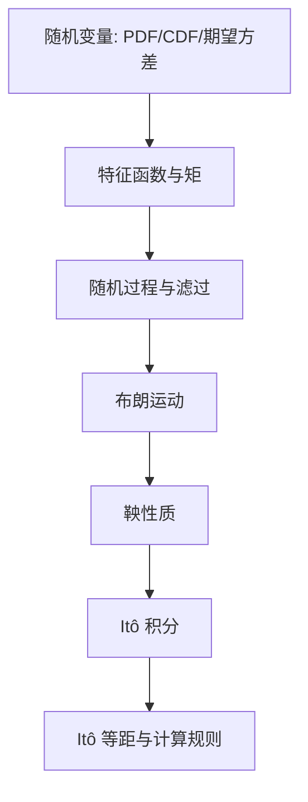

# Quantitative Finance（Chapter 1）

> 资料来源：`Mathematical Modeling and Computation in Finance`（Chapter 1）  
> 主题：随机变量（Stochastic Variables）、随机过程（Stochastic Processes）、鞅（Martingale）、Itô 积分（Ito Integral）

## 一句话理解

这一章的目标是建立后续量化金融的“概率语言”：**如何描述随机性、如何在信息流（filtration）下讨论过程、以及为什么 Itô 积分是金融随机微分方程的基础。**

---

## 本章核心问题

1. 随机变量如何用分布、期望、方差来刻画？
2. 特征函数（Characteristic Function）和矩（Moments）有什么关系？
3. 什么是鞅，为什么“零漂移”在金融里这么重要？
4. 为什么普通积分对布朗运动失效，必须用 Itô 积分？

---

## 一、随机变量基础：PDF、CDF、期望与方差

对于连续随机变量 `X`：

  $$
  F_X(x) := P[X \le x], \qquad
  f_X(x) := \frac{dF_X(x)}{dx}.
  $$

期望与方差分别为

  $$
  E[X] = \int_{-\infty}^{+\infty} x f_X(x)\,dx,
  $$

  $$
  \mathrm{Var}[X]
  =
  \int_{-\infty}^{+\infty} (x-E[X])^2 f_X(x)\,dx.
  $$

指示函数（Indicator Function）`1_{X\in\Omega}` 用于把事件概率写成期望：

  $$
  E[1_{X\le a}] = F_X(a).
  $$

### 一句话理解

**概率分布告诉我们“可能发生什么”，期望和方差告诉我们“中心在哪、波动多大”。**

---

## 二、正态分布与生存概率

本章回顾了正态分布 `N(\mu,\sigma^2)`，并强调生存概率（Survival Probability）：

  $$
  P[X > x] = 1 - F_X(x).
  $$

在信用风险和寿命建模里，这个量非常常见。

---

## 三、特征函数、矩与累积量

特征函数定义为

  $$
  \phi_X(u) := E[e^{iuX}]
  =
  \int_{-\infty}^{+\infty} e^{iux} f_X(x)\,dx.
  $$

矩母函数（Moment Generating Function）是

  $$
  M_X(u) := E[e^{uX}] = \phi_X(-iu).
  $$

第 `k` 阶矩可由特征函数导数给出：

  $$
  E[X^k] = \frac{1}{i^k}\frac{d^k}{du^k}\phi_X(u)\Big|_{u=0}.
  $$

累积量生成函数（Cumulant Generating Function）：

  $$
  \zeta_X(u) := \log \phi_X(u).
  $$

它能系统描述均值、方差、偏度（Skewness）和峰度（Kurtosis）。

### 为什么重要

在很多金融模型里，密度难写闭式，但特征函数可写闭式。  
这使得 Fourier 定价、矩匹配、近似展开成为可能。

---

## 四、二维分布与条件期望

对于二元随机变量 `(X,Y)`，联合密度 `f_{X,Y}` 可得到边缘密度和条件密度：

  $$
  f_{Y|X}(y|x)=\frac{f_{X,Y}(x,y)}{f_X(x)}.
  $$

条件期望用于“给定信息后的最优均值预测”。  
塔式性质（Tower Property）是后续推导中的关键：

  $$
  E[X|G] = E(E[X|F]\mid G), \quad G \subseteq F.
  $$

---

## 五、随机过程、滤过与适应性

随机过程是按时间索引的一族随机变量。  
章节强调了信息流 `\mathcal F(t)`（滤过，Filtration）：

- `\mathcal F(t)` 表示到时刻 `t` 已知的信息
- 过程若是 `\mathcal F(t)`-adapted，表示“不看未来”

这在金融里等价于“策略不能使用未来信息”的无套利基本要求。

---

## 六、布朗运动与鞅

标准布朗运动（Wiener Process）`W(t)` 的关键性质包括：

1. `W(0)=0`  
2. 路径连续  
3. 独立增量，且

  $$
  W(t)-W(s)\sim N(0,t-s), \quad t>s.
  $$

鞅（Martingale）定义核心是

  $$
  E[X(t)\mid \mathcal F(s)] = X(s), \quad s<t.
  $$

即“在当前信息下，未来条件期望等于现在”。  
布朗运动本身是鞅。

### 一句话理解

**鞅就是“公平游戏过程”：没有可预测的系统性漂移。**

---

## 七、为什么要 Itô 积分

对可微函数有

  $$
  \int_0^T g(t)\,d\xi(t)=\int_0^T g(t)\,\xi'(t)\,dt.
  $$

但当 `\xi(t)=W(t)`（布朗运动）时，这个写法失效，因为布朗路径几乎处处不可微。  
因此引入 Itô 积分：

  $$
  I(T)=\int_0^T g(t)\,dW(t).
  $$

其中 `g(t)` 需要是适应过程且平方可积。

---

## 八、Itô 积分的关键性质（本章重点）

### 1. 零均值

  $$
  E\left[\int_0^T g(t)\,dW(t)\right]=0.
  $$

### 2. Itô 等距（Ito Isometry）

  $$
  E\left[\left(\int_0^T g(t)\,dW(t)\right)^2\right]
  =
  \int_0^T E[g^2(t)]\,dt.
  $$

它把“随机积分的二阶矩”转成“普通积分”，非常强大。

### 3. 鞅性质

  $$
  \int_0^t g(s)\,dW(s)
  $$

在适当条件下是鞅，这也是风险中性定价推导的核心技术基础。

---

## 九、经典例子：\(\int_0^T W(t)\,dW(t)\)

章节给出并证明了经典结果：

  $$
  \int_0^T W(t)\,dW(t)
  =
  \frac{1}{2}W^2(T)-\frac{1}{2}T.
  $$

这个式子清楚体现了 Itô 计算和普通微积分的差异，也为 Itô 引理直觉打基础。

---

## 本章结构图

---

## 常见误区

### 误区 1：`E[dW_t]=0` 就表示 `dW_t=0`

不对。  
`dW_t` 是随机增量，均值为 0 但方差是 `dt`。

### 误区 2：Itô 积分和普通 Riemann 积分一样

不一样。  
Itô 积分对“取样点位置”敏感（通常取左端点），并依赖适应性。

### 误区 3：鞅就是“不会变化”

不是。  
鞅可以波动很大，只是“条件期望不漂移”。

### 误区 4：知道均值和方差就足够刻画分布

一般不够。  
偏度、峰度和更高阶信息在金融尾部风险里同样关键。

---

## 本章小结

### 这章真正建立了什么

- 用 PDF/CDF、期望、方差描述随机变量
- 用特征函数连接分布与矩
- 理解滤过、适应过程与“不可预见性”
- 掌握鞅定义和金融意义
- 理解 Itô 积分为何必要
- 掌握 Itô 等距与经典积分例子

### 一句话总结

**Chapter 1 是整门量化金融的概率地基：没有这套语言，后续 SDE、衍生品定价、风险中性测度都无法严谨展开。**

---

## 可继续思考的问题

1. 为什么特征函数在金融模型里常比密度函数更“可计算”？
2. Itô 积分若改成中点采样，会对应什么积分体系？
3. 鞅条件与“无套利”之间的逻辑联系是什么？
4. `\int_0^T W_t\,dW_t` 的结果为何多出 `-\frac12 T` 这一项？
