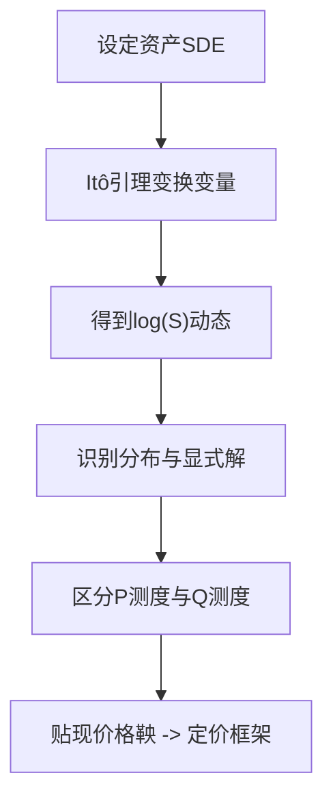

# Quantitative Finance（Chapter 2）

> 资料来源：_Mathematical Modeling and Computation in Finance_（Chapter 2）  
> 主题：金融资产动力学（Financial Asset Dynamics）、几何布朗运动（Geometric Brownian Motion, GBM）、伊藤引理（Itô's Lemma）、真实测度与风险中性测度（P / Q Measure）

## 一句话理解

这章的主线是：先给资产价格建立随机微分方程（SDE），再用伊藤引理做变量变换，最后说明为什么定价要在风险中性测度下看贴现后的鞅（Martingale）。

---

## 本章核心问题

1. 为什么资产价格常用随机过程建模？
2. GBM 为什么会导出“对数正态”价格分布？
3. `P` 与 `Q` 测度分别用于什么场景？
4. “贴现价格是鞅”到底在说什么？

---

## 1. 资产价格的标准起点：GBM

股票价格常写成：

$$
dS(t)=\mu S(t)\,dt+\sigma S(t)\,dW^P(t), \qquad S(t_0)=S_0.
$$

其中：

- `\mu` 是漂移（drift），反映平均增长趋势
- `\sigma` 是波动率（volatility），反映随机扰动强度
- `W^P(t)` 是真实测度 `P` 下的布朗运动（Brownian Motion）

### 一句话理解

GBM 表示“按比例波动”：价格越大，绝对波动通常也越大。

---

## 2. 无风险资产与贴现基准

货币账户（money market account）满足：

$$
\frac{dM(t)}{dt}=rM(t), \qquad M(0)=1,
$$

因此：

$$
M(t)=e^{rt}.
$$

它会作为后续贴现与换元（numeraire）的基准资产。

---

## 3. 伊藤引理与随机微积分规则

一般 Itô 过程：

$$
dX(t)=\bar\mu(t,X(t))\,dt+\bar\sigma(t,X(t))\,dW(t).
$$

若 `Y(t)=g(t,X(t))`，则 Itô 引理给出：

$$
dY(t)=
\left(
\frac{\partial g}{\partial t}
+\bar\mu\frac{\partial g}{\partial X}
+\frac12\bar\sigma^2\frac{\partial^2 g}{\partial X^2}
\right)dt
+\bar\sigma\frac{\partial g}{\partial X}\,dW(t).
$$

核心乘法规则：

$$
(dW)^2=dt,\qquad dt\cdot dW=0,\qquad (dt)^2=0.
$$

### 一句话理解

Itô 引理就是“随机世界里的链式法则”。

---

## 4. 从 GBM 到显式解：为什么是对数正态

令 `X(t)=\log S(t)`，应用 Itô 引理可得：

$$
dX(t)=\left(\mu-\frac12\sigma^2\right)dt+\sigma\,dW^P(t).
$$

积分后：

$$
X(t)=\log S_0+\left(\mu-\frac12\sigma^2\right)(t-t_0)+\sigma\bigl(W^P(t)-W^P(t_0)\bigr).
$$

因此 `X(t)=\log S(t)` 服从正态分布，`S(t)` 服从对数正态分布，其显式解为：

$$
S(t)=S_0\exp\!\left[\left(\mu-\frac12\sigma^2\right)(t-t_0)+\sigma\bigl(W^P(t)-W^P(t_0)\bigr)\right].
$$

---

## 5. P 测度与 Q 测度：预测与定价分离

在 `P` 测度下：

$$
E^P[S(t)\mid\mathcal F(t_0)]=S_0e^{\mu(t-t_0)}.
$$

若 `\mu>0`，原始价格通常不是鞅。

在 `Q` 测度下，漂移替换为无风险利率 `r`：

$$
dS(t)=rS(t)\,dt+\sigma S(t)\,dW^Q(t).
$$

定义贴现价格：

$$
\tilde S(t):=\frac{S(t)}{M(t)}=e^{-rt}S(t),
$$

则满足鞅性质：

$$
E^Q[\tilde S(t+\Delta t)\mid\mathcal F(t)]=\tilde S(t).
$$

### 一句话理解

`P` 用来描述现实世界统计规律，`Q` 用来做无套利定价。

---

## 6. 参数估计（MLE）直觉

对算术布朗运动（ABM）

$$
dX(t)=\mu\,dt+\sigma\,dW^P(t),
$$

离散观测步长为 `\Delta t` 时：

$$
X(t+\Delta t)\mid X(t)\sim N\!\bigl(X(t)+\mu\Delta t,\;\sigma^2\Delta t\bigr).
$$

最大似然估计（MLE）可写为：

$$
\hat\mu=\frac{X(t_m)-X(t_0)}{m\Delta t},
\qquad
\hat\sigma^2=
\frac{1}{m\Delta t}\sum_{k=0}^{m-1}\bigl(X(t_{k+1})-X(t_k)-\hat\mu\Delta t\bigr)^2.
$$

对 GBM，先令 `X=\log S` 后可用同样思路估计。

---

## 方法流程图

---

## 常见误解

### 误解 1：`S(t)` 在 `Q` 下一定是鞅

不对。通常是 `S(t)/M(t)`（贴现价格）在 `Q` 下是鞅。

### 误解 2：`P` 和 `Q` 只是记号不同

不对。`P` 对应历史统计与预测，`Q` 对应无套利定价。

### 误解 3：GBM 可以解释所有市场事实

不对。GBM 难以刻画跳跃、厚尾、波动率聚集等现象。

---

## 本章小结

- 数学上：GBM + Itô 引理给出可解析的价格动态与分布结论。
- 金融上：定价核心不在 `P` 的“真实漂移”，而在 `Q` 下贴现资产的鞅性质。
- 实务上：历史估计参数与市场隐含参数通常不同，不能直接混用。

---

## 讨论题

1. 如果市场存在随机波动率，GBM 哪些结论会最先失效？
2. 在实务建模中，为什么常常“预测用 `P`，定价用 `Q`”并行存在？
