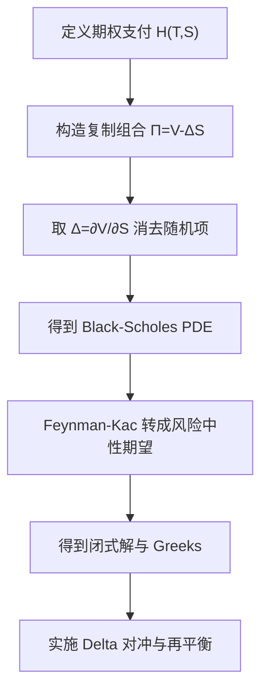

# Quantitative Finance（Chapter 3）

> 资料来源：_Mathematical Modeling and Computation in Finance_（Chapter 3）  
> 主题：Black-Scholes 期权定价方程（Black-Scholes PDE）、费曼-卡茨定理（Feynman-Kac Theorem）、闭式解、Delta 对冲（Delta Hedging）

## 一句话理解

本章把“期权怎么定价”这件事讲清楚了：先用复制组合（replicating portfolio）推导 Black-Scholes PDE，再用 Feynman-Kac 把 PDE 解转成风险中性贴现期望，最后落到闭式公式与动态对冲实践。

---

## 本章核心问题

1. 欧式看涨/看跌期权（European call/put option）的价值如何定义？
2. Black-Scholes PDE 为什么成立？
3. PDE 与“风险中性期望定价”之间如何互相对应？
4. Delta 对冲能否在实践中消除风险？

---

## 1. 期权基本定义与到期支付

欧式看涨（call）到期支付：

  $$
  V_c(T,S)=H_c(T,S):=\max(S(T)-K,0).
  $$

欧式看跌（put）到期支付：

  $$
  V_p(T,S)=H_p(T,S):=\max(K-S(T),0).
  $$

其中：

- `K` 是执行价（strike）
- `T` 是到期日（maturity）
- `S(T)` 是到期时标的价格

### 一句话理解

期权本质是“非线性支付函数”，到期价值由 `max` 结构决定。

---

## 2. 欧式看涨/看跌平价（Put-Call Parity）

在无套利框架下：

  $$
  V_c(t,S)=V_p(t,S)+S(t)-Ke^{-r(T-t)}.
  $$

若标的连续分红收益率为 `q`：

  $$
  V_c(t,S)=V_p(t,S)+S(t)e^{-q(T-t)}-Ke^{-r(T-t)}.
  $$

### 为什么重要

它是最核心的静态套利约束之一，也是检查市场报价一致性的第一把尺子。

---

## 3. Black-Scholes PDE：复制组合推导

假设标的在风险中性测度下服从 GBM（Geometric Brownian Motion）：

  $$
  dS(t)=rS(t)\,dt+\sigma S(t)\,dW^Q(t).
  $$

构造组合（多一份期权，空 `\Delta` 份股票）：

  $$
  \Pi(t,S)=V(t,S)-\Delta S(t).
  $$

取 `\Delta=\frac{\partial V}{\partial S}` 消去随机项后，组合应按无风险利率增长，得到 Black-Scholes PDE：

  $$
  \frac{\partial V}{\partial t}
  +\frac{1}{2}\sigma^2S^2\frac{\partial^2V}{\partial S^2}
  +rS\frac{\partial V}{\partial S}
  -rV=0.
  $$

终端条件：

  $$
  V(T,S)=H(T,S).
  $$

若有连续分红 `q`，PDE 漂移项变为：

  $$
  \frac{\partial V}{\partial t}
  +\frac{1}{2}\sigma^2S^2\frac{\partial^2V}{\partial S^2}
  +(r-q)S\frac{\partial V}{\partial S}
  -rV=0.
  $$

---

## 4. Feynman-Kac：PDE 解 = 风险中性贴现期望

Feynman-Kac 给出等价表示：

  $$
  V(t,S)=\mathbb E^Q\!\left[e^{-r(T-t)}H(S(T))\mid\mathcal F_t\right].
  $$

### 一句话理解

“解 PDE”与“做风险中性期望”是同一件事的两种视角。

---

## 5. Black-Scholes 闭式解与 Greeks

欧式看涨闭式解：

  $$
  V_c(t,S)=S\,N(d_1)-Ke^{-r(T-t)}N(d_2),
  $$

其中：

  $$
  d_1=\frac{\ln(S/K)+(r+\frac12\sigma^2)(T-t)}{\sigma\sqrt{T-t}},
  \qquad
  d_2=d_1-\sigma\sqrt{T-t}.
  $$

欧式看跌闭式解：

  $$
  V_p(t,S)=Ke^{-r(T-t)}N(-d_2)-S\,N(-d_1).
  $$

看涨 Delta（Greek）：

  $$
  \Delta_c=\frac{\partial V_c}{\partial S}=N(d_1).
  $$

看跌 Delta：

  $$
  \Delta_p=\frac{\partial V_p}{\partial S}=N(d_1)-1.
  $$

---

## 6. 数字期权与密度直觉

现金或无（cash-or-nothing）数字看涨的价格可写为：

  $$
  V_{\text{digital}}(t,S)=Ke^{-r(T-t)}N(d_2).
  $$

这类结果说明：风险中性分布（risk-neutral density）可以由期权价格结构反推，是后续 Fourier/密度方法的起点。

---

## 7. Delta 对冲与再平衡

连续时间极限下，`\Delta=\partial_S V` 可局部消去一阶价格风险；  
但离散再平衡时，组合仍受 Gamma、交易成本和跳跃风险影响。

### 实务直觉

- 再平衡越频繁，复制误差通常越小
- 但交易成本越高，净效果不一定更好
- 对冲是“误差管理”，不是“风险清零”

---

## 方法流程图

---

## 常见误解

### 误解 1：有 Black-Scholes 公式就不需要 PDE

不对。闭式解只覆盖部分产品；PDE 框架可扩展到更复杂边界和结构。

### 误解 2：Delta 对冲后就完全无风险

不对。离散调仓、交易成本、波动率错配都会带来残余 P&L 波动。

### 误解 3：`P` 测度下的真实收益率直接用于定价

不对。无套利定价核心在 `Q` 测度下贴现期望。

---

## 本章小结

- 理论主线：复制组合 -> PDE -> Feynman-Kac -> 风险中性定价。
- 计算主线：Black-Scholes 闭式解给出 vanilla 期权与 Delta 的快速计算。
- 实务主线：对冲效果取决于再平衡频率、模型误差与交易 frictions。

---

## 讨论题

1. 为什么同一个定价问题，PDE 与风险中性期望都能成立？
2. 如果波动率不是常数，哪些 Black-Scholes 结论会先失效？
3. 在交易成本存在时，最优再平衡频率如何权衡？
