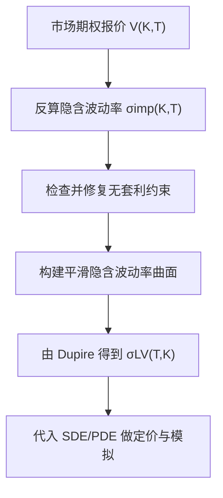

# Quantitative Finance（Chapter 4）

> 资料来源：_Mathematical Modeling and Computation in Finance_（Chapter 4）  
> 主题：局部波动率模型（Local Volatility Models）、隐含波动率微笑（Implied Volatility Smile）、Breeden-Litzenberger、Dupire 方程、无套利插值

## 一句话理解

这章回答的是：既然 Black-Scholes 常波动率无法匹配市场微笑（smile/skew），我们如何从市场期权价格反推出“状态相关波动率” `\sigma_{LV}(T,K)`，并保证插值过程不引入套利。

---

## 本章核心问题

1. 为什么 Black-Scholes 模型会与真实市场隐含波动率曲面不一致？
2. 如何从欧式期权价格恢复风险中性密度（risk-neutral density）？
3. Dupire 局部波动率公式如何由市场报价导出？
4. 为什么“插值”本身也可能制造套利？

---

## 1. 隐含波动率（Implied Volatility）与微笑

给定市场看涨价格 `V_c^{mkt}(K,T)`，隐含波动率定义为使 Black-Scholes 价格匹配市场价格的 `\sigma_{imp}`：

  $$
  V_c^{BS}(t_0,S_0;K,T,\sigma_{imp},r)=V_c^{mkt}(K,T).
  $$

对应求根问题：

  $$
  g(\sigma)=V_c^{mkt}(K,T)-V_c^{BS}(t_0,S_0;K,T,\sigma,r)=0.
  $$

Newton-Raphson 迭代：

  $$
  \sigma^{(k+1)}=\sigma^{(k)}-\frac{g(\sigma^{(k)})}{g'(\sigma^{(k)})}.
  $$

### 关键实践点

- 深度 ITM/OTM 时 vega 很小，Newton 可能不稳定
- 常见做法是 “二分法 + Newton” 组合，先稳再快

---

## 2. 期权价格与风险中性密度：Breeden-Litzenberger

欧式期权价格可写为贴现期望：

  $$
  V(t_0,S_0;K,T)=e^{-r(T-t_0)}\int_0^\infty H(T,y)f_{S(T)}(y)\,dy.
  $$

对看涨价格按执行价求导：

  $$
  \frac{\partial^2 V_c(t_0,S_0;K,T)}{\partial K^2}
  =e^{-r(T-t_0)}f_{S(T)}(K),
  $$

即：

  $$
  f_{S(T)}(K)=e^{r(T-t_0)}\frac{\partial^2 V_c(t_0,S_0;K,T)}{\partial K^2}.
  $$

### 一句话理解

“看涨价格对 strike 的曲率”就是风险中性密度。

---

## 3. 局部波动率模型与 Dupire 公式

局部波动率 SDE：

  $$
  dS(t)=rS(t)\,dt+\sigma_{LV}(t,S)S(t)\,dW(t).
  $$

对应定价 PDE（欧式看涨终端条件）：

  $$
  \frac{\partial V}{\partial t}
  +\frac12\sigma_{LV}^2(t,S)S^2\frac{\partial^2V}{\partial S^2}
  +rS\frac{\partial V}{\partial S}
  -rV=0,\qquad
  V(T,S)=\max(S-K,0).
  $$

由 Fokker-Planck 与期权价格关系推导得 Dupire 局部波动率：

  $$
  \sigma_{LV}^2(T,K)=
  \frac{
  \frac{\partial V_c}{\partial T}
  +rK\frac{\partial V_c}{\partial K}
  }{
  \frac12 K^2\frac{\partial^2V_c}{\partial K^2}
  }.
  $$

### 为什么重要

它给出“由市场 vanilla 期权面 -> 局部波动率面”的直接映射。

---

## 4. 用隐含波动率表示 Dupire：更稳的数值实现

书中将 `\sigma_{LV}` 改写为 `\sigma_{imp}(T,K)` 的函数（通过总方差 `w=\sigma_{imp}^2(T,K)(T-t_0)`），核心动机是：

- 直接用 `\partial_K^2 V` 数值噪声很大
- 用隐含波动率面做参数化后，导数计算更稳定

本质上：从“价格曲面导数”转为“隐含波动率曲面导数”。

---

## 5. 无套利插值条件（Arbitrage-Free Conditions）

当市场 quote 稀疏时必须插值，但插值需满足：

1. 日历套利约束（calendar spread）  
   到期更晚的同 strike 看涨不应更便宜

  $$
  V_c(K,T+\Delta T)-V_c(K,T)>0.
  $$

2. Strike 单调性（monotonicity）  
   看涨价格随 `K` 增大而下降

  $$
  V_c(K+\Delta K,T)-V_c(K,T)<0.
  $$

3. 蝶式套利约束（butterfly）  
   离散二阶差分非负（对应密度非负）

  $$
  V_c(K+\Delta K,T)-2V_c(K,T)+V_c(K-\Delta K,T)\ge 0.
  $$

并且：

  $$
  \frac{\partial V_c}{\partial K}=e^{-r(T-t_0)}(F_{S(T)}(K)-1),\qquad
  \frac{\partial^2V_c}{\partial K^2}=e^{-r(T-t_0)}f_{S(T)}(K).
  $$

---

## 6. 插值方法比较：线性 vs 参数化（如 SABR/Hagan）

章节强调：

- 线性/样条插值虽简单，但可能导致密度不平滑甚至负密度
- 来自无套利动态模型的参数化（如 SABR 近似）通常更稳
- “拟合价格”不等于“无套利一致”，需要同时检验导数约束

---

## 方法流程图

---

## 常见误解

### 误解 1：只要拟合到报价，就一定可用于风险管理

不对。若存在静态套利，后续密度、局部波动率与对冲结论会失真。

### 误解 2：局部波动率模型是“参数越少越简单”

不对。它虽是“非参数”思想，但数值实现依赖高质量曲面与导数稳定性。

### 误解 3：从价格算二阶导不会有问题

不对。二阶导最容易放大噪声，是局部波动率实务的主要数值难点之一。

---

## 本章小结

- 现象层：隐含波动率 smile/skew 直接否定了常波动率假设。
- 理论层：Breeden-Litzenberger 把价格曲率与风险中性密度连接起来。
- 模型层：Dupire 公式提供了从市场 vanilla 到局部波动率的桥梁。
- 工程层：无套利插值与导数稳定性，决定模型能否真正落地。

---

## 讨论题

1. 如果市场报价有噪声，先平滑价格面还是先平滑隐含波动率面？
2. 在什么市场状态下，局部波动率会出现不合理尖峰？
3. 为什么“无套利约束”本质上是对 CDF/PDF 形状的约束？
