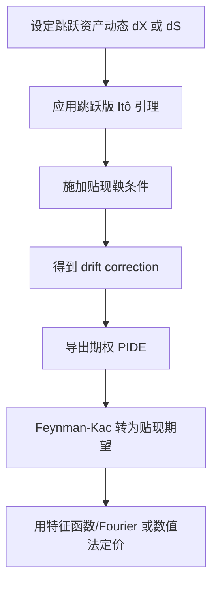

# Quantitative Finance（Chapter 5）

> 资料来源：_Mathematical Modeling and Computation in Finance_（Chapter 5）  
> 主题：跳跃过程（Jump Processes）、跳扩散（Jump Diffusion）、PIDE、Lévy 过程、等价鞅测度（Equivalent Martingale Measure, EMM）

## 一句话理解

本章从“连续扩散”走向“带跳资产模型”：用 Poisson 跳跃刻画突发价格变化，定价方程从 PDE 升级为 PIDE，并在指数 Lévy 框架下解释为什么漂移必须做 martingale 修正。

---

## 本章核心问题

1. 为什么仅靠 GBM 很难解释市场微笑（smile）？
2. 带跳模型下，资产与期权定价方程如何变化？
3. 为什么 risk-neutral 漂移不再是简单的 `r`？
4. Lévy 市场为什么通常是不完备市场（incomplete market）？

---

## 1. 跳扩散模型：从 GBM 到 Jump Diffusion

书中先给出对数价格过程（在真实测度 `P` 下）：

  $$
  dX(t)=\mu\,dt+\sigma\,dW^P(t)+J\,dX_P^P(t),
  $$

其中：

- `X_P(t)` 是 Poisson 过程（jump counting）
- `J` 是跳幅（jump size）随机变量
- 跳跃与 Brownian 扩散独立

Poisson 过程核心性质（强度 `\xi_p`）：

  $$
  \mathbb P\!\left[X_P(s+t)-X_P(s)=k\right]=\frac{(\xi_p t)^k e^{-\xi_p t}}{k!}.
  $$

并且：

  $$
  \mathbb E[X_P(t)]=\xi_p t.
  $$

---

## 2. Itô 引理的跳跃扩展与漂移修正

在跳跃场景下，`g(t,X(t))` 的变化除了连续项，还要加“跳前到跳后”的离散增量项。  
应用到 `S(t)=e^{X(t)}` 后可得：risk-neutral 下的收益率动态不是简单 `r\,dt`，而是：

  $$
  \frac{dS(t)}{S(t)}
  =
  \left(r-\xi_p\mathbb E[e^J-1]\right)dt
  +\sigma\,dW^Q(t)
  +(e^J-1)\,dX_P^Q(t).
  $$

这里

  $$
  \bar\omega:=\xi_p\mathbb E[e^J-1]
  $$

是“跳跃漂移修正项”（drift correction / convexity correction）。

### 一句话理解

跳跃会改变平均增长率，所以必须减去补偿项，才能让贴现价格成为鞅。

---

## 3. 定价方程：PDE -> PIDE

在 jump diffusion 下，期权价格 `V(t,S)` 满足偏积分微分方程（PIDE）：

  $$
  \frac{\partial V}{\partial t}
  +\left(r-\xi_p\mathbb E[e^J-1]\right)S\frac{\partial V}{\partial S}
  +\frac12\sigma^2S^2\frac{\partial^2V}{\partial S^2}
  -(r+\xi_p)V
  +\xi_p\mathbb E\!\left[V(t,Se^J)\right]
  =0.
  $$

其中新增积分期望项就是“跳跃贡献”，这也是数值上比 PDE 难得多的根源。

---

## 4. 跳跃版 Feynman-Kac

虽然方程从 PDE 升级为 PIDE，但风险中性贴现期望形式仍成立：

  $$
  V(t,S)=\mathbb E^Q\!\left[e^{-r(T-t)}H(T,S(T))\mid\mathcal F_t\right].
  $$

### 含义

- “解 PIDE”与“算贴现期望”依然等价
- 后续可走 Monte Carlo 或 Fourier 路线

---

## 5. 指数 Lévy 框架：有限/无限活跃跳跃

章节把 jump diffusion 放到更一般的指数 Lévy 框架：

- **有限活跃（finite activity）**：有限次跳跃（如复合 Poisson）
- **无限活跃（infinite activity）**：有限时间内可有无限多小跳（如 VG、CGMY）

对于很多 Lévy 模型，特征函数（characteristic function）有闭式表达，这为下一章 Fourier 定价提供核心工具。

---

## 6. 不完备市场与 EMM 选择

与 Black-Scholes 不同，Lévy 跳跃市场通常不完备：

- 不能仅靠股票 + 现金做完美复制
- 一般存在多个等价鞅测度（EMM）

风险中性条件写成：

  $$
  e^{-rt}\mathbb E^Q[S(t)\mid\mathcal F_0]=S_0.
  $$

即要求贴现价格过程是鞅。  
这在实务上对应“如何选测度/如何设 drift correction”的模型选择问题。

---

## 7. 例子：VG 模型漂移修正直觉

章节以 Variance Gamma（VG）说明：即使有闭式特征函数，仍需通过 martingale 条件确定漂移参数，常写成：

  $$
  \mu_{VG}=r+\bar\omega,
  $$

其中 `\bar\omega` 由模型参数（如 `\beta,\theta,\sigma_{VG}`）决定，用于保证风险中性一致性。

---

## 方法流程图

---

## 常见误解

### 误解 1：跳扩散只是给 GBM “加个噪声项”

不对。它会改变 drift、定价方程结构、对冲可复制性和测度唯一性。

### 误解 2：有了 Delta 对冲就能在跳跃市场完全复制

不对。跳跃风险通常无法被单一标的连续调仓完全对冲。

### 误解 3：风险中性下漂移总是 `r`

不对。带跳模型中需要 `\bar\omega` 修正，否则贴现价格不一定是鞅。

---

## 本章小结

- 建模层：加入 Poisson/Lévy 跳跃后，可刻画厚尾与偏斜。
- 数学层：定价方程从 PDE 变为 PIDE，难度上升但结构更真实。
- 金融层：市场从“可完美复制”走向“不完备”，EMM 选择成为核心问题。
- 计算层：特征函数闭式为 Fourier 定价铺路（Chapter 6 关键接口）。

---

## 讨论题

1. 为什么 jump risk 使得“唯一风险中性测度”不再成立？
2. 对同一市场数据，Merton jump diffusion 与 VG/CGMY 的校准差异来自哪里？
3. 在存在跳跃时，实务中应如何补充 Delta 之外的风险管理工具？
