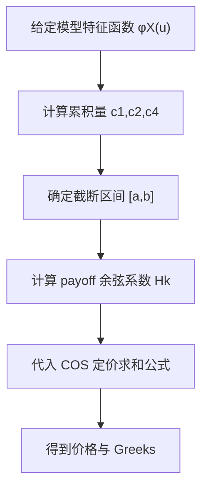

# Quantitative Finance（Chapter 6）

> 资料来源：_Mathematical Modeling and Computation in Finance_（Chapter 6）  
> 主题：COS 方法（Fourier COS Method）、特征函数（Characteristic Function）、欧式期权快速定价

## 一句话理解

这一章的核心是：把风险中性定价积分中的密度函数，用 Fourier 余弦展开替代，并用特征函数直接给出展开系数，从而得到一个**高精度、低复杂度**的欧式期权定价算法。

---

## 本章核心问题

1. 如何用特征函数恢复密度并做定价？
2. COS 方法的主公式是什么？
3. 为什么 COS 方法收敛快、计算快？
4. 误差来自哪里，如何控制？

---

## 1. 定价起点：风险中性积分

令 `X(T)=\log(S(T)/K)`，欧式期权价格写成：

  $$
  V(t_0,S_0)=e^{-r\tau}\int_{\mathbb R} v(x)\,f_X(x)\,dx,\qquad \tau:=T-t_0,
  $$

其中 `v(x)` 是以 `x` 表示的到期支付函数，`f_X` 是风险中性密度。

COS 思想：在截断区间 `[a,b]` 上用余弦级数逼近 `f_X`。

---

## 2. 特征函数与密度：Fourier 对偶

特征函数定义：

  $$
  \varphi_X(u)=\int_{\mathbb R}e^{iux}f_X(x)\,dx.
  $$

在 `[a,b]` 上，密度近似为：

  $$
  f_X(x)\approx\sum_{k=0}^{N-1}{}^{\prime} A_k
  \cos\!\left(k\pi\frac{x-a}{b-a}\right),
  $$

并且系数可由特征函数近似给出：

  $$
  A_k\approx
  \frac{2}{b-a}\,
  \Re\!\left[
  \varphi_X\!\left(\frac{k\pi}{b-a}\right)
  e^{-ik\pi\frac{a}{b-a}}
  \right].
  $$

### 一句话理解

有了 `\varphi_X`，就能直接得到密度展开系数，不必显式求密度闭式。

---

## 3. COS 欧式定价公式

将密度展开代回风险中性积分，可得定价近似：

  $$
  V(t_0,S_0)\approx
  e^{-r\tau}
  \sum_{k=0}^{N-1}{}^{\prime}
  \Re\!\left[
  \varphi_X\!\left(\frac{k\pi}{b-a}\right)
  e^{-ik\pi\frac{a}{b-a}}
  \right]
  H_k,
  $$

其中 `H_k` 是支付函数在 `[a,b]` 上的余弦系数：

  $$
  H_k=\frac{2}{b-a}\int_a^b
  v(x)\cos\!\left(k\pi\frac{x-a}{b-a}\right)\,dx.
  $$

对 vanilla call/put，`H_k` 可以写成闭式，因此计算非常快。

---

## 4. 截断区间 `[a,b]` 的选择

常用做法是用前几阶累积量（cumulants）控制概率质量：

  $$
  [a,b]
  =
  \left[c_1-L\sqrt{c_2+\sqrt{c_4}},\;
  c_1+L\sqrt{c_2+\sqrt{c_4}}\right],
  $$

其中 `c_1,c_2,c_4` 分别是 `X(T)` 的一、二、四阶累积量，`L` 常取 8~12。

### 直觉

- 区间太小：截断误差大（尾部被切掉）
- 区间太大：同样 `N` 下分辨率下降

---

## 5. 误差来源与收敛

章节把误差分为三部分：

1. 积分域截断误差（tail truncation）
2. 余弦级数截断误差（finite `N`）
3. 系数近似误差（由 `\varphi_X` 替代）

对于足够光滑的密度，COS 方法通常呈指数收敛（exponential convergence），同时复杂度随 `N` 线性增长，性价比很高。

---

## 6. 与其他 Fourier 方法的关系

章节也讨论了 FFT/Carr-Madan 等 Fourier 方法。  
相对而言，COS 的优势在于：

- 不必固定在单一 FFT 网格结构
- 对欧式产品可直接利用支付系数闭式
- 在许多 Lévy/仿射模型下实现更直接

---

## 7. 适用范围

只要模型特征函数可得（闭式或稳定数值形式），COS 都可用。  
书中示例包括：

- GBM
- Merton / Kou 跳扩散
- VG / CGMY / NIG 等指数 Lévy
- 后续章节中的随机波动率类模型

---

## 方法流程图

---

## 常见误解

### 误解 1：COS 只适用于 Black-Scholes

不对。关键条件是“特征函数可用”，不是“扩散模型”本身。

### 误解 2：`N` 越大一定越好

不完全对。若 `[a,b]` 选得不合理，盲目增大 `N` 收益有限。

### 误解 3：COS 的误差只来自级数截断

不对。尾部截断误差与区间选取常常同样关键。

---

## 本章小结

- 理论上：COS 用余弦展开把积分定价问题转化为“特征函数 + 系数求和”。
- 算法上：线性复杂度 + 指数收敛，使其成为欧式期权的高效基线方法。
- 实务上：模型选择、累积量区间和 payoff 系数实现细节决定最终精度。

---

## 讨论题

1. 在跳跃模型下，如何系统选择 `L` 和 `N` 达到目标精度？
2. COS 与 Carr-Madan FFT 在网格、稳定性和扩展性上各自优缺点是什么？
3. 若 payoff 存在不光滑点，如何改进 COS 收敛（如过滤/分段处理）？
