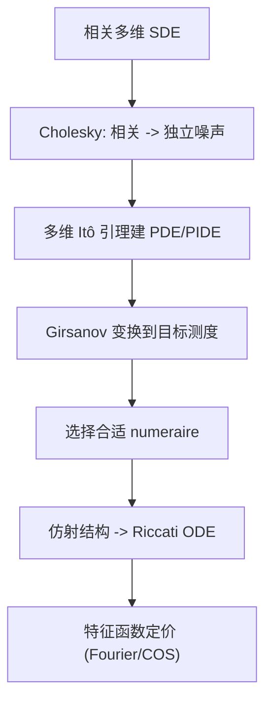

# Quantitative Finance（Chapter 7）

> 资料来源：_Mathematical Modeling and Computation in Finance_（Chapter 7）  
> 主题：多维随机系统（Multidimensional SDEs）、换测度（Change of Measure）、换计价资产（Change of Numeraire）、仿射过程（Affine Processes）

## 一句话理解

这章是后续高级模型的“数学工具箱”：先把相关 Brownian 系统标准化，再用 Girsanov 与 numeraire 技术切换到更易定价的测度，最后给出仿射过程“特征函数可解”的统一框架。

---

## 本章核心问题

1. 多维相关 Brownian 该如何构造与模拟？
2. 在不同测度下，SDE 漂移为何会变化而波动不变？
3. 为什么换 numeraire 可以简化定价？
4. 什么是仿射过程，为什么它对 Fourier 定价很关键？

---

## 1. 多维相关 Brownian 与 Cholesky 分解

相关 Brownian 向量 `W(t)` 的协方差结构写作相关矩阵 `C`，满足：

  $$
  C = LL^\top,
  $$

其中 `L` 为 Cholesky 下三角矩阵。若 `\widetilde W(t)` 为独立 Brownian，则可构造：

  $$
  W(t)=L\,\widetilde W(t).
  $$

### 2 维常见形式

  $$
  C=
  \begin{bmatrix}
  1 & \rho\\
  \rho & 1
  \end{bmatrix},
  \quad
  L=
  \begin{bmatrix}
  1 & 0\\
  \rho & \sqrt{1-\rho^2}
  \end{bmatrix}.
  $$

### 一句话理解

Cholesky 把“相关性问题”拆成“独立噪声 + 线性映射”，便于理论推导和 Monte Carlo 实现。

---

## 2. 多维 Itô 引理与定价 PDE（高维版本）

设状态向量 `X_t\in\mathbb R^n`，函数 `V(t,X_t)` 的 Itô 展开包含：

- 时间导数 `\partial_t V`
- 梯度项 `\nabla V` 与漂移
- Hessian 项 `\nabla^2V` 与协方差矩阵

对应风险中性定价 PDE 的结构是“对流-扩散-反应”型，和一维 Black-Scholes 形式一致，只是导数升级为向量/矩阵版本。

---

## 3. 换测度：Radon-Nikodym 与 Girsanov

章节核心结论：在绝对连续测度变换下，扩散项保持，漂移项重写。  
一般可表示为 Brownian 变换：

  $$
  dW^{\mathbb N}(t)=dW^{\mathbb M}(t)+\lambda(t)\,dt,
  $$

其中 `\lambda` 是 market price of risk（或与 numeraire 相关的漂移调整项）。

### Black-Scholes 中从 `P` 到 `Q`

在经典模型下可写成：

  $$
  dW^Q(t)=\frac{\mu-r}{\sigma}\,dt+dW^P(t),
  $$

进而资产动态变为风险中性形式：

  $$
  dS(t)=rS(t)\,dt+\sigma S(t)\,dW^Q(t).
  $$

---

## 4. 换计价资产（Change of Numeraire）

若以 `N(t)` 为新的 numeraire，则归一化价格 `V(t)/N(t)` 在对应测度下应为鞅。  
核心思想：

- 选对 numeraire，可把原本复杂的期望简化
- 常见 choices：money market、zero-coupon bond、stock numeraire

### 一句话理解

“换计价资产”本质是换观察坐标，让定价期望更容易算。

---

## 5. 仿射扩散（AD）与仿射跳扩散（AJD）

仿射类过程的关键优势：对数特征函数是指数仿射形式：

  $$
  \phi_X(u;t,T)
  =
  \exp\!\left(
  A(\tau,u)+B(\tau,u)^\top X_t
  \right),\qquad \tau=T-t.
  $$

其中 `A,B` 满足 Riccati 型 ODE 系统。  
这意味着：

- 不必直接解高维 PDE/PIDE
- 可转而解 ODE，再用 Fourier/COS 做定价

---

## 6. 为什么这章重要（承上启下）

- 与 Chapter 6 连接：给出“可计算特征函数”的结构条件
- 与后续 Heston/SABR/多因子模型连接：换测度与相关结构是基础动作
- 与实务连接：quanto、利率衍生品、多资产产品都依赖这套工具

---

## 方法流程图

---

## 常见误解

### 误解 1：换测度会改变“随机性强弱”

不对。扩散系数通常不变，主要变化在漂移表示。

### 误解 2：相关性只影响模拟，不影响定价结构

不对。相关性进入协方差项，直接影响 PDE 的混合二阶导与风险暴露。

### 误解 3：有了仿射形式就不需要数值方法

不对。虽然特征函数可得，但积分/反演与校准仍需要稳定数值算法。

---

## 本章小结

- 数学层：多维 Itô + Girsanov + Radon-Nikodym 构成换测度主框架。
- 模型层：Cholesky 处理相关结构，仿射类提供可解特征函数。
- 计算层：PDE/PIDE 问题可转向 Riccati ODE + Fourier 类高效定价。

---

## 讨论题

1. 什么时候“换 numeraire”比“直接在 risk-neutral measure 下积分”更高效？
2. 多维模型中相关参数不稳定时，如何提高校准鲁棒性？
3. 若模型不是仿射类，特征函数方法如何近似扩展？
