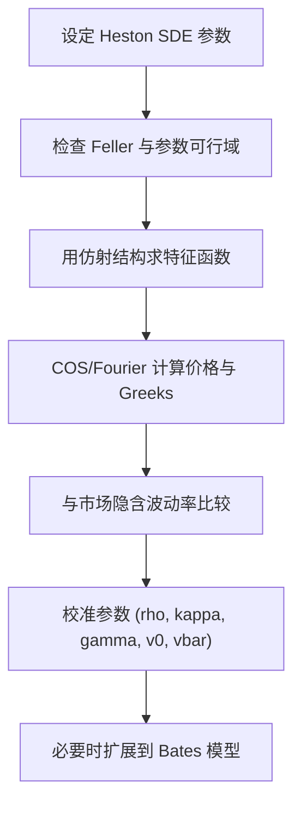

# Quantitative Finance（Chapter 8）

> 资料来源：_Mathematical Modeling and Computation in Finance_（Chapter 8）  
> 主题：随机波动率模型（Stochastic Volatility Models）、Heston 模型、CIR 方差过程、特征函数定价与校准

## 一句话理解

本章把“波动率是常数”升级为“波动率是随机过程”：用 Heston 的二维 SDE（价格 + 方差）解释市场 smile/skew，并通过仿射结构得到可计算的特征函数。

---

## 本章核心问题

1. 为什么要从局部波动率/跳跃模型进一步走向随机波动率？
2. 方差过程为什么常用 CIR（而不是直接 OU 波动率）？
3. Heston 定价 PDE 如何建立？
4. Heston 参数如何影响隐含波动率曲线与校准稳定性？

---

## 1. 随机波动率建模动机

相比 Black-Scholes 常波动率：

- 市场隐含波动率曲面呈现 smile/skew
- 波动率本身具有“均值回复 + 随机扰动”
- 中长期欧式与路径依赖产品更需要动态方差结构

章节强调：SV（stochastic volatility）模型在“截面拟合 + 动态演化”之间更平衡。

---

## 2. Schöbel-Zhu 与 CIR 方差过程

Schöbel-Zhu 模型先用 OU 过程驱动波动率：

  $$
  d\sigma(t)=\kappa(\bar\sigma-\sigma(t))dt+\gamma\,dW_\sigma^Q(t).
  $$

但 OU 可能出现负波动率，因此实务更常改为“方差”服从 CIR：

  $$
  dv(t)=\kappa(\bar v-v(t))dt+\gamma\sqrt{v(t)}\,dW_v^Q(t).
  $$

其中 `v(t)=\sigma^2(t)`。

### Feller 条件

  $$
  2\kappa\bar v \ge \gamma^2.
  $$

满足时方差更不易触及 0；不满足时左尾可能出现近奇异堆积（章节中有 PDF/CDF 对比图）。

---

## 3. Heston 模型：价格-方差耦合系统

Heston 在风险中性测度下可写为：

  $$
  \begin{aligned}
  dS(t)&=rS(t)\,dt+\sqrt{v(t)}\,S(t)\,dW_x^Q(t),\\
  dv(t)&=\kappa(\bar v-v(t))dt+\gamma\sqrt{v(t)}\,dW_v^Q(t),\\
  dW_x^Q(t)\,dW_v^Q(t)&=\rho_{x,v}\,dt.
  \end{aligned}
  $$

### 一句话理解

`ρ_{x,v}` 把“价格冲击”和“方差冲击”连接起来，是 skew 方向的核心来源。

---

## 4. Heston 二维定价 PDE

期权价值 `V(t,S,v)` 满足二维 PDE（典型结构）：

  $$
  \frac{\partial V}{\partial t}
  +\frac12 vS^2\frac{\partial^2V}{\partial S^2}
  +\rho_{x,v}\gamma vS\frac{\partial^2V}{\partial S\partial v}
  +\frac12\gamma^2 v\frac{\partial^2V}{\partial v^2}
  +rS\frac{\partial V}{\partial S}
  +\kappa(\bar v-v)\frac{\partial V}{\partial v}
  -rV=0.
  $$

与 Black-Scholes 相比，新增了：

- 方差方向扩散项
- 价格-方差混合二阶导项
- 方差漂移项

---

## 5. 特征函数与仿射结构

章节核心结论：Heston 属于仿射类（在适当变量下），其贴现特征函数可写为指数仿射形式，参数由 Riccati ODE 决定。  
这使得：

- COS/Fourier 方法可直接应用（衔接 Chapter 6）
- 计算速度远高于直接二维 PDE 网格法（特别是多 strike 场景）

---

## 6. 参数对 smile/skew 的影响（校准直觉）

章节给出系统参数敏感性：

- `\gamma`（vol-of-vol）增大：smile 曲率通常更强
- `\rho_{x,v}` 更负：左偏 skew 更陡
- `\kappa` 增大：方差回归更快，期限结构更“拉回”长期均值
- `v_0` 主要影响短期限 ATM 附近
- `\bar v` 决定长期波动率水平锚点

---

## 7. 校准实践要点

常见困难：

- 参数耦合强（多组参数可产生相似曲线）
- 目标函数可能多局部极值
- Feller 条件与市场拟合有时冲突

实务策略：

- 用短期限 ATM 估 `v_0`
- 用长期期限水平锚定 `\bar v`
- 先粗网格后局部优化，配合参数约束

---

## 8. 扩展：Bates（Heston + 跳跃）

章节后段介绍 Bates：在 Heston 基础上叠加跳跃项，进一步增强尾部和短期限 smile 拟合能力。  
结构上保持“扩散随机波动率 + 跳跃补充”的混合建模思路。

---

## 方法流程图

---

## 常见误解

### 误解 1：只要 Heston 就一定能完美拟合全曲面

不对。Heston 很强，但在极端短期限/深度 OTM 区域仍可能不足。

### 误解 2：Feller 条件必须严格满足才能使用模型

不完全对。实务校准中常出现违反 Feller 但仍可定价的参数，需要结合稳定性与业务约束判断。

### 误解 3：负相关 `\rho` 只影响价格，不影响风险管理

不对。它直接影响 skew、对冲敏感度与压力场景结果。

---

## 本章小结

- 建模层：随机波动率通过额外状态变量 `v(t)` 补足常波动率不足。
- 数学层：Heston PDE 为二维耦合对流-扩散方程。
- 计算层：仿射特征函数让 COS/Fourier 高效可用。
- 实务层：参数解释清晰，但校准需处理耦合、多解与稳定性问题。

---

## 讨论题

1. 当短期限 smile 很陡时，优先调 `\gamma` 还是跳跃扩展（Bates）？
2. 若校准结果持续违反 Feller 条件，应如何设置约束与惩罚项？
3. 在同等误差下，Heston-PDE 与 Heston-COS 的工程选型标准是什么？
