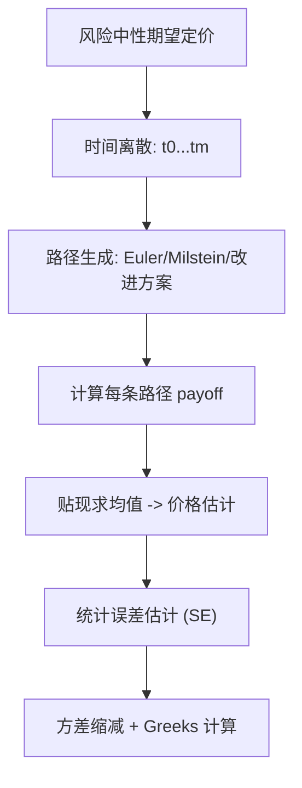

# Quantitative Finance（Chapter 9）

> 资料来源：_Mathematical Modeling and Computation in Finance_（Chapter 9）  
> 主题：蒙特卡洛模拟（Monte Carlo Simulation）、Euler/Milstein 离散化、CIR/Heston 路径模拟、方差缩减与 Greeks

## 一句话理解

这章把“随机过程定价”真正落到工程实现：如何把连续时间 SDE 变成可模拟路径、如何控制离散误差与统计误差、以及如何在 Monte Carlo 框架下稳定计算 Greeks。

---

## 本章核心问题

1. Monte Carlo 定价的统计误差怎么量化？
2. Euler 与 Milstein 离散化有何区别？
3. 为什么 CIR/Heston 不能直接用朴素 Euler？
4. 如何提高 Monte Carlo 收敛速度并计算 Greeks？

---

## 1. Monte Carlo 定价基础

欧式定价（风险中性）：

  $$
  V(t_0,S_0)=e^{-r(T-t_0)}\mathbb E^Q[H(T,S)\mid\mathcal F_{t_0}].
  $$

用 `N` 条路径近似：

  $$
  \widehat V_N
  =
  e^{-r(T-t_0)}\frac{1}{N}\sum_{j=1}^N H_j.
  $$

样本标准误差（standard error）近似：

  $$
  \varepsilon_N\approx \frac{\widehat \upsilon_N}{\sqrt{N}}.
  $$

### 关键结论

- 误差阶通常是 `O(N^{-1/2})`
- 路径数提高 4 倍，统计误差大约减半

---

## 2. SDE 离散化：Euler 与 Milstein

对一维 Itô 过程

  $$
  dX_t=\mu(t,X_t)dt+\sigma(t,X_t)dW_t,
  $$

Euler-Maruyama：

  $$
  X_{i+1}=X_i+\mu(t_i,X_i)\Delta t+\sigma(t_i,X_i)\Delta W_i.
  $$

Milstein（标量情形）：

  $$
  X_{i+1}=X_i+\mu_i\Delta t+\sigma_i\Delta W_i
  +\frac12\sigma_i\frac{\partial \sigma_i}{\partial x}\left((\Delta W_i)^2-\Delta t\right).
  $$

### 一句话理解

Milstein 比 Euler 多了“二阶修正项”，通常强收敛更快，但在高维相关系统中实现复杂度更高。

---

## 3. CIR 非负性问题与替代离散化

CIR 过程（如方差过程）理论上非负，但朴素 Euler 可能产生负值。  
这在 Heston 模型里会直接导致 `\sqrt{v}` 数值不稳定。

章节给出思路：

- Truncated Euler（截断）
- Reflecting Euler（反射）
- 更高质量的近似/几乎精确（almost exact）方案

### 核心直觉

“离散化方案是否保持结构性质（非负性）”比单纯局部精度更重要。

---

## 4. Heston 的 Monte Carlo 模拟

Heston 为二维系统（价格 + 方差），路径模拟挑战在于：

- 方差过程 `v_t` 的稳定离散
- 相关 Brownian 的构造
- 偏差（bias）与方差（variance）权衡

章节展示了相较截断 Euler 更低偏差的模拟流程（如基于桥接思想与条件分布近似），在相同计算量下能显著提升精度。

---

## 5. 方差缩减（Variance Reduction）

章节强调常用加速手段：

- 重要抽样（importance sampling）
- 控制变量（control variates）
- 分层/拟蒙特卡洛（stratified / QMC）
- 多层蒙特卡洛（MLMC）

### 一句话理解

Monte Carlo 的核心不是“盲目加路径”，而是“让每条路径更有信息量”。

---

## 6. Monte Carlo Greeks 三类方法

常见路线：

1. 路径法（pathwise differentiation）
2. 有限差分重估值（bump-and-revalue）
3. 似然比法（likelihood ratio method）

实务中通常会混合使用，并结合方差缩减来稳定 Delta/Gamma/Vega。

---

## 7. 早行权产品提示

章节末提及：美式/百慕大产品需结合回归近似继续价值（如 Longstaff-Schwartz, LSM），不是简单终值贴现平均即可。

---

## 方法流程图

---

## 常见误解

### 误解 1：Euler 足够小步长就总是可靠

不对。对 CIR/Heston 方差过程，结构性错误（负方差）可能比步长误差更致命。

### 误解 2：Monte Carlo 只要加路径就能解决一切

不对。若离散化偏差大或估计器方差高，单纯加路径效率很低。

### 误解 3：Greeks 只能用 bump-and-revalue

不对。路径法和似然比法在很多场景更高效，尤其配合方差缩减时。

---

## 本章小结

- 统计层：MC 误差随 `1/\sqrt N` 收敛，必须配合误差评估。
- 数值层：离散化方案选择决定偏差与稳定性。
- 模型层：CIR/Heston 需要结构保持型模拟方法。
- 工程层：方差缩减与 Greeks 估计是可用性关键。

---

## 讨论题

1. 在 Heston 下，如何系统比较“步长误差 vs 路径数误差”的投入产出？
2. 对同样算力预算，MLMC 与单层 MC 的最优配置如何定？
3. 对 barrier/Asian 等路径依赖产品，Greeks 用哪种估计器最稳？
