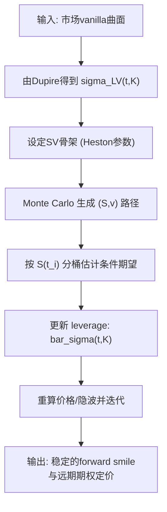

# Quantitative Finance（Chapter 10）

> 资料来源：_Mathematical Modeling and Computation in Finance_（Chapter 10）  
> 主题：远期生效期权（Forward Start Option）与随机局部波动率模型（Stochastic Local Volatility, SLV）

## 一句话理解

这一章解决两个核心问题：如何给“未来才开始”的期权定价，以及如何用 Heston-SLV 在拟合当下 smile 的同时更稳定地描述 forward smile。

---

## 本章核心问题

1. 远期生效期权（Forward Start Option）为什么比普通欧式期权更难？
2. Black-Scholes 与 Heston 下，远期期权的定价结构有什么差异？
3. 为什么单纯局部波动率（Local Volatility, LV）对 forward smile 往往不够稳健？
4. SLV 的关键杠杆函数（leverage function）应如何构造与数值实现？

---

## 1. 远期生效期权的定义与直觉

设 \(t_0 < T_1 < T_2\)。远期生效看涨期权在 \(T_1\) 才“启动”，到 \(T_2\) 到期，其标准化收益可写为：

  $$
  V^{\text{fwd}}(T_2)=\max\!\left(\frac{S(T_2)}{S(T_1)}-K^\*,\,0\right).
  $$

定价的风险中性表达为：

  $$
  V^{\text{fwd}}(t_0,S_0)=e^{-r(T_2-t_0)}
  \,\mathbb E^Q\!\left[
  \max\!\left(\frac{S(T_2)}{S(T_1)}-K^\*,0\right)\middle|\mathcal F_{t_0}
  \right].
  $$

### 为什么重要

- 它直接暴露未来区间 \([T_1,T_2]\) 的“前瞻波动率”信息，是 forward volatility 的关键探针。
- 它是 cliquet（棘轮）等结构化产品的重要 building block。

---

## 2. Black-Scholes 下的结果（结构最清晰）

在 Black-Scholes（BS）下，\(\log\!\big(S(T_2)/S(T_1)\big)\) 仍是正态结构，因此可得到类 BS 闭式：

  $$
  V^{\text{fwd}}(t_0,S_0)
  =
  e^{-rT_1}N(d_1)-K^\*e^{-rT_2}N(d_2),
  $$

其中（\(\tau=T_2-T_1\)）：

  $$
  d_1=\frac{\ln(1/K^\*)+(r+\tfrac12\sigma^2)\tau}{\sigma\sqrt{\tau}},
  \qquad
  d_2=d_1-\sigma\sqrt{\tau}.
  $$

### 一句话理解

在 BS 中，远期期权价格主要由“未来区间长度 \(\tau\)”和波动率决定，结构上与普通欧式看涨高度同构。

---

## 3. Heston 与 LV 的差异：为什么引出 SLV

### 3.1 Heston 的优势

- 随机波动率（Stochastic Volatility, SV）能产生更合理的 forward smile 形状。
- 对路径相关的前瞻波动敏感产品，通常比纯 LV 更有动态解释力。

### 3.2 纯 LV 的局限

- LV 能精确贴合“当前”vanilla 面，但对未来 smile 动态（尤其是 forward smile）可能失真。
- 结果是：静态校准好，不代表动态对冲稳定。

---

## 4. Heston-SLV 的关键公式

SLV 的核心是把局部波动率与随机波动率耦合，令模型既保持横截面拟合能力，也改善动态行为。

本章关键关系是杠杆函数（leverage）标定：

  $$
  \bar{\sigma}^2(t,K)
  =
  \frac{\sigma^2_{\text{LV}}(t,K)}
  {\mathbb E\!\left[\bar{\xi}^2(v(t))\mid S(t)=K\right]}.
  $$

### 直觉解释

- 分子 \(\sigma\_{\text{LV}}^2\)：来自 Dupire 的“市场局部波动”目标。
- 分母条件期望：描述在 \(S(t)=K\) 条件下，随机波动因子的平均强度。
- 比值相当于“校准杠杆”，把 SV 部分调节到与市场 LV 一致。

---

## 5. 数值实现：条件期望如何算

章节给出非参数 bin 方法的思路：在每个时间步，把路径按 \(S(t_i)\) 分桶，在桶内估计
\(\mathbb E[\bar{\xi}^2(v(t_i))\mid S(t_i)\in \text{bin}]\)，再近似替代点条件期望。

  $$
  \mathbb E\!\left[\bar{\xi}^2(v(t_i))\mid S(t_i)=s\right]
  \approx
  \mathbb E\!\left[\bar{\xi}^2(v(t_i))\mid S(t_i)\in (b_k,b_{k+1}]\right].
  $$

并常配合“按排序分位数设桶边界”的做法，提高中心区域的估计精度。

---

## 方法流程图

---

## 常见误区

### 误区 1：只要静态拟合 vanilla 曲面好，forward 产品也会好

不一定。forward smile 依赖动态分布演化，纯 LV 往往在这点上表现不足。

### 误区 2：SLV 只是“多加一个参数层”，不会提升实务表现

不准确。SLV 的核心价值就在于兼顾静态拟合与动态一致性，尤其体现在 forward-sensitive 产品和对冲稳定性上。

### 误区 3：条件期望估计只是技术细节

这恰恰是 SLV 落地成败关键。若分桶/插值/采样设置不合理，会直接传导到 leverage 与最终价格偏差。

---

## 本章小结

- 远期生效期权本质上定价“未来区间表现”，因此比普通欧式更依赖动态模型质量。
- BS 下可得清晰闭式；Heston 能提供更现实的 forward smile 动态。
- 纯 LV 静态拟合强，但 forward 维度可能不稳；SLV 用 leverage 标定来弥补这一缺口。
- Chapter 10 的实务核心是一个闭环：Dupire 目标 + 条件期望估计 + Monte Carlo 实现。

---

## 讨论问题

1. 在给定算力预算下，bin 数量、路径数、时间步长如何联合优化最有效？
2. 对同一组市场数据，Heston 与 Heston-SLV 的 forward smile 偏差如何做可解释归因？
3. 若引入跳跃（jumps），leverage 标定关系需要怎样修改？
