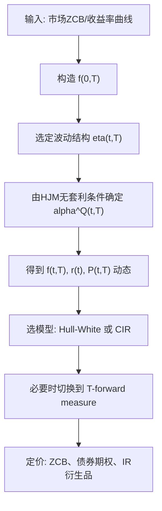

# Quantitative Finance（Chapter 11）

> 资料来源：_Mathematical Modeling and Computation in Finance_（Chapter 11）  
> 主题：短端利率模型（Short-Rate Models）、HJM 框架（Heath-Jarrow-Morton Framework）与 Hull-White / CIR

## 一句话理解

这一章把“利率建模”从债券现金流直觉推进到可定价框架：先用 HJM 描述瞬时远期利率，再落到可实做的短利率模型（Hull-White、CIR）与测度变换定价。

---

## 本章核心问题

1. 为什么零息债（Zero-Coupon Bond, ZCB）是利率衍生品定价的基础资产？
2. HJM 框架里，瞬时远期利率与短利率是什么关系？
3. HJM 的无套利漂移约束（drift restriction）如何保证模型一致性？
4. Hull-White 与 CIR 在实际建模里各自解决了什么问题？

---

## 1. 基础对象：零息债与短利率

零息债价格记为 \(P(t,T)\)，到期支付 1。风险中性定价为：

  $$
  P(t,T)=\mathbb{E}^Q\!\left[
  \exp\!\left(-\int_t^T r(z)\,dz\right)\middle|\mathcal{F}_t
  \right].
  $$

这里 \(r(t)\) 是短利率（short rate），可视作“无风险账户在无穷小时间内的即时回报率”。

---

## 2. HJM 框架：直接建模瞬时远期利率

瞬时远期利率定义为：

  $$
  f(t,T)=-\partial_T \log P(t,T), \qquad r(t)=f(t,t).
  $$

在风险中性测度 \(Q\) 下，HJM 设定：

  $$
  df(t,T)=\alpha^Q(t,T)\,dt+\eta(t,T)\,dW^Q_t.
  $$

### 一句话理解

HJM 的核心思想是“先建整条远期曲线的动态，再由曲线反推出债券和短端利率动态”，而不是先拍一个短利率过程再拼曲线。

---

## 3. HJM 无套利约束（最关键公式）

若以货币市场账户为 numeraire，折现后的可交易资产必须是 \(Q\)-鞅，这会给出漂移约束：

  $$
  \alpha^Q(t,T)=\eta(t,T)\int_t^T \eta(t,z)\,dz.
  $$

### 为什么重要

- 它不是“可选条件”，而是“无套利一致性条件”。
- 一旦 \(\eta(t,T)\) 给定，\(\alpha^Q(t,T)\) 就被锁定，模型自由度大幅收敛。

---

## 4. HJM 下的短利率与债券动态

由 \(r(t)=f(t,t)\) 可得短利率 SDE 的一般形式：

  $$
  dr(t)=\zeta(t)\,dt+\eta(t,t)\,dW^Q_t,
  $$

其中 \(\zeta(t)\) 由 \(f(0,t)\)、\(\alpha^Q\) 与 \(\eta\) 的结构共同决定。

对应零息债动态可写为：

  $$
  dP(t,T)=r(t)P(t,T)\,dt
  -P(t,T)\left(\int_t^T \eta(t,z)\,dz\right)dW^Q_t.
  $$

---

## 5. Hull-White 模型：可拟合初始曲线的高斯短利率

Hull-White（一因子）写作：

  $$
  dr(t)=\lambda\big(\theta(t)-r(t)\big)dt+\eta\,dW_t^Q.
  $$

### 直觉与特点

- \(\lambda\)：均值回复强度（mean reversion）
- \(\eta\)：波动率水平
- \(\theta(t)\)：时间依赖漂移，用于精确贴合初始收益率曲线
- 过程高斯，计算友好，债券与债券期权有较好解析结构

---

## 6. CIR 模型：非负短利率结构

CIR 模型：

  $$
  dr(t)=\lambda(\theta-r(t))dt+\gamma\sqrt{r(t)}\,dW_t^Q.
  $$

### 一句话理解

与 Hull-White 的主要区别是扩散项带 \(\sqrt{r}\)，天然强调“低利率时波动收缩”，并倾向维持非负利率结构（在参数条件满足时更明显）。

---

## 7. 测度变换：转到 \(T\)-forward measure

在利率衍生品里，切换到以 \(P(t,T)\) 为 numeraire 的 \(Q^T\) 测度常能显著简化定价，尤其是债券期权、远期利率相关产品。

在新测度下，漂移项会改变，扩散项结构保持；这让一些 payoff 的期望更接近“标准正态积分”形式。

---

## 方法流程图

---

## 常见误区

### 误区 1：短利率模型只需要拟合一条当前曲线

不够。还要保证动态无套利，并能支持目标衍生品的稳定定价与对冲。

### 误区 2：给了 HJM 波动率，漂移可以自由设

不对。无套利条件直接约束漂移，不能随意指定。

### 误区 3：Hull-White 与 CIR 只是“公式换皮”

不对。二者在利率分布形态、负利率行为、校准稳定性和产品适配性上差别明显。

---

## 本章小结

- 利率建模的底层对象是 \(P(t,T)\)、\(f(t,T)\)、\(r(t)\) 三者之间的一致关系。
- HJM 提供了“先曲线、后短端”的统一框架，\(\eta \rightarrow \alpha\) 的约束是核心。
- Hull-White 强在可拟合曲线和解析友好；CIR 强在非负结构与状态依赖波动。
- 测度变换是利率定价中极其重要的工程工具，不只是理论技巧。

---

## 讨论问题

1. 当市场出现长期低利率或负利率阶段时，HW 与 CIR 的校准鲁棒性如何比较？
2. 若目标产品以 forward-rate 敏感为主，直接在 HJM/LMM 下建模是否优于短利率模型？
3. 在实际数据离散且含噪时，\(f(0,T)\) 平滑与 \(\theta(t)\) 稳定求解应如何联动设计？
