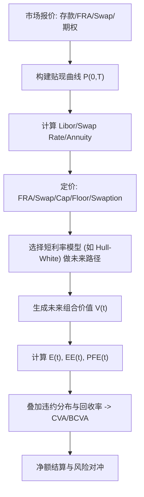

# Quantitative Finance（Chapter 12）

> 资料来源：_Mathematical Modeling and Computation in Finance_（Chapter 12）  
> 主题：利率衍生品（Interest Rate Derivatives）与估值调整（Valuation Adjustments, CVA/BCVA）

## 一句话理解

本章把“利率产品定价”和“交易对手信用风险”连成一条线：前半部分讲 FRA/Swap/Swaption 的定价骨架，后半部分讲如何把违约风险转成 CVA/BCVA 调整。

---

## 本章核心问题

1. 为什么很多利率产品都能写成零息债（ZCB）组合？
2. FRA、Swap 的“公平利率”如何从贴现因子直接得到？
3. Swaption 在 Hull-White 下如何转成一组债券期权来解？
4. 为什么衍生品“无风险价格”还不够，需要额外做 CVA/BCVA？

---

## 1. 基础：Libor 与 ZCB 的连接

对区间 \([T_{i-1},T_i]\)（\(\tau*i=T_i-T*{i-1}\)），简单复利远期 Libor 写为：

  $$
  \ell_i(t)=\frac{1}{\tau_i}\left(\frac{P(t,T_{i-1})}{P(t,T_i)}-1\right).
  $$

### 一句话理解

利率产品的“浮动腿”本质上是贴现债价格比值，因此很多产品可在“债券语言”中统一表达。

---

## 2. FRA（远期利率协议）

FRA 的价值可以写成：

  $$
  V^{\mathrm{FRA}}(t_0)=\tau_i\,P(t_0,T_i)\big(\ell_i(t_0)-K\big).
  $$

若初始价值为 0，则公平执行利率（par FRA rate）满足 \(K=\ell_i(t_0)\)。

---

## 3. Swap（利率互换）与互换利率

payer swap 经典表达式：

  $$
  V^{\mathrm{Swap}}(t_0)
  =N\big(P(t_0,T_i)-P(t_0,T_m)\big)
  -NK\sum_{k=i+1}^{m}\tau_k P(t_0,T_k).
  $$

定义年金因子（annuity）：

  $$
  A_{i,m}(t)=\sum_{k=i+1}^{m}\tau_k P(t,T_k),
  $$

则可压缩为：

  $$
  V^{\mathrm{Swap}}(t_0)=N\,A_{i,m}(t_0)\big(S_{i,m}(t_0)-K\big),
  $$

其中

  $$
  S_{i,m}(t_0)=\frac{P(t_0,T_i)-P(t_0,T_m)}{A_{i,m}(t_0)}.
  $$

### 为什么重要

- 这给出市场最常用的“par swap rate”定义；
- 也是后续 swaption、风险管理与对冲的核心输入。

---

## 4. Yield Curve（收益率曲线）构建直觉

章节强调：曲线不是一条“画出来的线”，而是由一组可交易产品校准得到的贴现节点（spine points）：

  $$
  \Omega_{\mathrm{yc}}=\{(t_1,p(t_1)),\ldots,(t_n,p(t_n))\},
  \qquad p(t_i)=P(t_0,t_i).
  $$

常见做法是以“价格误差向量=0”为目标做牛顿迭代：

  $$
  \Delta p=-J^{-1}(p)\,d(p).
  $$

---

## 5. Cap/Floor 与 Swaption（结构化到可计算）

在 Hull-White 框架中，caplet/floorlet 与债券期权有紧密映射；  
swaption 价格可进一步分解为一组零息债期权之和（Jamshidian 思路），并通过求根得到临界短端利率 \(r^\*\)。

### 一句话理解

“复杂利率期权 = 组合 + 测度变换 + 一维求根”，这就是工程落地的关键路径。

---

## 6. 从定价走向风险：EE / PFE / CVA

定义正向敞口（exposure）：

  $$
  E(t)=\max(V(t),0).
  $$

常见风险度量：

- 期望敞口（Expected Exposure, EE）
- 潜在未来敞口（Potential Future Exposure, PFE）

单边 CVA（概念上）是“违约时点上的折现正敞口期望损失”：

  $$
  \text{CVA}\approx (1-R_c)\,\mathbb{E}\!\left[D(0,\tau)\,E(\tau)\,\mathbf{1}_{\{\tau\le T\}}\right].
  $$

其中 \(R_c\) 为回收率（recovery rate），\(\tau\) 为交易对手违约时刻。

---

## 7. BCVA 与净额结算（Netting）

- BCVA 同时考虑“对手方违约风险”和“自身违约风险”。
- 净额结算把组合层面的正负市值相互抵消，能显著降低 EE/PFE 与 CVA 资本占用。

---

## 方法流程图

---

## 常见误区

### 误区 1：只要产品今天可定价，就不需要随机利率模型

错误。做未来敞口（EE/PFE/CVA）时必须模拟未来路径，模型动态不可省略。

### 误区 2：CVA 只是“后处理”小修正

错误。在 OTC 组合中，CVA/BCVA 会显著影响成交价、资本占用与风控决策。

### 误区 3：净额结算只是法务条款，不影响定量结果

错误。净额机制可明显降低组合层面正敞口，对 EE/PFE 与 CVA 都有实质影响。

---

## 本章小结

- FRA/Swap 等主流利率产品可以统一写在 ZCB 框架里，结构清晰、实现高效。
- Swaption 在 Hull-White 下有成熟的半解析路径（分解 + 求根）。
- 定价与风控在本章正式融合：从价格 \(V(t)\) 进入敞口 \(E(t)\)，再进入 CVA/BCVA。
- 对实际交易而言，曲线构建质量、模型动态与净额协议同等重要。

---

## 讨论问题

1. 若市场从 Libor 向 RFR 迁移，定价公式与曲线构建流程应如何调整？
2. 对同一组合，模型风险（Hull-White vs 更高维模型）会给 CVA 带来多大偏差？
3. 在净额与抵押并存时，EE/PFE/CVA 的计算应如何分层组织才最稳健？
