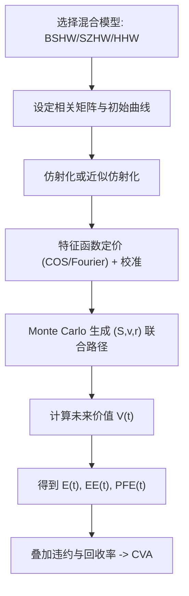

# Quantitative Finance（Chapter 13）

> 资料来源：_Mathematical Modeling and Computation in Finance_（Chapter 13）  
> 主题：混合资产模型（Hybrid Asset Models）与信用估值调整（Credit Valuation Adjustment, CVA）

## 一句话理解

本章把“股权-利率联合动态”与“交易对手风险暴露”真正接起来：先建可校准的混合模型（BSHW、SZHW、HHW），再看它们如何改变 EE/PFE/CVA。

---

## 本章核心问题

1. 为什么单一资产类模型不足以覆盖长期或复杂产品的真实风险？
2. BSHW（Black-Scholes + Hull-White）如何在保持可解性的同时引入股债相关性？
3. SZHW、HHW 这类更复杂混合模型如何走向仿射（affine）以便高效定价？
4. 模型中的随机利率与随机波动率会如何传导到 CVA 暴露曲线？

---

## 1. 混合模型的出发点

当股票、利率、波动率存在显著联动时，单资产模型会低估或误判长期风险。  
混合模型的核心是“多资产类 SDE + 相关结构 + 可计算定价器”。

### 为什么重要

- 长期限产品对利率动态敏感；
- CVA/EE/PFE 依赖未来路径分布，不能只看单因子边际；
- 校准效率要求模型最好具备特征函数（Characteristic Function）或近似半解析结构。

---

## 2. BSHW：最基础的股权-利率混合基准

在风险中性测度 \(Q\) 下，BSHW 典型形式为：

  $$
  \frac{dS_t}{S_t}=r_t\,dt+\sigma\,dW_t^x,\qquad
  dr_t=\lambda(\theta(t)-r_t)\,dt+\eta\,dW_t^r,\qquad
  dW_t^x dW_t^r=\rho_{x,r}\,dt.
  $$

它是一个“最小可用”的混合模型：利率由 Hull-White 驱动，股票由 GBM 驱动，但允许两类风险因子相关。

---

## 3. \(T\)-forward 测度下的定价简化

章节重点展示：把 numeraire 从货币账户切到零息债 \(P(t,T)\)，欧式到期 \(T\) 产品可写成：

  $$
  V(t_0)=P(t_0,T)\,\mathbb E^{T}[H(S_T)\mid\mathcal F_{t_0}].
  $$

定义远期股票 \(S_F(t,T)=S(t)/P(t,T)\)，其扩散在 \(Q^T\) 下可整理为“无漂移”结构：

  $$
  \frac{dS_F(t,T)}{S_F(t,T)}=\bar\sigma_F(t)\,dW_t^F,
  \qquad
  \bar\sigma_F^2(t)=\sigma^2+\eta^2\bar B_r^2(t,T)-2\rho_{x,r}\sigma\eta\,\bar B_r(t,T).
  $$

### 一句话理解

测度变换不是“数学技巧”，而是把混合模型重新写成近似 Black-Scholes 友好形态的工程工具。

---

## 4. 从 BSHW 到更丰富动态：SZHW 与 HHW

### 4.1 SZHW（Schöbel-Zhu Hull-White）

- 在股权侧引入随机波动率过程（OU 型波动率）；
- 与利率过程共同建模并允许全相关结构；
- 通过状态扩展与重写可得到仿射形式，便于特征函数定价。

### 4.2 HHW（Heston Hull-White）

- 把 Heston 波动率（方差）与 Hull-White 利率耦合；
- 保留股权 smile 能力，同时引入随机利率对远期期权/CVA 的影响；
- 章节给出近似仿射化与对应的 Monte Carlo 离散方案。

---

## 5. 定价与校准：为什么仿射很关键

本章反复强调的实务点：

- 若有特征函数，可用 COS/Fourier 类方法快速定价欧式产品；
- 这直接决定校准速度与稳定性；
- 无法高效校准的“好模型”通常难以进入生产。

---

## 6. CVA 视角：模型如何影响 EE/PFE

暴露定义仍是：

  $$
  E(t)=\max(V(t),0).
  $$

在混合模型下，未来价值 \(V(t)\) 同时受 \(S_t, v_t, r_t\) 驱动，故 EE/PFE 形状会明显变化。  
章节结论之一：随机利率通常抬升部分未来暴露，而随机波动率的影响方向与强度依产品而异。

---

## 7. Bermudan 示例与暴露路径

对 Bermudan 等可提前行权产品，CVA 分析需结合：

- 路径模拟（forward simulation）
- 续持价值近似（continuation value）
- 反向动态规划（backward induction / LSM 思路）

这使“产品定价算法”与“风险暴露算法”高度复用。

---

## 方法流程图

---

## 常见误区

### 误区 1：只需给模型加相关系数就算“混合建模”

不够。还要保证无套利、可校准、可计算，否则无法落地。

### 误区 2：CVA 只依赖违约概率，不太依赖底层定价模型

错误。CVA 的核心是“违约时点的正暴露”，暴露对模型动态非常敏感。

### 误区 3：混合模型越复杂越好

错误。复杂度必须换来可验证的定价/对冲/暴露改进，否则只会增加实现和校准风险。

---

## 本章小结

- Chapter 13 的主线是：混合模型不仅用于定价，也直接服务于 CVA 风险度量。
- BSHW 提供可解释的基准；SZHW/HHW 提供更强 smile 与动态刻画能力。
- 测度变换与仿射结构是把“复杂联合动态”变成“可计算系统”的关键。
- 在实务中，EE/PFE/CVA 对相关结构与随机因子的设定非常敏感，需谨慎校准与回测。

---

## 讨论问题

1. 对同一组合，BSHW 与 HHW 在 EE/PFE 上的差异主要来自哪类因子耦合？
2. 当相关矩阵接近非正定时，如何稳健处理并保持风险解释性？
3. 在生产系统中，何时应优先选择“近似仿射 + 快速校准”而非更重的全模型仿真？
