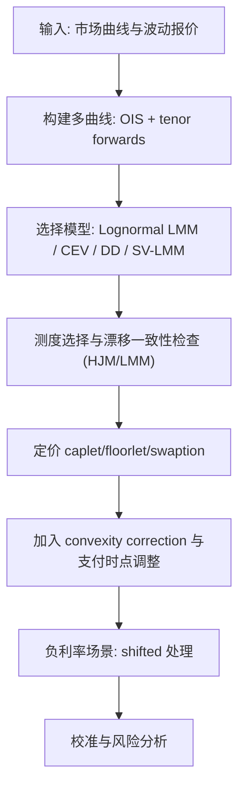

# Quantitative Finance（Chapter 14）

> 资料来源：_Mathematical Modeling and Computation in Finance_（Chapter 14）  
> 主题：高级利率模型（Advanced Interest Rate Models）、LMM 扩展、负利率与多曲线

## 一句话理解

这一章回答“后危机时代利率怎么建模”：从经典 Lognormal LMM 出发，加入 smile/skew（CEV、Displaced Diffusion、SV-LMM），再处理负利率与多曲线定价。

---

## 本章核心问题

1. 为什么仅靠短端利率模型已不足以覆盖很多利率衍生品？
2. LMM（Libor Market Model）如何与 HJM 框架连接并保持无套利？
3. Lognormal LMM 为什么会失真 smile/skew，如何修正？
4. 负利率与多曲线（multi-curve）环境下，定价框架应如何调整？

---

## 1. LMM 的基础表达

对区间 \([T_{i-1},T_i]\)、\(\tau*i=T_i-T*{i-1}\)，前向 Libor 率定义：

  $$
  \ell_i(t)=\frac{1}{\tau_i}\left(\frac{P(t,T_{i-1})}{P(t,T_i)}-1\right).
  $$

在其自然的 \(T_i\)-forward 测度下，\(\ell_i\) 可写成无漂移形式（鞅）：

  $$
  d\ell_i(t)=\bar{\sigma}_i(t)\,dW_i^{(i)}(t),\qquad t<T_{i-1}.
  $$

### 一句话理解

LMM 的“模型原语”就是一组可交易前向 Libor 率，而不是单一短利率。

---

## 2. LMM 与 HJM 的桥接

章节展示：由
\[
1+\tau*i\ell_i(t)=\exp\!\left(\int*{T\_{i-1}}^{T_i} f(t,z)\,dz\right)
\]
可把 LMM 放进 HJM 的瞬时远期利率框架，并得到对应漂移与波动关系。

这说明：

- LMM 不是“另一个体系”，而是 HJM 的离散前向利率化表达；
- 波动结构选择决定模型类型与可定价性。

---

## 3. Lognormal LMM：优点与局限

经典设定为：

  $$
  \bar{\sigma}_i(t)=\sigma_i(t)\,\ell_i(t)
  \quad\Longrightarrow\quad
  d\ell_i(t)=\sigma_i(t)\ell_i(t)\,dW_i^{(i)}(t).
  $$

### 优点

- caplet/floorlet 定价与市场 Black 体系兼容；
- 参数直观、实现成熟。

### 局限

- 对 smile/skew 刻画有限；
- 在低利率或负利率阶段容易失真。

---

## 4. Convexity Correction（凸性修正）

当支付时点与标准假设不一致（如 pay delay）时，\(\ell_i\) 在相关测度下不再是简单鞅，需加凸性修正项（convexity correction）。

### 为什么重要

- 常被误认为“小修正”，但在期限较长或波动较高时影响不可忽略；
- 直接关系到 FRA / futures / 延迟支付条款的公允定价。

---

## 5. Smile 扩展：CEV 与 Displaced Diffusion（DD）

### 5.1 CEV-LMM

通过非线性扩散（\(\ell^\beta\) 类）刻画 skew/smile，但校准与数值稳定性更敏感。

### 5.2 Displaced Diffusion-LMM

用 shift 把过程改写成“移位对数正态”：

  $$
  d\ell_i(t)=\sigma_i\big(\beta \ell_i(t)+(1-\beta)\ell_i(t_0)\big)\,dW_i^{(i)}(t).
  $$

等价视角：对 \(\ell_i\) 做常数位移后使用 lognormal 定价结构，通常比直接 CEV 更易校准。

---

## 6. SV-LMM：在 LMM 上叠加随机波动率

章节给出 Heston 风格的 LMM 扩展（含方差过程 \(\nu_t\)）：

- 既保留 LMM 的利率市场解释；
- 又提升 smile 动态拟合能力；
- 常配合参数冻结/近似仿射技巧，提升 caplet/swaption 计算效率。

---

## 7. 负利率与 shifted 定价

后危机市场出现系统性负利率后，纯 lognormal 假设不再稳健。  
常用处理是 shifted lognormal：

  $$
  \hat{\ell}_i(t)=\ell_i(t)+\theta_i,\qquad
  \ell_i(t)=\hat{\ell}_i(t)-\theta_i.
  $$

然后对 \(\hat{\ell}\_i\) 采用 lognormal/Black 型定价。

### 一句话理解

shift 不是“技巧补丁”，而是让模型在负利率区间仍保持可定价与可校准的关键工程方案。

---

## 8. 多曲线（Multi-Curve）框架

危机后，单曲线“既预测又贴现”不再成立。实践转向：

- 多条 forward 曲线（按 tenor 分层）
- 独立折现曲线（常用 OIS）
- 基差互换（basis swap）反映 tenor spread 风险

这会改变产品估值、对冲映射与风险归因。

---

## 方法流程图

---

## 常见误区

### 误区 1：LMM 只是“另一种写法”，与 HJM 无关

不对。LMM 可视为 HJM 在离散前向利率上的具体实现。

### 误区 2：负利率只需把利率截断到 0

不对。硬截断会破坏分布结构与无套利一致性，shifted 模型更稳健。

### 误区 3：多曲线只影响交易台，不影响模型核心

不对。多曲线会改变 forward 与 discount 的映射，直接影响定价和 Greeks。

---

## 本章小结

- Chapter 14 的主轴是 LMM 的现代化：从 lognormal 走向 smile、SV、负利率与多曲线。
- CEV/DD/SV-LMM 提供了从“可解释”到“可拟合”的不同平衡点。
- 后危机利率建模不再是单曲线 + 单分布问题，而是测度、曲线与风险源联合建模问题。

---

## 讨论问题

1. 在真实交易数据下，DD-LMM 与 SV-LMM 的校准稳定性和计算成本如何权衡？
2. 多曲线下，caplet 与 swaption 的联合校准应如何组织参数层级？
3. 若进入长期负利率区间，shift 参数的动态更新应采用何种治理规则？
