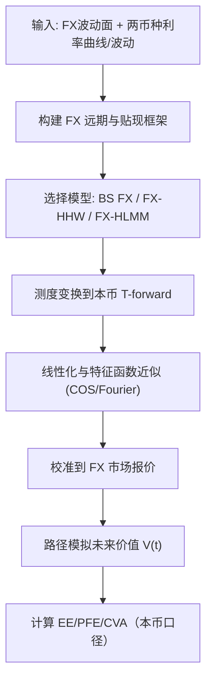

# Quantitative Finance（Chapter 15）

> 资料来源：_Mathematical Modeling and Computation in Finance_（Chapter 15）  
> 主题：跨货币模型（Cross-Currency Models）、FX-IR 混合建模与 FX-CVA

## 一句话理解

本章把外汇（FX）与利率（IR）真正耦合起来：从 FX 远期与 BS 定价出发，扩展到 Heston-FX + 随机利率，再到 FX-HLMM 与 FX-CVA 风险度量。

---

## 本章核心问题

1. 为什么 FX 远期价格天然依赖“两条利率曲线”（本币与外币）？
2. BS 外汇期权公式中的“外币利率贴现项”从何而来？
3. 在 FX + 随机利率（HW/LMM）联合模型下，如何保持可计算性？
4. FX 掉期的 CVA/EE 如何在跨币种框架下稳定计算？

---

## 1. FX 远期的无套利关系

设 \(y(t)\) 表示“每 1 单位外币对应的本币价格”（domestic per foreign），则远期汇率满足：

  $$
  y_F(t_0,T)=y(t_0)\frac{P_f(t_0,T)}{P_d(t_0,T)}.
  $$

若利率常数化（\(r_d,r_f\)），即：

  $$
  y_F(t_0,T)=y(t_0)e^{(r_d-r_f)(T-t_0)}.
  $$

### 一句话理解

FX 远期本质是“现货 × 两货币贴现比”，即跨币种 carry 的直接反映。

---

## 2. Black-Scholes 外汇期权（Garman-Kohlhagen 结构）

在本币风险中性测度下，FX 动态：

  $$
  dy_t=(r_d-r_f)y_t\,dt+\sigma y_t\,dW_t^{Q_d}.
  $$

欧式 FX 看涨定价：

  $$
  C(t_0)=e^{-r_f\tau}y_0N(d_1)-Ke^{-r_d\tau}N(d_2),
  \qquad \tau=T-t_0.
  $$

其中

  $$
  d_1=\frac{\ln(y_0/K)+(r_d-r_f+\tfrac12\sigma^2)\tau}{\sigma\sqrt{\tau}},
  \qquad d_2=d_1-\sigma\sqrt{\tau}.
  $$

---

## 3. 多币种 FX + 随机利率（FX-HHW）

章节核心扩展是将 FX 波动（Heston-type）与本币/外币短利率过程（Hull-White）耦合，并允许完整相关矩阵。

### 关键直觉

- 直接全模型很重，定价与校准成本高；
- 通过测度变换到本币 \(T\)-forward 测度后，前向汇率 \(y_F\) 的漂移结构可显著简化；
- 再配合线性化/投影近似，可获得可用于 COS/Fourier 的近似特征函数。

---

## 4. FX-HLMM：把利率 smile 也引入跨币种

为覆盖 IR smile，章节进一步采用 DD-SV Libor 市场模型（LMM）驱动两币种利率侧，并与 FX 因子关联，形成 FX-HLMM。

模型要点：

- FX 侧：Heston 型随机波动率；
- IR 侧：两币种的 DD-SV LMM；
- 实践中通过有效参数与线性化把非仿射项压到可计算近似。

---

## 5. FX-CVA：跨币种暴露计算

对 FX swap，未来价值和正向敞口随汇率与两币种利率共同演化。  
在合适 forward measure 下，某些前向量（如 \(y_F\)）可作为鞅，能显著简化 EE 估计。

### 为什么重要

- 跨币种交易的违约暴露对相关结构极其敏感；
- 只用“静态 BS FX”会低估长期或极端场景下的资本需求。

---

## 方法流程图

---

## 常见误区

### 误区 1：FX 期权只需要一条无风险利率曲线

不对。FX 天然涉及本币与外币两套贴现体系。

### 误区 2：先校准 FX 再“附加”利率风险即可

不稳健。长久期产品与 CVA 对 FX-IR 相关结构很敏感，需联合一致建模。

### 误区 3：复杂混合模型一定优于简化模型

不一定。若校准不稳或计算过慢，生产效果可能反而更差。

---

## 本章小结

- Chapter 15 把全书多条主线收束到跨币种场景：测度、混合动态、特征函数、CVA。
- FX 远期与期权定价的核心是“汇率动态 + 双曲线贴现”的一致性。
- 在工程实践中，FX-HHW/FX-HLMM 的价值在于平衡拟合能力与计算效率。

---

## 讨论问题

1. 在真实市场中，FX-HHW 与 FX-HLMM 的校准稳定性和速度如何权衡？
2. 对 FX swap 组合，哪些相关参数（\( \rho*{y,r_d},\rho*{y,r*f},\rho*{y,v}\)）最影响 CVA？
3. 当本外币曲线同时出现结构性变动时，模型重标定应如何分层执行？
