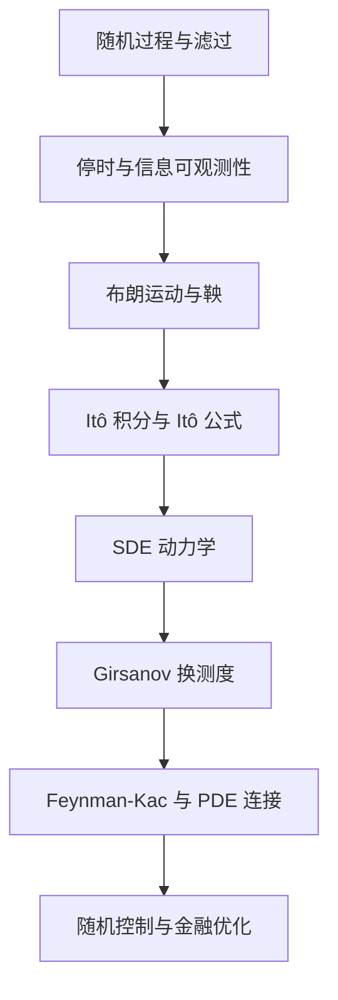

# Stochastic Control in Finance（Chapter 1）

> 主题：随机分析基础（Stochastic Analysis Foundations）与控制问题数学语言

## 一句话理解

这章是整门课的“语言层”：先定义信息流和随机过程，再建立布朗运动（Brownian Motion）、鞅（Martingale）、Itô 积分（Ito Integral）、随机微分方程（Stochastic Differential Equation, SDE）与换测度（Change of Measure）的统一框架。

---

## 本章核心问题

- 连续时间里“信息随时间展开”如何数学化？
- 什么过程才算“不偷看未来”？
- 为什么金融控制问题离不开 Itô 积分与 Itô 公式？
- 如何从概率测度切换（P 到 Q）得到更可定价的动力学？

---

## 1. 随机过程与滤过

随机过程（Stochastic Process）写作 $X=(X_t)_{t\in[0,T]}$，其中每个 $X_t$ 是随机变量。  
滤过（Filtration）$\mathbb F=(\mathcal F_t)_{t\ge 0}$ 表示到时刻 $t$ 的可得信息：

  $$
  \mathcal F_s \subseteq \mathcal F_t,\quad s\le t.
  $$

适应过程（Adapted Process）满足：

  $$
  X_t \in \mathcal F_t,\ \forall t,
  $$

一句话：时刻 $t$ 的变量只能依赖 $t$ 前的信息，不能依赖未来。

---

## 2. 停时与“事件何时发生”

停时（Stopping Time）$\tau$ 的定义是：

  $$
  \{\tau\le t\}\in\mathcal F_t,\quad \forall t.
  $$

这保证了“到时刻 $t$ 能否判断事件已经发生”是可观测的。  
在最优停止（Optimal Stopping）和美式期权（American Option）里，这是核心对象。

---

## 3. 布朗运动与缩放性质

标准布朗运动（Standard Brownian Motion）$W_t$ 满足：

- $W_0=0$；
- 路径连续；
- 增量独立且

  $$
  W_t-W_s \sim \mathcal N(0,t-s),\quad t>s.
  $$

常用直觉：布朗运动是“连续但粗糙”的噪声驱动，适合刻画高频不确定扰动。

---

## 4. 鞅与公平性

鞅（Martingale）表示在当前信息下，未来条件期望等于现在：

  $$
  \mathbb E[X_t\mid \mathcal F_s]=X_s,\quad s\le t.
  $$

在金融里，风险中性世界下“贴现资产价格是鞅”是定价主线。

---

## 5. 随机积分与 Itô 等距

对布朗运动积分定义为 Itô 积分：

  $$
  I_t=\int_0^t \phi_u\,dW_u.
  $$

两个最重要结论：

  $$
  \mathbb E[I_t]=0,
  $$

  $$
  \mathbb E\!\left[\left(\int_0^t \phi_u\,dW_u\right)^2\right]
  =
  \mathbb E\!\left[\int_0^t \phi_u^2\,du\right].
  $$

第二条就是 Itô 等距（Ito Isometry），它把随机积分二阶矩变成普通积分，是后续估计与证明的核心工具。

---

## 6. Itô 过程与 Itô 公式

典型 Itô 过程（Ito Process）：

  $$
  dX_t=b(t,X_t)\,dt+\sigma(t,X_t)\,dW_t.
  $$

对足够光滑的 $f(t,x)$，Itô 公式（Ito's Formula）给出：

  $$
  df(t,X_t)
  =
  \left(f_t+b f_x+\tfrac12 \sigma^2 f_{xx}\right)dt
  +\sigma f_x\,dW_t.
  $$

这条公式是“随机链式法则”，后续 HJB 方程与资产定价推导都靠它。

---

## 7. Girsanov 换测度与风险中性视角

Girsanov 定理（Girsanov Theorem）说明：在合适条件下可通过密度过程改测度，把漂移吸收到测度里。  
常见表示是定义新过程

  $$
  W_t^{\mathbb Q}
  =
  W_t+\int_0^t \theta_s\,ds,
  $$

在新测度 $\mathbb Q$ 下，$W_t^{\mathbb Q}$ 成为布朗运动。  
一句话：换测度把“概率权重”重排，从而把问题转成更好算的形式。

---

## 8. SDE 强解与 Feynman-Kac

强解（Strong Solution）强调：在给定概率空间和布朗运动下构造过程。  
在 Lipschitz 与线性增长条件下有存在唯一性。

Feynman-Kac 公式（Feynman-Kac Formula）建立 PDE 与期望表示之间的桥梁：  
某类抛物型 PDE 的解可写成扩散过程上条件期望。  
这是“控制/定价问题转 PDE，再转概率表示”的关键纽带。

---

## 结构图：从概率语言到控制工具

---

## 常见误区

### 误区 1：Itô 积分和普通微积分完全一样

不对。布朗路径不可微，必须使用随机积分框架与 Itô 公式。

### 误区 2：鞅等于“路径不变”

不对。鞅是条件期望意义上的公平，不是样本路径平坦。

### 误区 3：换测度只是数学技巧，对金融无关

不对。风险中性定价、对冲与许多闭式解都依赖换测度。

---

## 本章小结

- Chapter 1 建立了随机控制课程的共同语法：信息、噪声、积分、测度与动力学。
- Itô 公式、Girsanov 定理、Feynman-Kac 是连接“随机过程-控制-定价”的三条主干。
- 后续章节的最优控制与投资问题，本质都在这个框架里展开。
