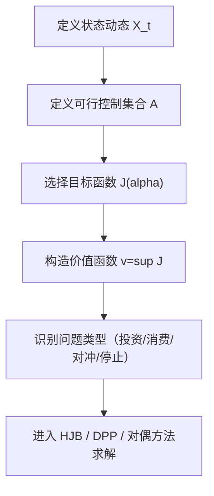

# Stochastic Control in Finance（Chapter 2）

> 主题：随机优化问题的统一结构与金融应用样例（Stochastic Optimization Problems in Finance）

## 一句话理解

这一章回答“我们到底在优化什么”：给定状态动态、可行控制和目标函数，构造价值函数（Value Function），再把投资、消费、对冲、最优出售等问题统一到同一个随机控制框架里。

---

## 本章核心问题

- 连续时间随机优化问题由哪些标准组件构成？
- 为什么“控制（Control）+ 状态（State）+ 目标函数（Objective）”可以统一多种金融问题？
- 有限时域与无限时域目标有什么差异？
- 金融应用里常见的目标函数有哪些？

---

## 1. 随机优化问题的三要素

### 1.1 状态过程

系统状态记为 $X_t$，通常由随机微分方程（SDE）描述。

### 1.2 控制过程

控制记为 $\alpha_t$，必须在信息流下可行（admissible），控制集合记为 $\mathcal A$。

### 1.3 绩效函数

有限时域典型目标：

  $$
  J(\alpha)=
  \mathbb E\!\left[\int_0^T f(X_t,\alpha_t)\,dt+g(X_T)\right].
  $$

无限时域折现目标：

  $$
  J(\alpha)=
  \mathbb E\!\left[\int_0^{\infty}e^{-\beta t}f(X_t,\alpha_t)\,dt\right],\quad \beta>0.
  $$

对应价值函数：

  $$
  v=\sup_{\alpha\in\mathcal A}J(\alpha).
  $$

若同时优化停时（Stopping Time）$\tau$，则是混合控制/最优停止问题：

  $$
  v=\sup_{\alpha,\tau}
  \mathbb E\!\left[\int_0^\tau f(X_t,\alpha_t)\,dt+g(X_\tau)\right].
  $$

---

## 2. 例子 1：组合配置（Portfolio Allocation）

给定无风险资产 $S^0$ 与风险资产 $S$，自融资财富过程可写为

  $$
  dX_t
  =
  (X_t-\pi_t\!\cdot S_t)\frac{dS_t^0}{S_t^0}
  +\pi_t\,dS_t.
  $$

两类核心目标：

- 期望效用最大化（Expected Utility）：

  $$
  \sup_{\pi}\ \mathbb E[U(X_T)].
  $$

- 均值-方差（Mean-Variance）：

  $$
  \inf_{\pi}\{\mathrm{Var}(X_T):\mathbb E[X_T]=m\}.
  $$

本章还回顾了 Merton 型 CRRA（Constant Relative Risk Aversion）效用设定。

---

## 3. 例子 2：生产-消费控制（Production-Consumption）

资本、债务与消费共同决定净值动态，控制变量通常是投资比率 $k_t$ 与消费比率 $c_t$。  
典型目标是最大化折现效用：

  $$
  \sup_{(k,c)}
  \mathbb E\!\left[\int_0^\infty e^{-\beta t}U(c_tX_t)\,dt\right].
  $$

一句话：这是“动态资产负债管理 + 消费决策”的联合控制问题。

---

## 4. 例子 3：不可逆投资（Irreversible Investment）

控制 $\alpha_t\ge 0$ 表示扩产速度，典型容量动态：

  $$
  dX_t=X_t(-\delta\,dt+\sigma\,dW_t)+\alpha_t\,dt.
  $$

利润-成本目标：

  $$
  \sup_{\alpha}
  \mathbb E\!\left[\int_0^\infty e^{-\beta t}\big(\varphi(X_t)-\lambda\alpha_t\big)\,dt\right].
  $$

核心直觉：扩产可提升未来收益，但投资不可逆，过量投入会锁定风险。

---

## 5. 例子 4：期权二次对冲与超复制

### 5.1 二次对冲（Quadratic Hedging）

目标是在不可完全复制市场里最小化终端误差方差：

  $$
  \min_{\pi}\ \mathbb E\!\left[(X_T-H)^2\right].
  $$

### 5.2 超复制（Superreplication）

要求终端财富几乎处处覆盖负债：

  $$
  X_T^\pi \ge H\ \ \text{a.s.}
  $$

并最小化初始成本。  
这类问题常引出“最坏情形”定价与不确定波动率（Uncertain Volatility）框架。

---

## 6. 其他扩展目标（章节概览）

章节还概览了若干现代控制目标：

- 风险敏感控制（Risk-sensitive Control）
- 大偏差型长期目标（Large-deviation Criteria）
- 鲁棒效用最大化（Robust Utility Maximization）
- 前向绩效（Forward Performance）

这些问题共同点是：优化目标不再只关心“平均收益”，而是显式管理模型不确定性与尾部风险。

---

## 方法流程图

---

## 常见误区

### 误区 1：不同金融问题需要完全不同数学框架

不对。多数都能写成“受控状态 + 可行控制 + 价值函数”。

### 误区 2：目标函数只写期望收益就够了

不对。风险、约束与不确定性通常决定策略可用性。

### 误区 3：最优控制一定是“实时交易信号”

不对。很多问题的控制也包括停时决策、消费率、资本扩张速度等。

---

## 本章小结

- Chapter 2 给出了随机控制在金融中的“问题模板”。
- 多个经典场景可统一成价值函数最大化（或成本最小化）问题。
- 后续章节会在这个模板上引入 DPP、HJB 与验证定理来真正求解。
