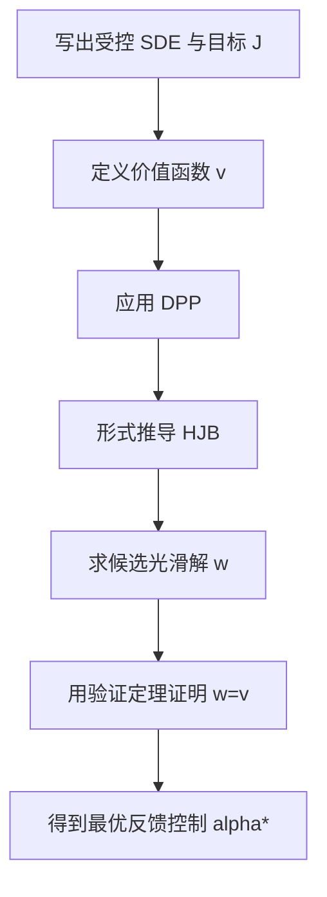

# Stochastic Control in Finance（Chapter 3）

> 主题：动态规划的经典 PDE 方法（Dynamic Programming, HJB, and Verification）

## 一句话理解

这一章给出随机控制的“求解主流程”：先写价值函数，再用动态规划原理（DPP）导出 HJB 方程，最后用验证定理证明候选解就是最优解，并得到最优 Markov 控制。

---

## 本章核心问题

- 为什么把控制问题写成“从任意初值出发的一族问题”很关键？
- DPP 如何把全局优化拆成局部递推？
- HJB 方程如何从 DPP 的“无穷小版本”得到？
- 什么时候可以从 PDE 解反推出最优策略？

---

## 1. 受控扩散模型（Controlled Diffusion）

状态过程通常写成

  $$
  dX_s=b(X_s,\alpha_s)\,ds+\sigma(X_s,\alpha_s)\,dW_s.
  $$

有限时域目标函数：

  $$
  J(t,x,\alpha)
  =
  \mathbb E\!\left[
  \int_t^T f(s,X_s^{t,x},\alpha_s)\,ds+g(X_T^{t,x})
  \right].
  $$

价值函数：

  $$
  v(t,x)=\sup_{\alpha\in\mathcal A(t,x)} J(t,x,\alpha).
  $$

无限时域对应折现版本：

  $$
  v(x)=\sup_{\alpha\in\mathcal A(x)}
  \mathbb E\!\left[\int_0^\infty e^{-\beta s}f(X_s^x,\alpha_s)\,ds\right].
  $$

---

## 2. 动态规划原理（DPP）

DPP 的直觉是：最优策略满足“任意中间时刻看过去和看未来都仍最优”。

有限时域可写成（以停时 $\tau$ 表示中间重规划时点）：

  $$
  v(t,x)=
  \sup_{\alpha}
  \sup_{\tau\in\mathcal T_{t,T}}
  \mathbb E\!\left[
  \int_t^\tau f(s,X_s^{t,x},\alpha_s)\,ds + v(\tau,X_\tau^{t,x})
  \right].
  $$

一句话：先做 $[t,\tau]$ 的控制，再接上从 $(\tau,X_\tau)$ 出发的最优价值。

---

## 3. HJB 方程：DPP 的局部化

定义控制 $a$ 下的生成算子（Generator）

  $$
  \mathcal L^a \phi
  =
  b(x,a)\cdot D_x\phi
  +\frac12\mathrm{Tr}\!\left(\sigma\sigma^\top(x,a)D_x^2\phi\right).
  $$

有限时域 HJB：

  $$
  -v_t(t,x)-\sup_{a\in A}\big[\mathcal L^a v(t,x)+f(t,x,a)\big]=0,
  \qquad v(T,x)=g(x).
  $$

无限时域平稳 HJB：

  $$
  \beta v(x)-\sup_{a\in A}\big[\mathcal L^a v(x)+f(x,a)\big]=0.
  $$

---

## 4. 验证定理（Verification Theorem）

经典思路：若找到足够光滑函数 $w$ 满足 HJB（及增长/边界条件），则通过 Itô 公式可证明：

- $w \ge v$（对任意可行控制）；
- 若存在控制 $\alpha^\*$ 使 HJB 上确界点态取到，则 $w=v$ 且 $\alpha^\*$ 最优。

这一步把“PDE 候选解”转化成“控制问题真解”。

---

## 5. 章节中的金融应用主线

本章示例覆盖了动态规划在金融中的典型落地：

- Merton 有限时域投资问题（CRRA 效用）；
- 投资-消费问题（含随机期限/折现）；
- 生产-消费型无限时域控制问题。

共同套路：

1. 先猜价值函数形状（Ansatz）；
2. 代入 HJB 得到参数方程；
3. 用验证定理闭环最优性；
4. 导出反馈控制（Feedback/Markov Control）。

---

## 方法流程图

---

## 常见误区

### 误区 1：HJB 推出来就等于问题已解

不对。HJB 只是必要结构，是否真是价值函数还需验证定理。

### 误区 2：最优控制一定非 Markov

不对。在这章的 Markov 扩散框架下，最优控制常可取为反馈型 Markov 控制。

### 误区 3：PDE 方法总能得到光滑解

不对。很多问题无经典光滑解，需要粘性解（Viscosity Solution）框架。

---

## 本章小结

- Chapter 3 建立了随机控制最经典的求解链条：DPP → HJB → Verification。
- 这条链条是后续投资、消费、对冲、停止等问题的统一方法学基础。
- 当光滑性不足时，下一步自然过渡到粘性解理论。
