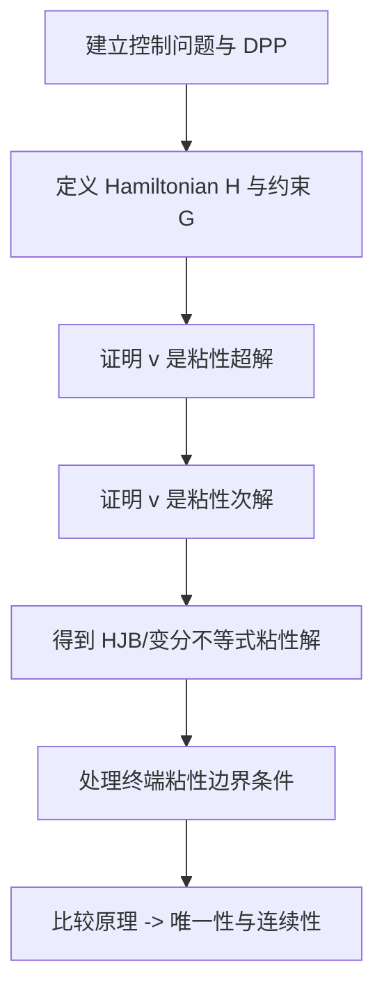

# Stochastic Control in Finance（Chapter 4）

> 主题：粘性解方法（Viscosity Solutions）与随机控制 HJB 方程

## 一句话理解

这章解决了 Chapter 3 的核心痛点：当价值函数不光滑时，经典 PDE 验证法失效；粘性解（Viscosity Solution）提供了弱意义下的严格 HJB 表述与唯一性工具。

---

## 本章核心问题

- 为什么价值函数常常不够光滑，不能直接用经典导数？
- 粘性次解/超解（Subsolution/Supersolution）如何定义？
- 如何从 DPP 严格推出“粘性意义”下的 HJB（或变分不等式）？
- 比较原理（Comparison Principle）为什么决定了唯一性与连续性？

---

## 1. 从经典解到粘性解

一般二阶非线性 PDE 写作

  $$
  F(x,w,Dw,D^2w)=0.
  $$

控制问题对应的 HJB（有限时域）典型形式：

  $$
  -v_t-\sup_{a\in A}\!\left[
  b(x,a)\!\cdot\!D_xv
  +\frac12\mathrm{Tr}\!\left(\sigma\sigma^\top(x,a)D_x^2v\right)
  +f(t,x,a)
  \right]=0.
  $$

当 $v$ 不可微时，改用“测试函数在局部极值点接触”的方式定义方程成立。

---

## 2. 粘性解定义（直觉版）

对局部有界函数 $w$，用上半连续包络 $w^\*$ 与下半连续包络 $w_*$：

- 若 $\phi$ 在点 $\bar x$ 使 $w^\*-\phi$ 取局部最大，则要求

  $$
  F(\bar x,w^\*(\bar x),D\phi(\bar x),D^2\phi(\bar x))\le 0
  $$

称为粘性次解（Subsolution）；

- 若 $\phi$ 在点 $\bar x$ 使 $w_*-\phi$ 取局部最小，则要求

  $$
  F(\bar x,w_*(\bar x),D\phi(\bar x),D^2\phi(\bar x))\ge 0
  $$

称为粘性超解（Supersolution）。

两者同时成立即粘性解。

---

## 3. 从 DPP 到 HJB（粘性意义）

章节证明主线：

- 用 DPP 第一部分得到超解性质；
- 用 DPP 第二部分（配合反证）得到次解性质；
- 合并得到价值函数是 HJB（或 HJB 变分不等式）的粘性解。

在控制集无界、Hamiltonian 可能奇异时，常写成变分不等式统一处理：

  $$
  \min\!\Big\{
  -v_t-H(t,x,Dv,D^2v),\;
  G(t,x,Dv,D^2v)
  \Big\}=0.
  $$

---

## 4. 终端条件为什么要“放宽”

有限时域问题里，价值函数在 $t\uparrow T$ 可能出现边界层，未必点态满足 $v(T,x)=g(x)$。  
因此章节给出“终端粘性条件”：

- 对 $v^\*(T,\cdot)$ 证明超解性质；
- 对 $v_*(T,\cdot)$ 证明次解性质；
- 在比较原理成立时两者夹逼一致，得到正确终端描述。

一句话：不是机械代入 $t=T$，而是用粘性边界条件确保数学与控制含义一致。

---

## 5. 比较原理与唯一性

强比较原理（Strong Comparison）的意义：

- 任意上半连续次解 $\le$ 任意下半连续超解；
- 因而粘性解唯一；
- 同时常能推出价值函数连续性。

这一步是“把 DPP 推导结果变成可计算、可验证唯一对象”的关键。

---

## 6. 对金融控制的直接价值

Chapter 4 的方法使我们在以下场景仍可严谨求解：

- 控制集无界（如杠杆/头寸不截断）；
- 价值函数有折点或边界不规则；
- 终端条件存在松弛现象（特别是奇异控制/约束问题）。

这正是实务金融模型中最常见、也最难的情况。

---

## 方法流程图

---

## 常见误区

### 误区 1：粘性解只是“近似方法”

不对。它是弱正则条件下的严格解概念，不是数值近似替代品。

### 误区 2：只要有 HJB 就能唯一确定价值函数

不对。没有比较原理，可能存在多个粘性解。

### 误区 3：终端条件总是直接 $v(T,x)=g(x)$

不对。在奇异/约束问题里，正确条件常是终端粘性条件（可含“放松”）。

---

## 本章小结

- Chapter 4 将随机控制从“光滑世界”推广到“真实不光滑世界”。
- 价值函数通过 DPP 被严格刻画为 HJB（或变分不等式）的粘性解。
- 比较原理把存在性结果升级为唯一性与稳定性，是后续理论与数值方法的基础。
