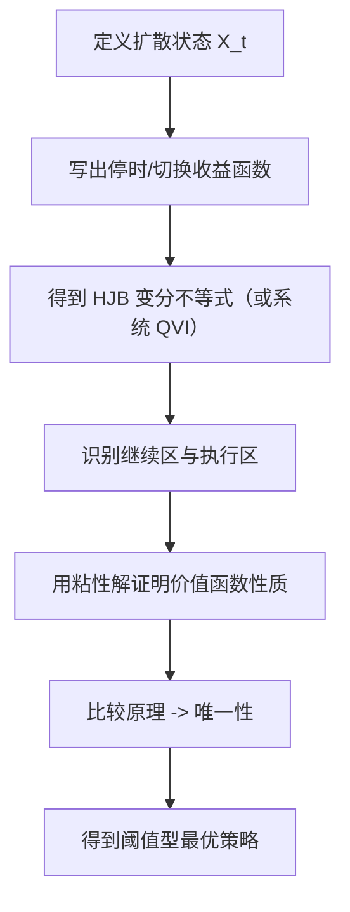

# Stochastic Control in Finance（Chapter 5）

> 主题：最优切换与自由边界问题（Optimal Switching and Free Boundary Problems）

## 一句话理解

这一章把“是否继续/是否切换”决策写成粘性解下的变分不等式：最优停止是单次决策，最优切换是多次 regime 决策，本质都是自由边界（Free Boundary）问题。

---

## 本章核心问题

- 最优停止（Optimal Stopping）如何对应美式期权（American Option）定价？
- 为什么停止区域与继续区域是“未知边界”问题？
- 最优切换（Optimal Switching）如何推广最优停止？
- 如何用粘性解与比较原理证明价值函数唯一性？

---

## 1. 最优停止：从控制到停时

给定扩散过程

  $$
  dX_t=b(X_t)\,dt+\sigma(X_t)\,dW_t,
  $$

无限时域最优停止价值函数写为

  $$
  v(x)=\sup_{\tau\in\mathcal T}
  \mathbb E\!\left[
  \int_0^\tau e^{-\beta t}f(X_t^x)\,dt
  +e^{-\beta \tau}g(X_\tau^x)
  \right].
  $$

对应 HJB 变分不等式：

  $$
  \min\{\beta v-\mathcal Lv-f,\ v-g\}=0.
  $$

其中 $\mathcal L$ 是扩散生成算子。  
一句话：要么继续（满足 PDE），要么立即停止（价值贴住 payoff）。

---

## 2. 继续区/停止区与自由边界

定义继续区（Continuation Region）$C=\{x:\ v(x)>g(x)\}$，停止区 $S=\{x:\ v(x)=g(x)\}$。  
在 $C$ 上满足

  $$
  \beta v-\mathcal Lv-f=0,
  $$

而边界 $\partial C$ 事先未知，因此是自由边界问题。  
在一维均匀椭圆条件下，章节讨论了 smooth-fit（边界处一阶导连续）作为策略结构识别工具。

---

## 3. 最优停止的金融例子

章节应用包括：

- 永续美式看跌（Perpetual American Put）；
- 最优出售资产时机；
- 自然资源开发/停产时机。

这些问题都可归结为“阈值策略（Threshold Policy）”：当状态穿越某个临界点即执行停止。

---

## 4. 最优切换：多 regime 扩展

在最优切换中，控制是切换时刻与目标 regime 序列。  
设 regime 集合为 $\mathcal I=\{1,\dots,m\}$，切换成本 $g_{ij}$，价值函数为 $v_i(x)$。

对应系统变分不等式（QVI）：

  $$
  \min\!\Big\{
  \beta v_i-\mathcal L_i v_i-f_i,\;
  v_i-\max_{j\ne i}(v_j-g_{ij})
  \Big\}=0,\quad i\in\mathcal I.
  $$

这里第一项表示“留在当前 regime”，第二项表示“立即切到其他 regime”。

---

## 5. 切换区域与策略含义

定义从 $i$ 切到 $j$ 的切换区域：

  $$
  S_{ij}=\{x:\ v_i(x)=v_j(x)-g_{ij}\},\qquad
  S_i=\bigcup_{j\ne i}S_{ij}.
  $$

若 $x\in S_i$，最优动作是切换；若 $x\notin S_i$，最优动作是继续当前 regime。  
章节还强调三角不等式型成本条件（防止“瞬时来回切换套利”）。

---

## 6. 粘性解与唯一性

本章沿用 Chapter 4 方法：

- 先证价值函数是 QVI 的粘性解；
- 再用比较原理得到唯一性与连续性；
- 在一维两 regime 情形可给出显式阈值结构。

这使最优停止/切换从“直觉策略”变成“可证明最优”的策略。

---

## 方法流程图

---

## 常见误区

### 误区 1：最优停止只是“看到高价就卖”

不对。最优阈值由折现、漂移、波动和收益结构共同决定。

### 误区 2：最优切换等价于每时点挑当前收益最高 regime

不对。切换成本与未来路径价值决定了“何时切、切到哪”。

### 误区 3：自由边界只是数值现象

不对。它是变分不等式结构的理论核心，决定策略形态。

---

## 本章小结

- Chapter 5 把“单次执行”推广到“多次 regime 决策”，统一在自由边界框架下。
- 最优停止与最优切换都可由粘性解 + 比较原理严谨刻画。
- 这类方法直接服务于实物期权、产能管理、资产出售与策略切换问题。
