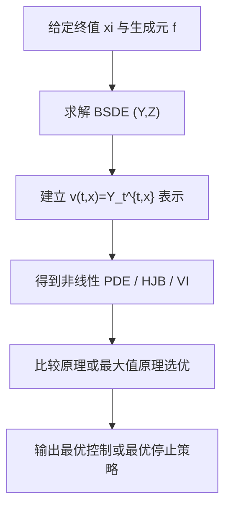

# Stochastic Control in Finance（Chapter 6）

> 主题：后向随机微分方程（BSDE）与最优控制（Optimal Control）

## 一句话理解

这一章把“控制/PDE问题”改写为“后向方程问题”：BSDE 提供了非线性 PDE 的概率表示，也给出了最优控制、最优停止和金融定价的一条统一路径。

---

## 本章核心问题

- BSDE 的标准形式是什么，何时存在唯一解？
- BSDE 如何推广 Feynman-Kac 到非线性 PDE？
- 如何利用 BSDE 表达和求解随机控制问题？
- 反射 BSDE（Reflected BSDE）为何对应最优停止与变分不等式？

---

## 1. BSDE 基本形式

标准一维 BSDE：

  $$
  -dY_t=f(t,Y_t,Z_t)\,dt-Z_t\,dW_t,\qquad Y_T=\xi.
  $$

在终值 $\xi\in L^2$、生成元 $f$ 对 $(y,z)$ 满足 Lipschitz 条件时，章节给出经典结论：存在唯一解 $(Y,Z)$。

---

## 2. 线性 BSDE 与比较原理

线性 BSDE 形如

  $$
  -dY_t=(A_tY_t+B_t\!\cdot\!Z_t+C_t)\,dt-Z_t\,dW_t,\qquad Y_T=\xi,
  $$

可写显式表示。  
比较原理（Comparison Principle）是核心工具：若终值与生成元满足顺序关系，则解过程保持同序。  
它在后续最优化证明中反复使用。

---

## 3. 非线性 Feynman-Kac：BSDE 与 PDE

半线性 PDE 典型形式：

  $$
  -v_t-\mathcal Lv-f\!\left(t,x,v,\sigma^\top D_xv\right)=0,\qquad v(T,x)=g(x).
  $$

对应前向扩散 + 后向方程（FBSDE）：

  $$
  \begin{cases}
  dX_s=b(X_s)\,ds+\sigma(X_s)\,dW_s,\\
  -dY_s=f(s,X_s,Y_s,Z_s)\,ds-Z_s\,dW_s,\quad Y_T=g(X_T).
  \end{cases}
  $$

并给出表示关系（Markov 情况）：

  $$
  v(t,x)=Y_t^{t,x}.
  $$

这就是非线性版 Feynman-Kac 桥梁。

---

## 4. 控制问题中的 BSDE 视角

章节展示两条路线：

- 把控制问题转成一族 BSDE，再用比较原理选优；
- 通过对偶（duality）把凹生成元写成“线性 BSDE 的下确界”形式。

并回顾了随机最大值原理（Stochastic Maximum Principle）：  
最优控制可由 Hamiltonian 最大化条件 + 伴随 BSDE（adjoint BSDE）刻画。

---

## 5. 反射 BSDE 与最优停止

反射 BSDE 引入障碍过程 $L_t$ 与增过程 $K_t$：

  $$
  \begin{cases}
  Y_t=\xi+\int_t^T f(s,Y_s,Z_s)\,ds+K_T-K_t-\int_t^T Z_s\,dW_s,\\
  Y_t\ge L_t,\quad \int_0^T (Y_t-L_t)\,dK_t=0.
  \end{cases}
  $$

直觉：$K$ 只在 $Y$ 触碰障碍时“最小必要地”向上推。  
在 Markov 场景下，章节得到对应变分不等式：

  $$
  \min\!\left\{
  -v_t-\mathcal Lv-f\!\left(\cdot,v,\sigma^\top D_xv\right),\;
  v-h
  \right\}=0.
  $$

这正是最优停止的 PDE 结构。

---

## 6. 金融应用脉络

本章案例包括：

- 含衍生品 payoff 的指数效用最大化；
- 最优控制与伴随方程联立求解；
- 反射 BSDE 对应的美式/停止类问题。

一句话：BSDE 把“概率、控制、PDE、金融目标函数”连成同一个可计算框架。

---

## 方法流程图

---

## 常见误区

### 误区 1：BSDE 只是 PDE 的替代写法

不对。它是概率表示与优化分析工具，常带来更强的结构与数值优势。

### 误区 2：反射 BSDE 里的 K_t 只是技术项

不对。$K_t$ 精确编码了“障碍约束/停止决策”的经济含义。

### 误区 3：最大值原理与 DPP 是互斥方法

不对。两者是互补视角，常在同一问题中相互印证。

---

## 本章小结

- Chapter 6 建立了 BSDE 在随机控制中的核心地位。
- 非线性 Feynman-Kac 与反射 BSDE 让 HJB/变分不等式获得概率表示。
- 这为后续高维、非线性、带约束金融控制问题提供了关键方法库。
