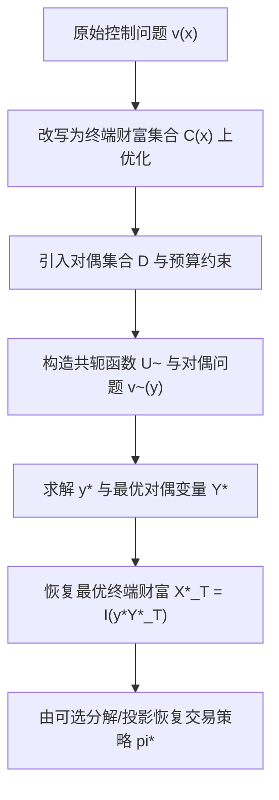

# Stochastic Control in Finance（Chapter 7）

> 主题：鞅方法与凸对偶（Martingale and Convex Duality Methods）

## 一句话理解

这一章把“在控制过程上优化”转成“在终端财富与对偶变量上优化”：用鞅测度与凸对偶把动态问题静态化，从而系统求解超复制、效用最大化和均方对冲问题。

---

## 本章核心问题

- 为什么可以把控制变量优化改写为终端随机变量优化？
- 超复制成本（Superreplication Cost）如何用对偶测度表述？
- 效用最大化（Utility Maximization）的原问题与对偶问题如何连接？
- 均方对冲（Quadratic Hedging）为何是投影问题？

---

## 1. 从控制到终端财富：问题重写

原始问题通常是

  $$
  v(x)=\sup_{\alpha\in\mathcal A(x)}\mathbb E[U(X_T^x)].
  $$

借助鞅表示与可行性约束，可改写为“终端财富集合上的凸优化”：

  $$
  v(x)=\sup_{X_T\in \mathcal C(x)} \mathbb E[U(X_T)].
  $$

关键变化：动态控制约束被转成线性预算约束。

---

## 2. 超复制与对偶表示

给定索赔 $H\ge 0$，超复制成本定义为最小初始资本

  $$
  v_0=\inf\Big\{x:\exists \pi,\ x+(\pi\!\cdot\!S)_T\ge H\ \text{a.s.}\Big\}.
  $$

在无套利且等价鞅测度集合 $\mathcal M^e(S)\neq\varnothing$ 下，得到核心对偶公式：

  $$
  v_0=\sup_{Q\in\mathcal M^e(S)}\mathbb E^Q[H].
  $$

一句话：超复制价格是所有风险中性期望中的“最坏情形上界”。

---

## 3. 可行集合的对偶刻画

章节给出终端可达集合 $\mathcal C(x)$ 的对偶条件：

  $$
  X_T\in\mathcal C(x)
  \iff
  \mathbb E[Y_T X_T]\le x,\ \forall Y_T\in\mathcal D,
  $$

其中 $\mathcal D$ 是由鞅测度密度诱导的对偶变量集合。  
这一步把“交易可行性”完全转成线性泛函约束。

---

## 4. 效用最大化的凸对偶

定义共轭函数（Legendre-Fenchel）：

  $$
  \tilde U(y)=\sup_{x>0}\{U(x)-xy\}.
  $$

对偶价值函数：

  $$
  \tilde v(y)=\inf_{Y_T\in\mathcal D}\mathbb E[\tilde U(yY_T)].
  $$

并有共轭关系：

  $$
  v(x)=\inf_{y>0}\{\tilde v(y)+xy\},
  \qquad
  \tilde v(y)=\sup_{x>0}\{v(x)-xy\}.
  $$

在适当条件下，最优终端财富满足

  $$
  X_T^\*=I(y^\*Y_T^\*),\qquad I=(U')^{-1}.
  $$

---

## 5. 均方对冲：投影视角

均方对冲问题：

  $$
  \min_{\pi}\ \mathbb E\!\left[(x+(\pi\!\cdot\!S)_T-H)^2\right].
  $$

本质是把 $H$ 在随机积分空间上的 $L^2$ 投影。  
章节结合 Kunita-Watanabe 分解与方差最优鞅测度（Variance-Optimal Martingale Measure）给出结构化解法。

---

## 6. 方法价值与适用边界

这套方法特别适合：

- 不完全市场（Incomplete Market）；
- 半鞅价格过程（Semimartingale）；
- 动态规划难以直接落地的高维/非 Markov 模型。

相较 HJB 路径，它更偏“函数分析 + 概率测度”视角。

---

## 方法流程图

---

## 常见误区

### 误区 1：对偶方法只适用于完全市场

不对。它在不完全市场中反而更有优势。

### 误区 2：超复制价格等于单一风险中性测度下价格

不对。一般是对所有可行鞅测度取上确界。

### 误区 3：均方对冲就是“回归一下”

不对。严格上是随机积分子空间中的 Hilbert 投影问题。

---

## 本章小结

- Chapter 7 给出随机控制的另一条主干：鞅表示 + 凸对偶。
- 超复制、效用最大化、均方对冲在该框架下得到统一刻画。
- 这为后续处理不完全市场与更一般半鞅模型提供了强有力工具。
