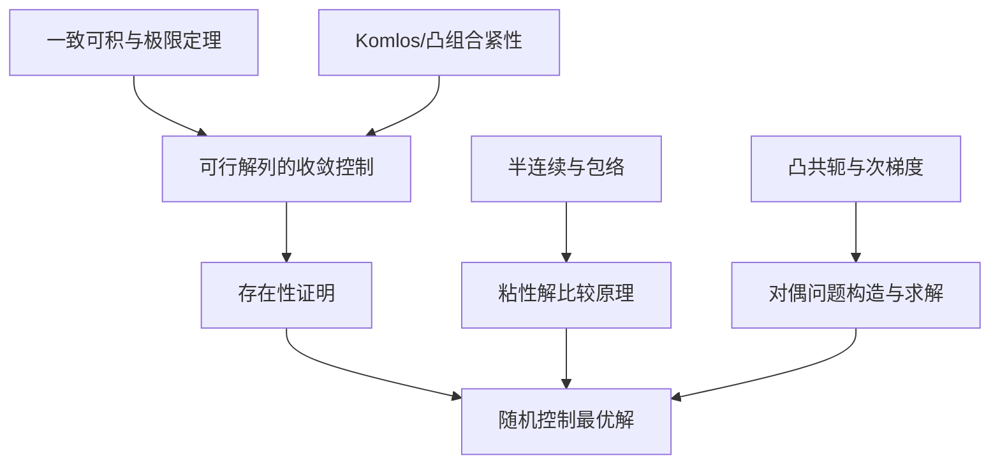

# Stochastic Control in Finance（Chapter 8）

> 主题：附录方法工具总览（Integration & Convex Analysis Foundations）

## 一句话理解

这一章相当于全课的“数学工具箱收官”：把前面章节频繁使用的积分极限定理、紧性结论、本质上确界与凸分析基本构件系统化，方便在随机控制与金融优化中反复调用。

---

## 本章核心问题

- 为什么一致可积（Uniform Integrability）是极限交换与存在性证明的关键？
- 如何用本质上确界（Essential Supremum）刻画“随机最优值”？
- Komlós 类紧性结论如何保障最优解存在？
- 凸分析中的共轭、次梯度、min-max 为什么是对偶方法基础？

---

## 1. 一致可积与收敛升级

本章首先整理了随机变量族的一致可积条件与其作用：  
它把“几乎处处收敛”升级到“$L^1$ 收敛”，是随机优化中从近似解列到极限解的核心桥梁。

一句话：没有一致可积，很多看似自然的极限交换都不安全。

---

## 2. 本质上确界（ess sup）

对随机变量族 $(f_i)$，本质上确界 $\operatorname{ess\,sup}_i f_i$ 提供了“几乎处处意义下最小上界”。  
这正是动态规划和对偶推导中写

  $$
  X_t=\operatorname*{ess\,sup}_{Q\in\mathcal M}\mathbb E^Q[\cdot\mid\mathcal F_t]
  $$

这类表达的数学基础。

---

## 3. 紧性与存在性：Komlós 思想

章节回顾了序列的凸组合紧性结论（如 Komlós 类型结果）：  
即便原序列不收敛，也常能通过凸组合提取几乎处处收敛子列。

这在效用最大化、对偶优化里尤其重要，因为它支持“最大化序列 $\to$ 可行极限点”的存在性证明。

---

## 4. 凸分析工具：下半连续、次梯度、共轭

附录系统整理了：

- 半连续包络（l.s.c/u.s.c）；
- 次梯度（Subdifferential）与可微判别；
- Fenchel-Legendre 共轭变换；
- min-max 交换定理的适用条件。

这些工具直接支撑 Chapter 7 的凸对偶主线。

---

## 5. 与前七章的对应关系

- Chapter 4/5 的粘性解比较原理：依赖半连续框架；
- Chapter 6 的 BSDE 极限论证：依赖积分估计与收敛工具；
- Chapter 7 的鞅-对偶方法：依赖共轭函数、次梯度与紧性结果。

一句话：本章不是“新模型”，而是把所有模型背后的通用证明引擎集中展示。

---

## 工具关系图

---

## 常见误区

### 误区 1：附录工具只是形式化补充

不对。很多主定理（存在性、唯一性、对偶等价）都直接依赖这些工具。

### 误区 2：有点态收敛就可以直接传递期望

不对。通常还需要一致可积或可支配条件。

### 误区 3：凸对偶只要写出共轭函数就结束

不对。还需要可行域闭性、紧性和 min-max 条件保证对偶无间隙与最优解存在。

---

## 本章小结

- Chapter 8 作为系列收官，补齐了随机控制证明链条中的关键分析工具。
- 前七章中的 DPP、HJB、BSDE、鞅对偶方法都可回溯到本章的基础模块。
- 这套“工具层”让你在迁移到新模型时仍能复用同一证明框架。
