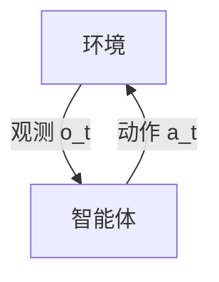

# Decision-making under uncertainty（Chapter 1）

> 主题：课程导论、智能体-环境闭环、方法谱系

## 一句话理解

本章回答“这门课在解决什么问题”：在不确定环境中，智能体如何持续决策，并且为什么需要从规则系统走向规划（Planning）与强化学习（Reinforcement Learning）。

---

## 本章核心问题

- 什么是不确定性下的决策？
- 决策系统的最小闭环结构是什么？
- 规则、监督学习、规划、RL 的边界分别在哪里？
- 为什么后续章节要进入 MDP / POMDP 等概率决策框架？

---

## 决策闭环

在时刻 $t$，智能体基于观测 $o_t$ 选择动作 $a_t$，动作改变环境并影响下一步观测。

---

## 方法谱系（本章导航）

| 方法                            | 优势           | 局限                 |
| ------------------------------- | -------------- | -------------------- |
| 规则系统（Rule-based）          | 可控、可解释   | 难覆盖复杂场景       |
| 监督学习（Supervised Learning） | 工程落地快     | 受标注分布限制       |
| 规划（Planning）                | 可利用模型结构 | 依赖模型质量         |
| 强化学习（RL）                  | 适应复杂策略   | 样本效率与稳定性挑战 |

---

## 数学目标（课程总目标）

  $$
  \pi^\star=\arg\max_{\pi} J(\pi)
  $$

其中 $J(\pi)$ 代表长期任务性能（如安全、效率、成本等综合目标）。

---

## 常见误区

### 误区 1：不确定性只是噪声细节

不对。很多任务里，不确定性本身就是决策核心。

### 误区 2：有了 RL 就不需要模型

不对。工程系统通常是规则、模型、优化与学习的混合架构。

---

## 本章小结

- 明确了“在不确定环境中持续决策”的问题定义。
- 给出了后续课程的技术路线图。
- 建立了统一目标函数视角，为后续 MDP/POMDP 铺垫。
