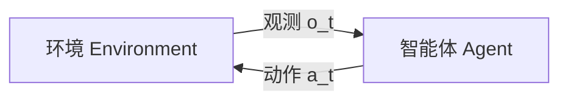

# Decision-making under uncertainty（Chapter 1）

> 主题：课程导论、智能体-环境循环、方法谱系（规划与强化学习）

## 一句话理解

这一章先定义“什么是不确定性下的决策问题”，再给出从规则系统到规划（Planning）与强化学习（Reinforcement Learning）的整体地图。

---

## 本章核心问题

## 1. 现实决策系统为什么必须显式处理不确定性（Uncertainty）？

## 2. 智能体（Agent）如何与环境（Environment）交互？

## 3. 为什么课程主线是规划与强化学习，而不只是规则系统？

---

## 1. 问题场景与挑战

典型场景包括：防碰撞、持续监视、应急调度。共同难点是：

- 观测不完整或有噪声
- 同一动作结果不确定
- 安全、效率、成本等目标冲突

---

## 2. 决策闭环

在时刻 \(t\)，智能体基于观测 \(o_t\) 选择动作 \(a_t\)，动作再改变环境并影响后续观测。

---

## 3. 方法谱系

| 方法                            | 主要依赖 | 优势         | 局限                 |
| ------------------------------- | -------- | ------------ | -------------------- |
| 显式规则（Rule-based）          | 人工知识 | 可解释、可控 | 难覆盖复杂场景       |
| 监督学习（Supervised Learning） | 标注数据 | 工程落地快   | 受示例分布限制       |
| 优化（Optimization）            | 目标函数 | 可系统寻优   | 可能计算代价高       |
| 规划（Planning）                | 动态模型 | 利用结构信息 | 依赖模型质量         |
| 强化学习（RL）                  | 交互反馈 | 适应复杂策略 | 样本效率与稳定性挑战 |

---

## 4. 课程目标函数视角

课程核心是寻找策略 \(\pi\)，使长期目标最优：

$$
\pi^\star=\arg\max_{\pi} J(\pi)
$$

其中 \(J(\pi)\) 可以综合任务收益、安全惩罚和资源消耗。

---

## 常见误区

### 误区 1：不确定性只是噪声项

不对。在很多任务里，不确定性本身就是决策核心。

### 误区 2：有了 RL 就不需要模型

不对。实际系统通常是规则、模型、优化、RL 的组合。

---

## 本章小结

- 明确了“不确定性下决策”的问题定义与闭环结构。
- 梳理了主流方法与适用边界。
- 解释了课程为何聚焦规划与强化学习主线。

---

## 讨论问题

1. 你的场景里，不确定性主要来自观测、转移，还是目标冲突？
2. 如果只能先做一版系统，你会优先规则、规划还是 RL？为什么？
