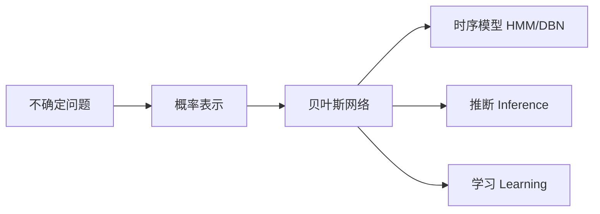

# Decision-making under uncertainty（Chapter 2）

> 主题：概率模型（Probabilistic Models）、贝叶斯网络（Bayesian Network）、推断（Inference）与学习（Learning）

## 一句话理解

这一章讨论如何把不确定世界表示成概率结构，并在给定证据后做推断，再从数据学习参数和结构。

---

## 本章核心问题

## 1. 为什么要把“信念”写成概率分布？

## 2. 联合分布太大时，如何压缩表示？

## 3. 如何在观测条件下推断隐藏变量？

## 4. 模型未知时如何学习？

---

## 1. 概率基础

关键关系式：

$$
P(A\mid B)=\frac{P(A,B)}{P(B)}
$$

$$
P(A\mid C)=\sum_b P(A\mid b,C)\,P(b\mid C)
$$

$$
P(A\mid B)=\frac{P(B\mid A)P(A)}{P(B)}
$$

分别对应条件概率、全概率公式和贝叶斯公式（Bayes' Rule）。

---

## 2. 贝叶斯网络：结构化联合分布

贝叶斯网络用条件独立性（Conditional Independence）降低表示复杂度：

$$
P(X_1,\dots,X_n)=\prod_{i=1}^{n}P\!\left(X_i\mid \mathrm{Pa}(X_i)\right)
$$

\(\mathrm{Pa}(X_i)\) 表示 \(X_i\) 的父节点。

---

## 3. 时序不确定模型

- 马尔可夫链（Markov Chain）
- 隐马尔可夫模型（Hidden Markov Model, HMM）
- 动态贝叶斯网络（Dynamic Bayesian Network, DBN）

常见一阶马尔可夫假设：

$$
P(S_t\mid S_{0:t-1})=P(S_t\mid S_{t-1})
$$

---

## 4. 推断：从证据到后验

在 HMM 中，递归贝叶斯估计（Recursive Bayesian Estimation）常分两步：

预测：

$$
P(s_t\mid o_{1:t-1})=\sum_{s_{t-1}}P(s_t\mid s_{t-1})P(s_{t-1}\mid o_{1:t-1})
$$

更新：

$$
P(s_t\mid o_{1:t})\propto P(o_t\mid s_t)\,P(s_t\mid o_{1:t-1})
$$

---

## 5. 学习：参数与结构

- 参数学习（Parameter Learning）：MLE 或贝叶斯参数学习
- 结构学习（Structure Learning）：图搜索 + 评分（如 Bayesian Score）

一句话：参数学习是“图固定调数字”，结构学习是“连线也要学”。

---

## 关系图

---

## 常见误区

### 误区 1：贝叶斯网络等于因果网络

不完全对。贝叶斯网络首先编码的是条件独立结构，不自动等价因果关系。

### 误区 2：精确推断总优于近似推断

不对。复杂模型下精确推断代价高，近似方法更实用。

---

## 本章小结

- 概率模型给了不确定性一个可计算表达。
- 贝叶斯网络通过结构假设压缩联合分布。
- 推断与学习共同支撑后续决策优化。
