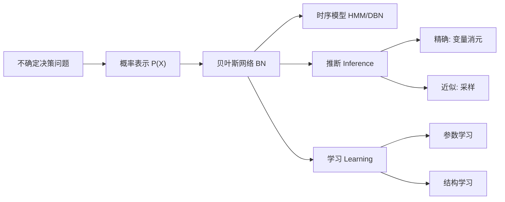

# Decision-making under uncertainty（Chapter 2）

> 资料来源：`decision-making under uncertainty-37-80.pdf`  
> 主题：概率模型（Probabilistic Models）、贝叶斯网络（Bayesian Network）、推断（Inference）与学习（Learning）

## 一句话理解

这一章回答的是：面对不确定环境，我们如何用“可计算的概率结构”表示世界、做推断、再从数据学习模型。

---

## 本章核心问题

## 1. 为什么要用概率而不是“确定规则”描述现实？

## 2. 联合分布（Joint Distribution）太大时，如何压缩表示？

## 3. 给定观测后，如何高效推断隐藏状态？

## 4. 模型参数与结构未知时，如何从数据学习？

---

## 1. 概率表示：从信念到可计算模型

不确定性来源包括：观测不完整、系统噪声、未来结果不可精确预测。  
因此需要把“相信程度”映射成概率（Probability）。

关键公式：

$$
P(A \mid B) = \frac{P(A,B)}{P(B)}
$$

$$
P(A \mid C) = \sum_{b} P(A \mid b, C) P(b \mid C)
$$

$$
P(A \mid B) = \frac{P(B \mid A)P(A)}{P(B)}
$$

上面分别是：条件概率（Conditional Probability）、全概率公式（Law of Total Probability）、贝叶斯公式（Bayes' Rule）。

---

## 2. 从联合分布到贝叶斯网络

直接建模联合分布 \(P(X_1,\dots,X_n)\) 的参数规模会随变量数快速爆炸。  
贝叶斯网络（Bayesian Network, BN）通过条件独立（Conditional Independence）把大问题拆小：

$$
P(X_1,\dots,X_n)=\prod_{i=1}^n P\!\left(X_i \mid \mathrm{Pa}(X_i)\right)
$$

其中 \(\mathrm{Pa}(X_i)\) 表示 \(X_i\) 的父节点（Parents）。

### 一句话理解

贝叶斯网络的本质是“用结构假设换计算效率”。

---

## 3. 时序模型：从马尔可夫链到动态贝叶斯网络

本章给出时序不确定系统的统一视角：

- 马尔可夫链（Markov Chain）：状态随时间演化
- 隐马尔可夫模型（Hidden Markov Model, HMM）：状态不可直接观测，只能通过观测变量间接推断
- 动态贝叶斯网络（Dynamic Bayesian Network, DBN）：更一般的时序概率图

常见一阶马尔可夫假设：

$$
P(S_t \mid S_{0:t-1}) = P(S_t \mid S_{t-1})
$$

---

## 4. 推断（Inference）：给定证据后如何回答查询

查询变量（Query）、证据变量（Evidence）、隐藏变量（Hidden）构成了典型推断任务。

### 4.1 递归贝叶斯估计（Recursive Bayesian Estimation）

在 HMM 中，滤波（Filtering）常写为两步：

预测（Prediction）：

$$
P(s_t \mid o_{1:t-1})=\sum_{s_{t-1}} P(s_t \mid s_{t-1})P(s_{t-1}\mid o_{1:t-1})
$$

更新（Update）：

$$
P(s_t \mid o_{1:t}) \propto P(o_t \mid s_t)\,P(s_t \mid o_{1:t-1})
$$

### 4.2 精确推断与近似推断

- 精确推断（Exact Inference）：如变量消元（Variable Elimination）
- 近似推断（Approximate Inference）：如直接采样、似然加权（Likelihood Weighting）、Gibbs 采样

本章强调：一般图上的精确推断复杂度高，实践中常需近似方法。

---

## 5. 学习（Learning）：参数与结构怎么学

## 5.1 参数学习（Parameter Learning）

- 极大似然估计（Maximum Likelihood Estimation, MLE）：求最能解释数据的参数
- 贝叶斯参数学习（Bayesian Parameter Learning）：对参数保持分布不确定性，再做后验更新

## 5.2 结构学习（Structure Learning）

当图结构未知时，需要搜索有向无环图（DAG）并评分。  
常见是贝叶斯评分（Bayesian Score）+ 图搜索（Graph Search）。

### 一句话理解

参数学习是在“图固定”下调数字；结构学习是在“连线也未知”时调图。

---

## 概念关系图

---

## 常见误区

### 误区 1：有了贝叶斯网络就等于“真实因果关系”

不完全正确。贝叶斯网络编码的是条件独立结构，未必自动等同因果图。

### 误区 2：精确推断一定优于采样推断

不完全正确。高维或复杂结构下，精确推断计算成本可能不可接受，近似方法更实用。

### 误区 3：只做参数学习就够了

不完全正确。若结构设错，参数再精确也可能系统性偏差。

---

## 本章小结

- 用概率把“不确定信念”变成可计算对象。
- 用贝叶斯网络压缩联合分布并显式表达条件独立。
- 用滤波/采样等方法在证据下做状态推断。
- 用参数学习与结构学习让模型贴近数据。

---

## 讨论问题

1. 在你的应用中，错误来自“观测噪声”还是“结构假设错误”更多？
2. 如果必须实时推断，你会优先选精确推断还是采样推断？为什么？
3. 当数据有限时，你更倾向 MLE 还是贝叶斯学习？背后的风险权衡是什么？
