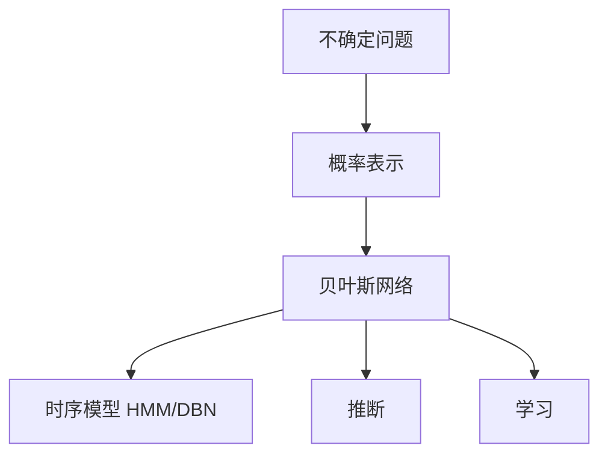

# Decision-making under uncertainty（Chapter 2）

> 主题：概率模型（Probabilistic Models）、贝叶斯网络（Bayesian Network）、推断（Inference）

## 一句话理解

本章把“不确定性”变成可计算对象：先表示概率结构，再在证据下推断隐藏状态，最后讨论参数与结构学习。

---

## 本章核心问题

- 如何把主观不确定性写成概率分布？
- 联合分布太大时，怎样结构化压缩？
- 给定观测后，如何高效推断？
- 模型未知时，参数和结构如何学习？

---

## 概率基础公式

  $$
  P(A\mid B)=\frac{P(A,B)}{P(B)}
  $$

  $$
  P(A\mid C)=\sum_b P(A\mid b,C)\,P(b\mid C)
  $$

  $$
  P(A\mid B)=\frac{P(B\mid A)\,P(A)}{P(B)}
  $$

---

## 贝叶斯网络：压缩联合分布

  $$
  P(X_1,\dots,X_n)=\prod_{i=1}^n P\!\left(X_i\mid \mathrm{Pa}(X_i)\right)
  $$

这里 $\mathrm{Pa}(X_i)$ 是 $X_i$ 的父节点。  
一句话：用条件独立假设换计算可行性。

---

## 时序模型：马尔可夫视角

  $$
  P(S_t\mid S_{0:t-1})=P(S_t\mid S_{t-1})
  $$

这对应一阶马尔可夫假设，也是 HMM / DBN 的基础。

---

## 递归贝叶斯估计（Filtering）

预测步：

  $$
  P(s_t\mid o_{1:t-1})=\sum_{s_{t-1}}P(s_t\mid s_{t-1})P(s_{t-1}\mid o_{1:t-1})
  $$

更新步：

  $$
  P(s_t\mid o_{1:t})\propto P(o_t\mid s_t)\,P(s_t\mid o_{1:t-1})
  $$

---

## 概念关系图

---

## 常见误区

### 误区 1：贝叶斯网络天然等于因果图

不完全对。BN 先编码条件独立结构，不自动等同因果方向。

### 误区 2：精确推断一定优于近似推断

不对。复杂模型下，采样/近似常更实用。

---

## 本章小结

- 概率模型是处理不确定决策的底层语言。
- BN 提供了可扩展的结构化表示。
- 推断与学习共同支撑后续最优决策算法。
