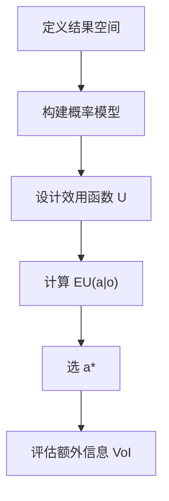

# Decision-making under uncertainty（Chapter 3）

> 主题：决策问题（Decision Problems）、效用理论（Utility Theory）、决策网络（Decision Networks）

## 一句话理解

本章把“概率推断”推进到“理性决策”：用效用函数表达偏好，再用最大期望效用原则选动作。

---

## 本章核心问题

- 理性偏好如何导出效用函数？
- 为什么理性决策等价于最大期望效用？
- 决策网络如何统一“概率 + 动作 + 效用”？
- 什么时候要看信息价值（Value of Information）？

---

## 效用公理与彩票效用

若偏好满足冯·诺伊曼-摩根斯坦公理，则有实值效用函数 $U$，且

  $$
  U([S_1:p_1;\ldots;S_n:p_n])=\sum_{i=1}^{n}p_i\,U(S_i)
  $$

并且效用只在正仿射变换下唯一：

  $$
  U'(S)=mU(S)+b,\quad m>0
  $$

---

## 最大期望效用（MEU）原则

  $$
  EU(a\mid o)=\sum_{s'}P(s'\mid a,o)\,U(s')
  $$

  $$
  a^\star=\arg\max_a EU(a\mid o)
  $$

一句话：理性动作就是“在当前信息下让期望效用最大”。

---

## 决策网络（Decision Network）

节点类型：

- 机会节点（Chance）
- 决策节点（Decision）
- 效用节点（Utility）

用途：在不确定条件下评估每个动作的 $EU$ 并选择最优动作。

---

## 信息价值（VoI）

  $$
  \mathrm{VoI}(o'\mid o)=
  \sum_{o'}P(o'\mid o)\,EU^\*(o,o')-EU^\*(o)
  $$

解释：信息价值是“能否改变并提升最优决策”的增量，不是“知道更多”本身。

---

## 方法流程图

---

## 常见误区

### 误区 1：最大期望收益等于最大期望效用

不对。收益是客观金额，效用反映偏好与风险态度。

### 误区 2：概率模型准就一定决策好

不完全对。效用函数若设错，最优动作也会错。

---

## 本章小结

- 效用理论是理性决策的数学基础。
- MEU 是单步决策的核心准则。
- 决策网络提供了可解释、可计算的统一框架。
