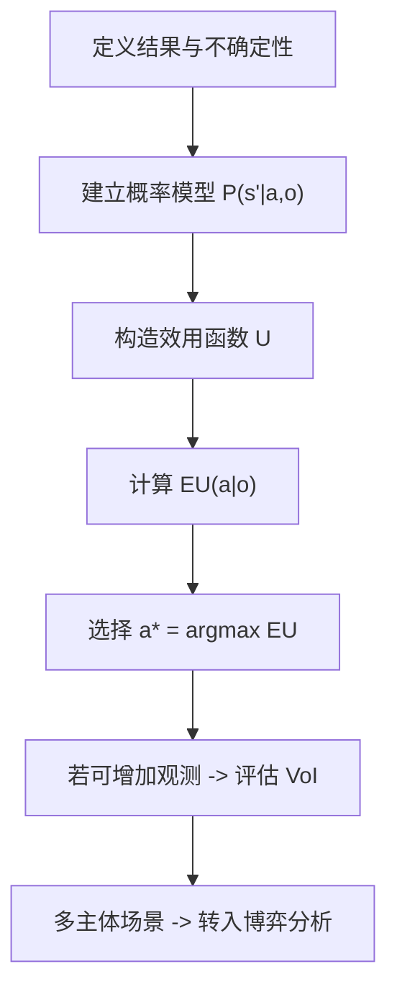

# Decision-making under uncertainty（Chapter 3）

> 主题：决策问题（Decision Problems）、效用理论（Utility Theory）、决策网络（Decision Networks）与博弈（Games）

## 一句话理解

这一章把“有概率模型”推进到“如何做理性决策”：用效用函数刻画偏好，用最大期望效用原则选动作，再用决策网络与博弈模型处理更复杂场景。

---

## 本章核心问题

## 1. 什么是“理性偏好”，它如何导出效用函数？

## 2. 为什么理性决策等价于最大化期望效用？

## 3. 决策网络如何把不确定性与决策动作放到同一图模型中？

## 4. 多主体互动时，为什么需要博弈论视角？

---

## 1. 效用理论：把“偏好”变成可计算量

本章先定义偏好关系（Preference）与彩票（Lottery）：

$$
[S_1:p_1;\ldots;S_n:p_n]
$$

若偏好满足冯·诺伊曼-摩根斯坦公理（von Neumann-Morgenstern Axioms），则存在实值效用函数 \(U\)，并且彩票效用可写为期望：

$$
U([S_1:p_1;\ldots;S_n:p_n])=\sum_{i=1}^{n} p_i U(S_i)
$$

另外，效用函数只在正仿射变换下唯一：

$$
U'(S)=mU(S)+b,\quad m>0
$$

### 一句话理解

只要偏好“足够理性”，就能用一个数字函数 \(U\) 表达“我更想要什么”。

---

## 2. 最大期望效用（MEU）原则

给定观测 \(o\) 与动作 \(a\)，若结果状态为 \(s'\)，期望效用定义为：

$$
EU(a\mid o)=\sum_{s'} P(s'\mid a,o)\,U(s')
$$

理性动作选择：

$$
a^\star=\arg\max_{a} EU(a\mid o)
$$

这就是最大期望效用原则（Maximum Expected Utility Principle）。

---

## 3. 效用刻画与风险偏好

## 3.1 效用询问（Utility Elicitation）

实务中常先把“最差结果”定为 0，“最好结果”定为 1，再通过等价彩票反推中间结果效用。

## 3.2 金钱效用不是线性的

“钱”不总等于“效用”。不同风险偏好会导致不同决策：

- 风险中性（Risk Neutral）：效用近似线性
- 风险偏好（Risk Seeking）：更偏向高波动高收益
- 风险厌恶（Risk Averse）：更偏好确定收益

### 一句话理解

同样的期望金额，不同人可能因为效用曲线不同而做出完全不同的选择。

---

## 4. 多变量效用与加性分解

如果结果由多个变量 \(x_1,\ldots,x_n\) 决定，完整效用表规模会很大。  
在满足结构假设时，可用加性分解降低参数量：

$$
U(x_{1:n})=\sum_{i=1}^{n} k_i\,U_i(x_i)
$$

这里 \(k_i\) 是权重，\(U_i\) 是单变量效用分量。

---

## 5. 决策网络（Decision Network）

决策网络可以看作“贝叶斯网络 + 决策节点 + 效用节点”：

- 机会节点（Chance Node）：不确定变量
- 决策节点（Decision Node）：可选动作
- 效用节点（Utility Node）：偏好/收益函数

其核心用途是：给定可观察信息，计算每个动作的期望效用并选最优动作。

## 5.1 信息价值（Value of Information, VoI）

某个额外观测 \(o'\) 的信息价值可写为：

$$
\mathrm{VoI}(o'\mid o)=\sum_{o'} P(o'\mid o)\,EU^\star(o,o')-EU^\star(o)
$$

其中 \(EU^\star(\cdot)\) 表示“在该信息条件下最优动作的期望效用”。

### 一句话理解

信息的价值不是“知道更多”，而是“知道后是否能改变并改善最优决策”。

---

## 6. 多主体：从单人决策到博弈

当环境里有其他会决策的主体（Agents）时，需要博弈论（Game Theory）建模。  
本章介绍了均衡与行为博弈的基本想法，比如 logit 响应：

$$
P(a_i)\propto e^{\lambda U_i(a_i,s_{-i})}
$$

\(\lambda\) 越大，越倾向高效用动作；\(\lambda\to 0\) 时接近随机。

---

## 方法流程图

---

## 常见误区

### 误区 1：最大期望收益就等于最大期望效用

不对。收益是客观金额，效用反映偏好与风险态度，二者通常不线性等价。

### 误区 2：只要概率模型准，决策一定好

不完全对。若效用函数刻画错了，即使概率预测准，动作也可能偏离真实目标。

### 误区 3：信息越多越好

不完全对。信息可能获取成本高，且未必改变最优动作，净价值可能为零或负。

---

## 本章小结

- 从偏好公理出发可建立效用函数并定义理性决策。
- 理性动作由最大期望效用原则给出。
- 决策网络把概率推断与效用优化统一在一个图框架中。
- 多主体互动需要结合博弈论，而不是单体优化。

---

## 讨论问题

1. 你的任务里，最容易量化的是“概率”还是“效用”？为什么？
2. 在高风险业务中，你会如何做效用询问，避免“金额替代效用”的偏差？
3. 你能想到一个“信息很多但 VoI 很低”的实际例子吗？
