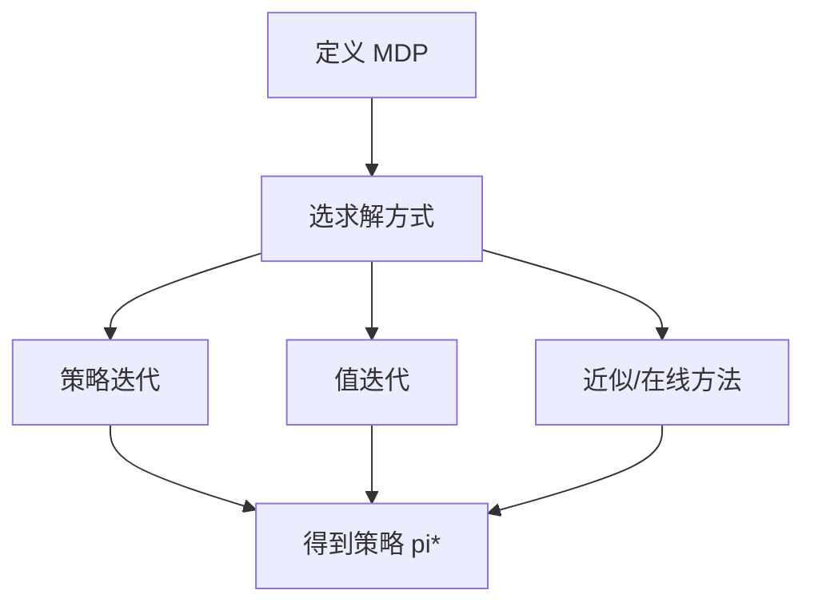

# Decision-making under uncertainty（Chapter 4）

> 主题：序贯决策（Sequential Problems）、马尔可夫决策过程（MDP）、动态规划（Dynamic Programming）

## 一句话理解

本章把单步决策升级到多步决策：用 MDP 建模长期问题，再用贝尔曼递推求最优策略。

---

## 本章核心问题

- 序贯决策如何形式化为 MDP？
- 有限期与无限期目标函数如何定义？
- 策略评估、策略迭代、值迭代有什么关系？
- 状态空间很大时如何近似或在线求解？

---

## MDP 基本要素

- 状态 $S$
- 动作 $A$
- 转移 $T(s'\mid s,a)$
- 奖励 $R(s,a)$
- 折扣因子 $\gamma$

马尔可夫假设：

  $$
  P(s_{t+1}\mid s_{0:t},a_{0:t})=P(s_{t+1}\mid s_t,a_t)
  $$

---

## 回报定义

有限期总回报：

  $$
  U=\sum_{t=0}^{n-1} r_t
  $$

无限期折扣回报：

  $$
  U=\sum_{t=0}^{\infty}\gamma^t r_t,\quad 0\le\gamma<1
  $$

---

## 策略价值与最优策略

  $$
  U^\pi(s)=\mathbb{E}\!\left[\sum_{t=0}^{\infty}\gamma^t r_t\mid s_0=s,\pi\right]
  $$

  $$
  \pi^\star=\arg\max_\pi U^\pi
  $$

---

## 动态规划三件套

策略评估：

  $$
  U^\pi(s)=R(s,\pi(s))+\gamma\sum_{s'}T(s'\mid s,\pi(s))U^\pi(s')
  $$

策略改进：

  $$
  \pi_{k+1}(s)=\arg\max_a\!\left[R(s,a)+\gamma\sum_{s'}T(s'\mid s,a)U^{\pi_k}(s')\right]
  $$

值迭代：

  $$
  U_{k+1}(s)=\max_a\!\left[R(s,a)+\gamma\sum_{s'}T(s'\mid s,a)U_k(s')\right]
  $$

---

## 方法流程图

---

## 常见误区

### 误区 1：折扣因子只是技术参数

不对。$\gamma$ 会直接改变“看短期还是看长期”的策略偏好。

### 误区 2：状态空间大就不能做决策优化

不对。可通过因子化表示、函数近似和在线搜索求可用解。

---

## 本章小结

- MDP 是序贯决策的标准建模框架。
- 贝尔曼方程把长期优化分解成局部递推。
- 工程落地通常是精确 DP、近似 DP、在线搜索的组合。
