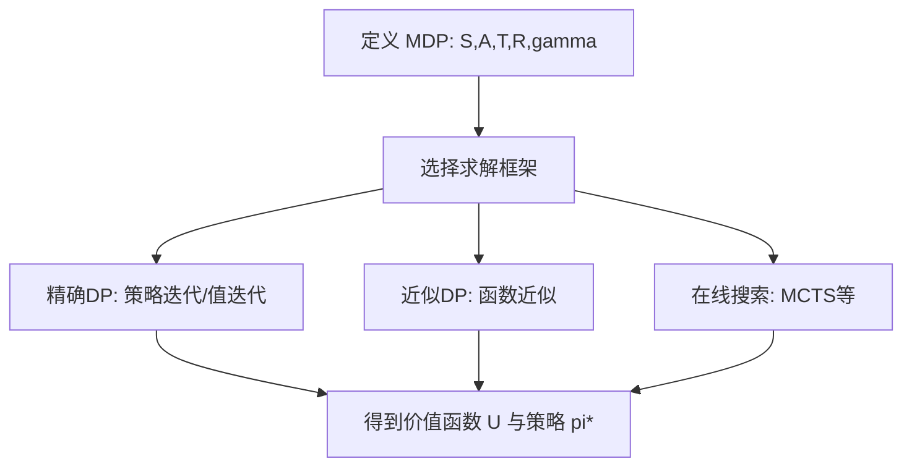

# Decision-making under uncertainty（Chapter 4）

> 主题：序贯决策（Sequential Problems）、马尔可夫决策过程（Markov Decision Process, MDP）、动态规划（Dynamic Programming）

## 一句话理解

这一章把单步决策扩展到多步决策：核心是用 MDP 建模“状态-动作-转移-奖励”，再用贝尔曼方程（Bellman Equation）和动态规划求最优策略。

---

## 本章核心问题

## 1. 序贯决策如何形式化为 MDP？

## 2. 有限期与无限期目标函数应该怎么定义？

## 3. 为什么动态规划可以高效求最优策略？

## 4. 状态空间很大时，如何近似或在线求解？

---

## 1. MDP 形式化

在 MDP 中，智能体在状态 \(s*t\) 选择动作 \(a_t\)，环境随机转移到下一状态 \(s*{t+1}\)，并给出奖励 \(r_t\)。

核心组成：

- 状态空间 \(S\)
- 动作空间 \(A\)
- 转移函数 \(T(s'\mid s,a)\)
- 奖励函数 \(R(s,a)\)
- 折扣因子 \(\gamma\in[0,1)\)

马尔可夫假设（Markov Assumption）：

$$
P(s_{t+1}\mid s_{0:t},a_{0:t}) = P(s_{t+1}\mid s_t,a_t)
$$

---

## 2. 回报定义：有限期 vs 无限期

有限期 \(n\) 步总回报：

$$
U=\sum_{t=0}^{n-1} r_t
$$

无限期折扣回报：

$$
U=\sum_{t=0}^{\infty}\gamma^t r_t,\quad 0\le \gamma<1
$$

无限期平均回报（另一常见定义）：

$$
\lim_{n\to\infty}\frac{1}{n}\sum_{t=0}^{n-1} r_t
$$

### 一句话理解

\(\gamma\) 决定了“短期收益”和“长期收益”的权衡强度。

---

## 3. 策略与价值函数

策略（Policy） \(\pi\) 给出状态到动作的映射。  
在平稳 MDP 中，常关注平稳策略 \(\pi(s)\)。

策略价值函数（Value Function）：

$$
U^\pi(s)=\mathbb{E}\!\left[\sum_{t=0}^{\infty}\gamma^t r_t \,\middle|\, s_0=s,\pi\right]
$$

最优策略定义：

$$
\pi^\star(s)=\arg\max_{\pi} U^\pi(s)
$$

---

## 4. 动态规划三件套

## 4.1 策略评估（Policy Evaluation）

固定策略 \(\pi\) 下的贝尔曼期望方程：

$$
U^\pi(s)=R(s,\pi(s))+\gamma\sum_{s'}T(s'\mid s,\pi(s))U^\pi(s')
$$

矩阵形式：

$$
U_\pi=R_\pi+\gamma T_\pi U_\pi
$$

$$
U_\pi=(I-\gamma T_\pi)^{-1}R_\pi
$$

## 4.2 策略迭代（Policy Iteration）

交替执行：

1. 策略评估：求当前 \(\pi_k\) 的 \(U^{\pi_k}\)
2. 策略改进：对每个状态贪心更新动作

改进步：

$$
\pi_{k+1}(s)=\arg\max_a\left[R(s,a)+\gamma\sum_{s'}T(s'\mid s,a)U^{\pi_k}(s')\right]
$$

## 4.3 值迭代（Value Iteration）

直接迭代最优贝尔曼方程：

$$
U_{k+1}(s)=\max_a\left[R(s,a)+\gamma\sum_{s'}T(s'\mid s,a)U_k(s')\right]
$$

收敛后提取策略：

$$
\pi^\star(s)=\arg\max_a\left[R(s,a)+\gamma\sum_{s'}T(s'\mid s,a)U^\star(s')\right]
$$

---

## 5. 规划视角：闭环与开环

- 闭环规划（Closed-loop）：根据实时状态反馈决策（策略）
- 开环规划（Open-loop）：先规划动作序列再执行，不随中途随机结果调整

在随机环境中，闭环通常更稳健。

---

## 6. 大规模问题：结构化、近似与在线方法

## 6.1 结构化表示

因子化 MDP（Factored MDP）把大状态拆成变量组合，配合决策树/决策图减少计算。

## 6.2 近似动态规划

用函数近似表示价值函数，例如：

$$
\hat U(s)=\sum_i \lambda_i \beta_i(s)=\lambda^\top \beta(s)
$$

可用局部插值、线性回归、基函数扩展等方法。

## 6.3 在线搜索

常见方法包括：

- 前向搜索（Forward Search）
- 分支定界（Branch and Bound）
- 稀疏采样（Sparse Sampling）
- 蒙特卡洛树搜索（Monte Carlo Tree Search, MCTS/UCT）

这些方法适合“离线全局求解太贵、但在线局部规划可行”的场景。

---

## 方法流程图

---

## 常见误区

### 误区 1：\(\gamma\) 只是数学技巧，不影响策略

不对。\(\gamma\) 会显著改变策略偏好，尤其在短期收益与长期收益冲突时。

### 误区 2：值迭代和策略迭代本质完全不同

不完全对。二者都基于贝尔曼最优性，只是更新路径不同。

### 误区 3：状态空间大就无法做决策优化

不对。可以通过因子化、函数近似和在线搜索获得可用解。

---

## 本章小结

- MDP 是序贯决策的标准数学框架。
- 动态规划通过贝尔曼递推把“长期最优”分解为“局部递推”。
- 工程上通常结合精确方法、近似方法与在线方法，按算力和时延约束取舍。

---

## 讨论问题

1. 你的任务更适合折扣回报还是平均回报？为什么？
2. 在你的状态空间规模下，策略迭代、值迭代还是 MCTS 更现实？
3. 如果模型 \(T,R\) 不够准确，你会优先做模型校准，还是直接转向学习型方法？
