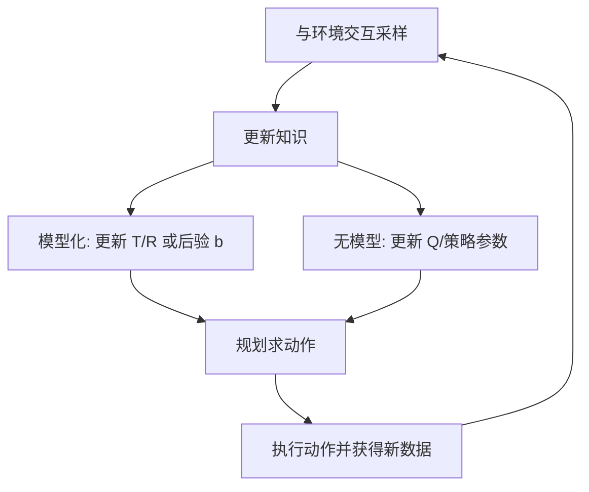

# Decision-making under uncertainty（Chapter 5）

> 主题：模型不确定性（Model Uncertainty）、探索与利用（Exploration vs Exploitation）、强化学习（Reinforcement Learning）

## 一句话理解

这一章回答“模型未知时怎么决策”：核心是边行动边学习，在探索新信息与利用已知高回报之间做动态平衡。

---

## 本章核心问题

## 1. 为什么模型不确定性会让决策变难？

## 2. 探索和利用如何平衡？

## 3. 模型化方法（Model-based）与无模型方法（Model-free）怎么选？

## 4. 数据有限时如何做泛化（Generalization）？

---

## 1. 从已知模型到未知模型

前一章默认转移和奖励函数已知；本章转到强化学习设定：  
转移 \(T\) 与奖励 \(R\) 未知，只能通过交互数据估计。

典型挑战：

- 探索-利用权衡
- 延迟奖励的信用分配（Credit Assignment）
- 从有限经验外推到未见状态

---

## 2. 单状态原型：多臂老虎机（Multi-Armed Bandit）

每个臂 \(i\) 的成功概率为 \(\theta_i\)，成功奖励 1，失败奖励 0。  
若先验是 \(\mathrm{Beta}(1,1)\)，观察到 \(w_i\) 次成功、\(\ell_i\) 次失败后：

$$
\theta_i \sim \mathrm{Beta}(w_i+1,\ell_i+1)
$$

后验均值（下一次赢的概率）：

$$
\rho_i=\mathbb{P}(\mathrm{win}_i\mid w_i,\ell_i)=\frac{w_i+1}{w_i+\ell_i+2}
$$

---

## 3. 探索策略

## 3.1 启发式探索

- \(\varepsilon\)-greedy：以 \(\varepsilon\) 概率随机探索，否则选当前最优
- Softmax / Logit：按 \( \propto \exp(\lambda \rho_i) \) 抽样动作
- 置信上界类方法：偏向“不确定但潜力高”的臂

## 3.2 最优探索（Bandit 的贝叶斯动态规划）

把 \((w_1,\ell_1,\ldots,w_n,\ell_n)\) 当作“信念状态（Belief State）”，可写最优值函数：

$$
U^\*(w_1,\ell_1,\ldots,w_n,\ell_n)=\max_i Q^\*(w_1,\ell_1,\ldots,w_n,\ell_n,i)
$$

有限时域可动态规划反推，但复杂度随时域指数增长；无限时域下可用 Gittins 指数思想降维。

---

## 4. 最大似然模型化 RL（Maximum Likelihood Model-Based RL）

用经验计数估计模型：

$$
N(s,a)=\sum_{s'}N(s,a,s')
$$

$$
\hat T(s'\mid s,a)=\frac{N(s,a,s')}{N(s,a)}
$$

$$
\hat R(s,a)=\frac{\rho(s,a)}{N(s,a)}
$$

然后在 \((\hat T,\hat R)\) 上做规划更新 \(Q/U\)。  
典型加速：

- Dyna：真实一步 + 若干随机模型回放更新
- Prioritized Sweeping：优先更新“价值变化传播大”的前驱状态

---

## 5. 贝叶斯模型化 RL（Bayesian Model-Based RL）

与最大似然不同，贝叶斯方法直接维护“模型参数后验分布”，把模型不确定性显式纳入决策。

## 5.1 参数后验

离散转移下，常用 Dirichlet 先验-后验更新：

$$
\theta(s,a)\sim \mathrm{Dir}(\alpha(s,a))
$$

观测计数 \(m(s,a)\) 后：

$$
\theta(s,a)\mid \mathcal D \sim \mathrm{Dir}(\alpha(s,a)+m(s,a))
$$

## 5.2 Bayes-Adaptive MDP（BAMDP）

把状态扩展为 \((s,b)\)，其中 \(b\) 是模型信念；本质是“在信念空间上的 MDP”。  
理论上更完整，但通常计算代价高。

## 5.3 Thompson Sampling

每轮从后验采样一个模型参数 \(\theta\)，按该样本模型求最优动作并执行，再更新后验。  
优点是实现简单且“天然带探索”。

---

## 6. 无模型方法（Model-Free）

## 6.1 Q-learning（离策略）

$$
Q(s_t,a_t)\leftarrow Q(s_t,a_t)+\alpha\!\left[r_t+\gamma\max_a Q(s_{t+1},a)-Q(s_t,a_t)\right]
$$

## 6.2 Sarsa（在策略）

$$
Q(s_t,a_t)\leftarrow Q(s_t,a_t)+\alpha\!\left[r_t+\gamma Q(s_{t+1},a_{t+1})-Q(s_t,a_t)\right]
$$

## 6.3 Eligibility Traces

通过资格迹（Eligibility Trace）把迟到奖励更快回传到早期状态-动作对，缓解信用分配难题。

---

## 7. 泛化（Generalization）与函数近似

当状态空间大时，用参数化近似代替表格：

$$
\hat Q(s,a)=\theta^\top \beta(s,a)
$$

其中 \(\beta(s,a)\) 是特征（Feature），\(\theta\) 是参数。  
可从局部插值到全局近似（感知机/神经网络）。

---

## 方法流程图

---

## 常见误区

### 误区 1：探索就是随机乱试

不对。高质量探索应针对“不确定且潜在高价值”区域，而非无差别随机。

### 误区 2：无模型方法一定比模型化方法更实用

不对。若可获得较好模型，模型化方法在样本效率和可解释性上常有优势。

### 误区 3：Thompson Sampling 只是启发式技巧

不完全对。它来自贝叶斯后验采样逻辑，兼顾探索与利用，且在很多场景表现稳健。

---

## 本章小结

- 模型不确定性是强化学习问题的核心难点。
- 探索-利用平衡决定长期性能上限。
- 模型化、贝叶斯、无模型三类方法各有代价与优势。
- 大规模问题必须借助函数近似与泛化能力。

---

## 讨论问题

1. 你的任务更缺“数据”还是更缺“可用模型”？
2. 如果在线试错代价很高，你会优先选哪类方法降低探索风险？
3. 在你场景里，Q 表格法何时必须升级到函数近似？
