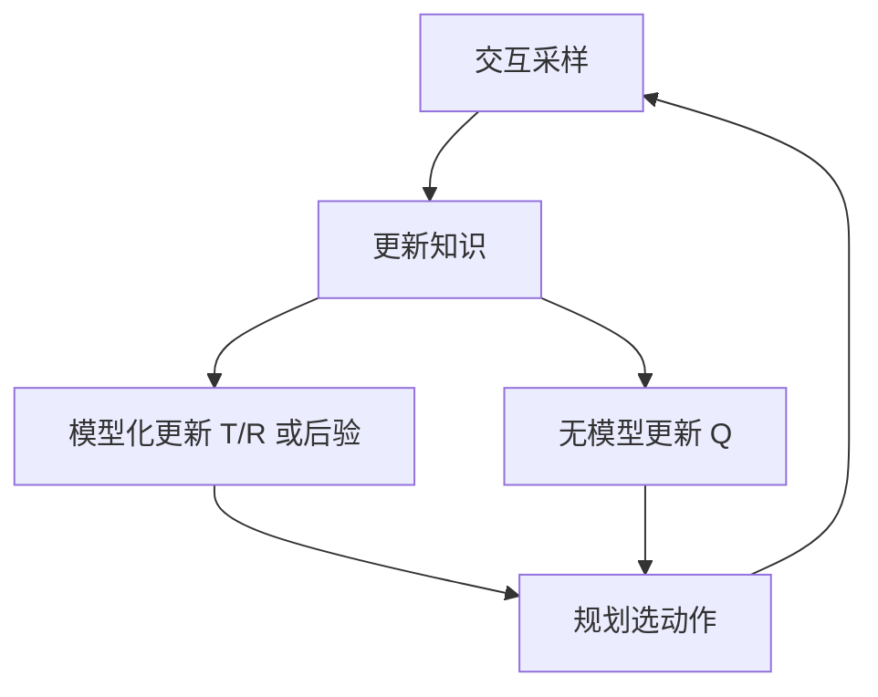

# Decision-making under uncertainty（Chapter 5）

> 主题：模型不确定性（Model Uncertainty）、探索与利用（Exploration vs Exploitation）、强化学习（RL）

## 一句话理解

本章讨论“模型未知时如何决策”：边交互边学习，在探索新信息和利用当前最优之间持续权衡。

---

## 本章核心问题

- 为什么模型不确定性会显著增加决策难度？
- 探索与利用如何平衡？
- 模型化（Model-based）与无模型（Model-free）各自适合什么场景？
- 如何在大状态空间中做泛化？

---

## 多臂老虎机：探索问题原型

若臂 $i$ 的胜率是 $\theta_i$，先验取 $\mathrm{Beta}(1,1)$，观测 $w_i$ 胜和 $\ell_i$ 负后：

  $$
  \theta_i\sim\mathrm{Beta}(w_i+1,\ell_i+1)
  $$

后验均值（下一次成功概率）：

  $$
  \rho_i=\frac{w_i+1}{w_i+\ell_i+2}
  $$

---

## 探索策略

- $\varepsilon$-greedy：以概率 $\varepsilon$ 随机探索
- Softmax：按 $\exp(\lambda \rho_i)$ 比例抽样
- UCB / 区间策略：偏向“高不确定 + 高潜力”动作

Bandit 最优策略可写成信念状态上的动态规划：

  $$
  U^\*(b)=\max_i Q^\*(b,i)
  $$

---

## 最大似然模型化 RL

基于交互计数估计模型：

  $$
  \hat T(s'\mid s,a)=\frac{N(s,a,s')}{N(s,a)},\qquad
  \hat R(s,a)=\frac{\rho(s,a)}{N(s,a)}
  $$

再在估计模型上做规划更新（如 Dyna、Prioritized Sweeping）。

---

## 贝叶斯模型化 RL

将模型参数本身作为不确定对象，维护后验分布：

  $$
  \theta(s,a)\sim\mathrm{Dir}(\alpha(s,a)),\qquad
  \theta(s,a)\mid\mathcal D\sim\mathrm{Dir}(\alpha(s,a)+m(s,a))
  $$

Bayes-Adaptive MDP 用扩展状态 $(s,b)$（状态 + 信念）统一“学模型 + 做决策”。  
Thompson Sampling 通过“后验采样模型再规划”实现自然探索。

---

## 无模型方法

Q-learning：

  $$
  Q(s_t,a_t)\leftarrow Q(s_t,a_t)+\alpha\!\left[r_t+\gamma\max_a Q(s_{t+1},a)-Q(s_t,a_t)\right]
  $$

Sarsa：

  $$
  Q(s_t,a_t)\leftarrow Q(s_t,a_t)+\alpha\!\left[r_t+\gamma Q(s_{t+1},a_{t+1})-Q(s_t,a_t)\right]
  $$

Eligibility Traces 用于加速“延迟奖励”向早期动作的信用分配。

---

## 泛化与函数近似

状态空间大时，用参数化近似：

  $$
  \hat Q(s,a)=\theta^\top\beta(s,a)
  $$

其中 $\beta(s,a)$ 是特征，$\theta$ 是可学习参数。

---

## 方法流程图

---

## 常见误区

### 误区 1：探索就是随机乱试

不对。有效探索应针对“不确定且高潜在收益”区域。

### 误区 2：无模型一定更实用

不对。若可获得高质量模型，模型化方法通常更省样本。

---

## 本章小结

- 模型不确定性是 RL 的核心难点。
- 探索-利用平衡决定长期表现上限。
- 模型化、贝叶斯、无模型方法各有优势与代价。
