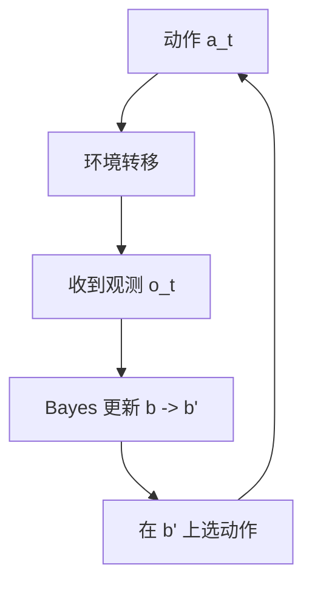

# Decision-making under uncertainty（Chapter 6）

> 主题：状态不确定性（State Uncertainty）、部分可观测马尔可夫决策过程（POMDP）、信念更新（Belief Updating）

## 一句话理解

这一章把“模型不确定”进一步推进到“状态也看不清”：智能体不再直接看到真实状态，而是维护一个信念分布并在其上做决策。

---

## 本章核心问题

- 为什么状态不可观测会让 MDP 不再直接适用？
- POMDP 如何把“观测噪声”纳入决策框架？
- 离散滤波、卡尔曼滤波、粒子滤波分别适用于什么场景？
- POMDP 为什么难精确求解，常用近似思路有哪些？

---

## 1. 从 MDP 到 POMDP

POMDP 可以看作“MDP + 观测模型”。  
在状态 $s$ 下看到观测 $o$ 的概率记为：

  $$
  O(o\mid s)\quad \text{或}\quad O(o\mid s,a)
  $$

由于真实状态不可直接观测，策略不再是 $\pi(s)$，而是基于信念状态 $b$：

  $$
  \pi:\mathcal B\to\mathcal A
  $$

这里 $b(s)$ 是“当前处于状态 $s$ 的概率”。

---

## 2. 信念状态就是新的“状态”

POMDP 等价于一个“信念空间上的 MDP”。  
其即时奖励可写为状态奖励在信念下的期望：

  $$
  R(b,a)=\sum_s R(s,a)\,b(s)
  $$

一句话：我们不再控制“真实状态”，而是在控制“对真实状态的概率认知”。

---

## 3. 信念更新（Bayes Filter）

离散状态下，执行动作 $a$ 并得到观测 $o$ 后：

  $$
  b'(s')
  \propto
  O(o\mid s',a)\sum_s T(s'\mid s,a)\,b(s)
  $$

这就是 POMDP 的核心递推。  
它把“动力学预测（Predict）+ 观测校正（Update）”组合起来。

---

## 4. 三类常见滤波器

## 4.1 离散状态滤波（Exact for Discrete）

- 状态离散、转移和观测模型已知时可精确更新。
- 适合小到中等规模离散问题。

## 4.2 线性高斯滤波（Kalman Filter）

在线性-高斯假设下，信念保持高斯形式：

  $$
  T(z\mid s,a)=\mathcal N(T_s s+T_a a,\Sigma_s),\qquad
  O(o\mid s)=\mathcal N(O_s s,\Sigma_o)
  $$

卡尔曼增益与均值/协方差更新：

  $$
  K=\Sigma_p O_s^\top (O_s\Sigma_p O_s^\top+\Sigma_o)^{-1}
  $$

  $$
  \mu_b\leftarrow \mu_p+K(o-O_s\mu_p),\qquad
  \Sigma_b\leftarrow (I-KO_s)\Sigma_p
  $$

## 4.3 粒子滤波（Particle Filter）

- 用样本集合近似信念分布。
- 适合非线性、非高斯、连续高维问题。
- 需关注样本退化（particle deprivation）问题。

---

## 5. 精确解与 Alpha 向量

有限时域离散 POMDP 的值函数具有分段线性凸（piecewise-linear convex）结构，可由 alpha 向量表示：

  $$
  U^\*(b)=\max_{\alpha\in\Gamma}\alpha^\top b
  $$

对应动作选择：

  $$
  \pi^\*(b)=\arg\max_a U_a(b)
  $$

难点在于：可行条件计划数增长极快，精确求解复杂度很高。

---

## 6. 近似求解方法（本章重点）

- QMDP / FIB：用上界近似加速
- 点基值迭代（Point-Based Value Iteration, PBVI）：只在部分信念点备份
- 随机化点基方法：减少每轮备份成本
- 在线前瞻搜索 / 分支定界 / MCTS：从当前信念局部规划

一句话：离线近似负责“预计算结构”，在线搜索负责“现场决策精化”。

---

## 方法流程图

---

## 常见误区

### 误区 1：POMDP 只是“MDP 加一点噪声”

不对。策略空间从状态策略变成了信念策略，难度是结构性上升。

### 误区 2：粒子越多一定越好

不完全对。粒子数上升会增大计算成本，且若重采样策略不好仍会退化。

### 误区 3：卡尔曼滤波适用于所有连续问题

不对。它依赖线性-高斯假设，非线性强时需扩展卡尔曼/无迹卡尔曼/粒子滤波等方法。

---

## 本章小结

- POMDP 把“看不清状态”的现实决策问题形式化。
- 信念更新是核心操作，决定了后续策略质量。
- 精确解通常不可扩展，工程上以 PBVI 和在线搜索为主。
