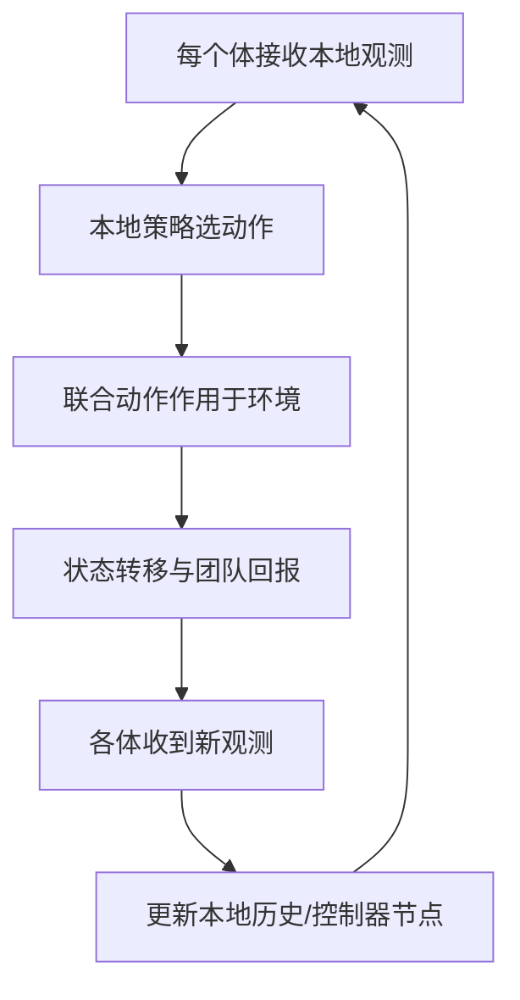

# Decision-making under uncertainty（Chapter 7）

> 主题：协作决策（Cooperative Decision Making）、分散式 POMDP（Dec-POMDP）、多智能体规划

## 一句话理解

这一章讨论“多智能体在局部观测下如何协同最优”：核心模型是 Dec-POMDP，核心困难是每个体只能看到自己的信息，却要为团队全局回报负责。

---

## 本章核心问题

- 为什么单智能体 POMDP 不能直接覆盖分散执行场景？
- Dec-POMDP 与 POSG 的区别是什么？
- 联合策略如何表示与评估？
- 精确方法为什么很快不可扩展，常见近似方法有哪些？

---

## 1. Dec-POMDP 形式化

Dec-POMDP 在 POMDP 基础上引入多智能体集合 $I$，联合动作与联合观测。  
状态转移与奖励依赖“全体动作”：

  $$
  T(s'\mid s,\mathbf a),\qquad R(s,\mathbf a)
  $$

观测模型：

  $$
  O(\mathbf o\mid s',\mathbf a)
  $$

目标是求联合策略 $\boldsymbol\pi=(\pi_1,\ldots,\pi_n)$，最大化团队期望效用。

---

## 2. 与 POMDP 的关键差异

- POMDP：单体可在统一信念上规划
- Dec-POMDP：每个体仅有本地观测历史，无法直接恢复全局信念
- 因此策略是“分布式本地策略”的组合，而非单一中心化策略

如果改为各智能体有独立奖励并自利优化，则转为部分可观测随机博弈（POSG）。

---

## 3. 策略表示

## 3.1 有限时域：策略树（Policy Tree）

- 每个智能体一棵本地策略树
- 节点选动作，边对应本地观测
- 多棵树组合成联合策略

有限时域下，联合策略值可递推：

  $$
  U(q,s)=R(\mathbf a_q,s)+\sum_{s',\mathbf o}
  P(s'\mid \mathbf a_q,s)\,P(\mathbf o\mid \mathbf a_q,s')\,U(q_{\mathbf o},s')
  $$

## 3.2 无限时域：有限状态控制器（FSC）

- 用有限内部节点压缩历史
- 可用随机策略节点提升性能
- 适合无限时域近似求解

---

## 4. 联合策略评估（控制器视角）

令 $q$ 为联合控制器节点、$s$ 为系统状态，随机控制器的贝尔曼形式：

  $$
  U(q,s)=\sum_{\mathbf a}\!\Big(\prod_i P(a_i\mid q_i)\Big)
  \!\left[
  R(s,\mathbf a)+\gamma\!\sum_{s',\mathbf o,q'}
  P(s'\mid s,\mathbf a)\,O(\mathbf o\mid s',\mathbf a)
  \Big(\prod_j P(q'_j\mid q_j,a_j,o_j)\Big)U(q',s')
  \right]
  $$

这体现了三层耦合：环境随机性、观测随机性、其他体策略随机性。

---

## 5. 性质与复杂度

- Dec-POMDP 的分散信息结构使其比 POMDP 难得多
- 通常无法仅依赖单体“信念状态”充分刻画全局决策
- 精确求解复杂度很高，实际多用近似与结构化约束

---

## 6. 代表性求解方法

## 6.1 精确方法

- 动态规划（策略树备份 + 剪枝）
- 多智能体 A*（MAA*）启发式搜索
- 策略迭代（基于控制器）

## 6.2 近似方法

- 内存受限动态规划（MBDP）
- 交替最优响应（JESP）
- 利用问题分解结构（如 ND-POMDP）

## 6.3 通信增强

- 通过通信缓解局部信息不足
- 但通信有成本，需权衡“信息增益 vs 通信代价”

---

## 方法流程图

---

## 常见误区

### 误区 1：Dec-POMDP 就是把 POMDP 复制成多个体

不对。核心难点不是“多个模型”，而是“分散信息下的联合协调”。

### 误区 2：只要每个体都局部最优，团队就最优

不对。局部最优响应可能导致全局次优，需要联合策略设计。

### 误区 3：通信一定提升性能

不完全对。若通信代价高或时延大，过度通信可能降低总效用。

---

## 本章小结

- Dec-POMDP 是协作多智能体在局部观测下的标准模型。
- 策略表示从单策略扩展为“本地策略组合”。
- 精确方法理论完整但规模受限，工程上以近似方法和结构假设为主。
