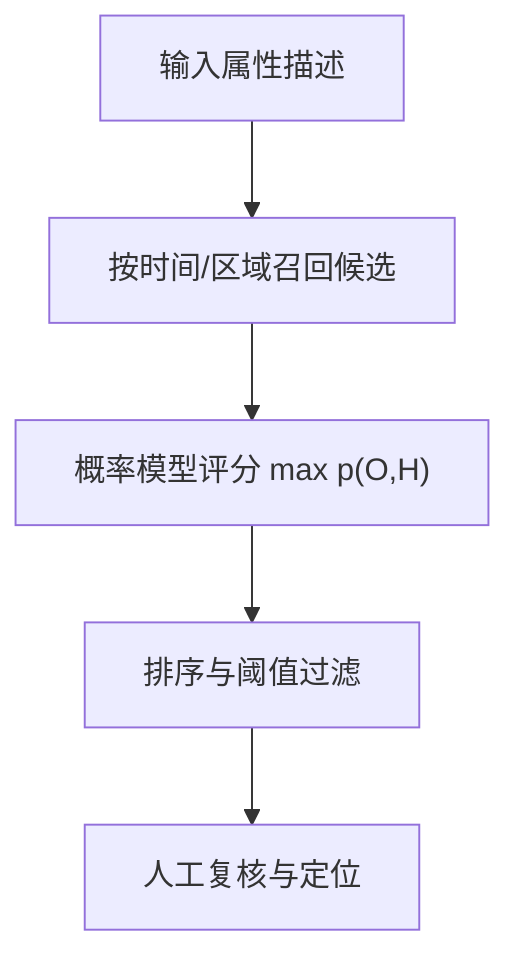

# Decision-making under uncertainty（Chapter 8）

> 主题：概率视频检索（Probabilistic Surveillance Video Search）、属性检索（Attribute-based Search）、生成模型（Generative Model）

## 一句话理解

这一章把“决策与不确定性”落到监控检索场景：面对噪声视频与外观变化，用概率生成模型给候选目标打分，并把人工检索从“逐帧翻视频”变成“按相关性排序”。

---

## 本章核心问题

- 为什么属性检索比“直接比像素”更可靠？
- 检测与检索评分如何拆分为两阶段流程？
- 如何用隐藏变量解释姿态、遮挡、光照等外观变化？
- 模型参数如何学习，匹配分数如何高效推断？

---

## 1. 任务定义：属性检索而非生物特征检索

在很多安防场景中，只有“描述信息”（如衣着颜色、包类型），没有稳定的人脸模板。  
因此本章聚焦软生物特征（soft biometrics）检索：性别、上衣颜色、下装颜色、包类型/颜色等。

---

## 2. 检索系统流程

1. 人员检测（Detection）：从视频中提取行人候选并入库（时间戳/位置戳）
2. 候选召回（Retrieval）：按时间与区域过滤数据库
3. 相关性评分（Scoring）：根据属性描述给每个候选打分并排序

---

## 3. 概率外观模型：观测 + 隐变量

设观测变量为 $O$（属性与图像特征），隐藏变量为 $H$（人体分区、姿态、构成因素等），匹配分数定义为：

  $$
  s=\max_H p(O,H)
  $$

直觉：寻找“最可能生成该图像的隐藏解释”，再用该最优解释评价匹配度。

---

## 4. 颜色建模与像素分类

以 HSV 空间像素 $X_k$ 为例，颜色类别 $C_k$ 的条件概率可用高斯型密度表示：

  $$
  p(X_k\mid C_k=i,\Theta)
  =
  \phi(\Theta_i)\exp\!\left(
  -\frac12\,d(X_k,\mu_i)^\top\Sigma_i^{-1}d(X_k,\mu_i)
  \right)
  $$

像素颜色赋值采用最大后验：

  $$
  C_k=\arg\max_i p(C_k=i\mid X_k,\Theta)
  $$

这一步把原始像素转换为更稳健的“语义颜色统计”。

---

## 5. 生成结构与可扩展特征

基础模型将人体分区（头部/上身/下身/包）作为隐藏结构变量，  
并在每个局部分区上建颜色主题混合、边缘原语等特征分支。

可扩展分支包括：

- 性别分类分支
- 颜色可变性分支（多色混合）
- 边缘/形状原语分支

一句话：通过分层隐藏结构，把“外观变化”组织成可学习的概率因子。

---

## 6. 学习与推断

## 6.1 参数学习

- 利用标注数据做最大似然估计（MLE）
- 分区位置参数、颜色混合参数、特征分支参数分别估计

## 6.2 隐状态推断

直接边缘化 $p(O)=\int p(O,H)\,dH$ 成本高，采用最大似然近似：

  $$
  \hat s=\log p(O,\hat H),\qquad
  \hat H=\arg\max_H p(O,H)
  $$

通过迭代优化“分区估计 + 局部主题估计”计算最终分数。

---

## 7. 性能指标与工程意义

实验关注两类指标：

- 检索准确性：Recall / False Positive / 排序质量
- 检索时延：单候选评分耗时、每小时视频搜索耗时

本章结论：概率模型相比简单颜色匹配更稳健，且在工程优化后可满足交互式检索速度需求。

---

## 方法流程图

---

## 常见误区

### 误区 1：监控检索只要目标检测准就够了

不对。检测负责“找候选”，检索效果主要由评分模型区分能力决定。

### 误区 2：属性检索等于“颜色最近邻”

不对。真实场景有姿态、光照、遮挡变化，必须用隐藏变量建模。

### 误区 3：概率模型一定太慢不实用

不完全对。通过近似推断和缓存优化，可达到可交互检索速度。

---

## 本章小结

- 属性检索是安防视频检索的重要现实任务。
- 生成式概率模型能系统处理外观变化与观测噪声。
- “检测 + 概率评分 + 人工复核”构成了实用闭环。
