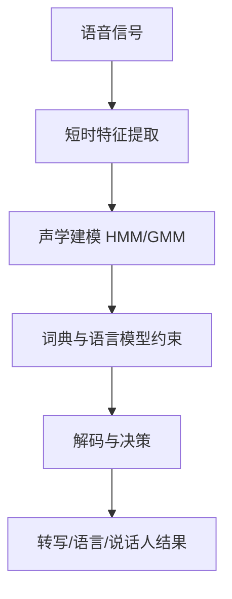

# Decision-making under uncertainty（Chapter 9）

> 主题：语音应用中的动态模型（Dynamic Models for Speech Applications）、HMM/GMM、识别决策

## 一句话理解

这一章讲的是“如何把连续语音信号变成可决策的信息”：先做特征提取，再用动态概率模型建模时间结构，最后在识别任务上做贝叶斯决策。

---

## 本章核心问题

- 语音信号为什么适合用动态概率模型？
- HMM 与 GMM 在语音识别中各自承担什么角色？
- EM 算法如何训练 GMM/HMM 参数？
- 识别系统如何结合声学模型、发音词典、语言模型？

---

## 1. 语音建模的层次

语音是强时变信号，常用短时分析近似局部平稳。  
典型信息层次：谱特征、音素、词、语义、说话人属性等。

最常见输入特征是倒谱类特征（如 Mel-cepstral / MFCC）。

---

## 2. HMM：时间结构建模核心

语音识别中常用左到右 HMM（常见 3 状态结构），用于表示语音单元的时间演化。  
核心问题包括：

- 参数估计（训练）
- 最可能状态序列（解码）
- 观测序列似然计算（评分）

Viterbi 算法常用于最优路径解码。

---

## 3. GMM：连续观测分布建模

GMM 用于描述声学特征的连续概率分布：

  $$
  p(x\mid \mu_{1:M},\Sigma_{1:M},\alpha_{1:M})
  =
  \sum_{i=1}^{M}\alpha_i\,\mathcal N(x\mid \mu_i,\Sigma_i)
  $$

在经典系统中，GMM 常作为 HMM 各状态的观测分布。

---

## 4. EM 训练思想

当存在隐变量（例如样本来自哪个高斯分量未知）时，用 EM 迭代优化：

  $$
  \hat\theta
  \leftarrow
  \arg\max_{\theta}
  \sum_Y
  P(Y\mid X,\hat\theta)\log P(Y,X\mid \theta)
  $$

一句话：E 步估计隐变量后验，M 步更新参数使期望对数似然最大。

---

## 5. 语音识别的贝叶斯决策框架

识别目标是找到最可能词序列 $W$：

  $$
  \arg\max_W P(W\mid X)
  =
  \arg\max_W P(X\mid W)\,P(W)
  $$

进一步分解为：

  $$
  \arg\max_W P(X\mid A)\,P(A\mid W)\,P(W)
  $$

其中：

- $P(X\mid A)$：声学模型（Acoustic Model）
- $P(A\mid W)$：发音模型/词典（Pronunciation）
- $P(W)$：语言模型（Language Model）

---

## 6. 任务扩展

本章还覆盖了多个任务分支：

- 主题识别（Topic Identification）
- 语言识别（Language Recognition）
- 说话人识别（Speaker Identification）
- 机器翻译（Machine Translation）中的语音环节

这些任务都共享“特征 + 概率模型 + 决策”的主线。

---

## 方法流程图

---

## 常见误区

### 误区 1：语音识别只靠声学模型

不对。没有词典与语言模型约束，解码空间会过大且错误率上升。

### 误区 2：EM 一定找到全局最优

不对。EM 通常收敛到局部最优，初始化对结果影响很大。

### 误区 3：HMM/GMM 已过时完全无价值

不对。即便深度学习主导，HMM/GMM 仍是理解语音建模与序列决策的基础框架。

---

## 本章小结

- 语音应用本质是时序不确定信号下的概率决策问题。
- HMM 负责时间结构，GMM 负责连续观测分布。
- 贝叶斯分解把声学、发音、语言知识统一到同一决策公式中。
