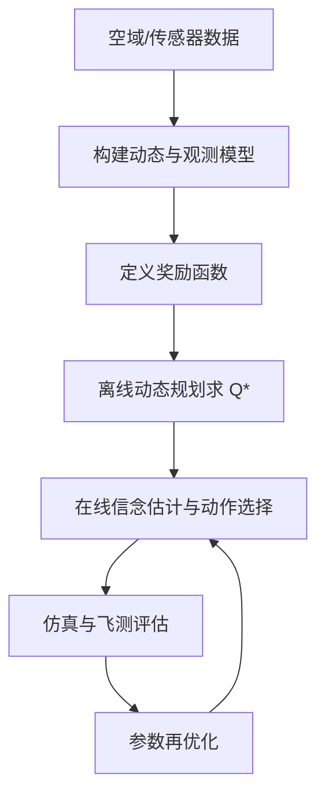

# Decision-making under uncertainty（Chapter 10）

> 主题：机载防撞优化（Optimized Airborne Collision Avoidance）、ACAS X、POMDP 决策逻辑

## 一句话理解

这一章展示了一个高风险真实应用：把传统规则式 TCAS 逻辑升级为基于 POMDP 与动态规划的 ACAS X，以更低告警率实现更高安全性。

---

## 本章核心问题

- 传统 TCAS 为什么在新空域与无人机场景下面临瓶颈？
- ACAS X 如何把防撞问题形式化为 POMDP？
- 如何用奖励函数和离线优化表替代大量手工规则？
- 安全性与运行可接受性如何通过仿真和飞行测试验证？

---

## 1. 从 TCAS 到 ACAS X

TCAS 长期有效，但主要局限包括：

- 依赖确定性行为假设，对飞行员非标准响应鲁棒性不足
- 规则复杂、维护成本高、迁移到新平台困难
- 对小型/无人机性能与传感器差异适配性不足

ACAS X 的核心转变：  
从“手工规则集”转为“通过模型与优化生成决策表”。

---

## 2. POMDP 防撞建模

状态变量示例包括相对高度、双方垂直速度、潜在碰撞时间、当前告警与飞行员响应状态。  
动作是分辨率告警（Resolution Advisory, RA）集合中的离散建议。

在线执行时，基于信念分布选择动作：

  $$
  a^\*(b)=\arg\max_a \int b(s)\,Q^\*(s,a)\,ds
  $$

粒子形式近似：

  $$
  \int b(s)Q^\*(s,a)\,ds \approx \sum_i w^{(i)}Q^\*(s^{(i)},a)
  $$

---

## 3. 奖励函数设计（安全 vs 干扰）

奖励结构同时惩罚：

- 近失碰撞（NMAC）风险
- 不必要告警与过强机动
- 不良告警切换（无意义反转、不合规转移等）

一句话：不是只追求“零碰撞”，而是优化“安全 + 可操作性 + 告警负担”。

---

## 4. 状态估计与在线逻辑

由于传感器误差与未来轨迹不确定，系统需估计：

- 目标状态与垂直速度（含滤波）
- 飞行员响应概率
- 潜在碰撞时间分布

并在离线表值基础上叠加在线成本规则（如告警抑制、切换惩罚、多威胁融合）。

---

## 5. 评估方法与关键指标

## 5.1 安全评估

核心指标：风险比（Risk Ratio）

  $$
  \text{Risk Ratio}
  =
  \frac{P(\text{NMAC} \mid \text{with system})}
       {P(\text{NMAC} \mid \text{without system})}
  $$

NMAC 常定义为：水平 < 500 ft 且垂直 < 100 ft。

## 5.2 运行评估

- 告警率（Alert Rate）
- 反转/Level-off 行为可接受性
- 多威胁场景稳定性

结论方向：ACAS X 在保持或提升安全性的同时显著降低无效告警。

---

## 6. 参数调参与飞行测试

参数（如告警成本、动力学噪声等）通过“仿真 + 代理模型优化”迭代调整，  
并通过真实飞行测试验证模型假设与逻辑行为。

---

## 方法流程图

---

## 常见误区

### 误区 1：防撞系统只要更早告警就更安全

不对。过早过频告警会降低遵循性并增加运行负担，需要整体优化。

### 误区 2：规则堆得越多越鲁棒

不对。规则系统复杂度会失控，难覆盖分布外场景。

### 误区 3：仿真通过就不需要飞测

不对。飞测是验证模型偏差与人机交互行为的关键环节。

---

## 本章小结

- ACAS X 代表了从规则式逻辑到优化式决策系统的工程跃迁。
- POMDP + 动态规划提供了可系统调参与可复用的设计框架。
- 在高安全场景中，建模、优化、仿真、飞测必须形成闭环。
