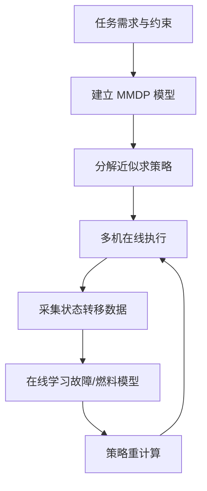

# Decision-making under uncertainty（Chapter 11）

> 主题：多智能体持续监视规划（Multiagent Planning for Persistent Surveillance）

## 一句话理解

这一章讨论的是：在“通信受限 + 燃料受限 + 故障随机发生”的真实约束下，如何让多架无人机长期协同执行监视任务，并通过在线学习持续提升策略质量。

---

## 本章核心问题

- 持续监视任务（Persistent Surveillance）为什么天然是多智能体决策问题？
- 集中式多智能体 MDP（Multiagent Markov Decision Process, MMDP）为什么很快不可扩展？
- 如何用分解近似在“性能”和“计算效率”之间做平衡？
- 在模型参数未知时，如何边执行边学习并改进策略？

---

## 1. 任务建模：三区域与三类约束

任务区域分为基地（Base）、通信中继区（Communication Area）、监视区（Surveillance Area）。  
每个智能体都要在以下约束下行动：

- 通信中继约束：必须维持任务区到基地的通信链路。
- 燃料约束：电量耗尽前必须返航补给。
- 健康状态约束：传感器故障与执行器故障会改变可执行任务。

这决定了规划不能只看“覆盖率”，还必须显式建模资源与故障风险。

---

## 2. 集中式 MMDP 公式化

设第 $i$ 个智能体状态为位置 $y_i$、燃料 $f_i$、健康状态 $h_i$，则全局状态空间可写为：

  $$
  S=\prod_{i=1}^{n} S_i,\quad S_i=Y\times F\times H
  $$

规模为：

  $$
  |S|=(|Y|\cdot |F|\cdot |H|)^n
  $$

动作集合采用“返航/保持/前往监视区”离散动作，联合动作规模近似为：

  $$
  |A|\approx 3^n
  $$

健康状态转移（在非基地、且当前健康时）可写成三分支随机模型：

  $$
  \begin{aligned}
  P(H_{\text{nom}}\to H_{\text{nom}}) &= (1-P_{\text{sns}})(1-P_{\text{act}}),\\
  P(H_{\text{nom}}\to H_{\text{sns}}) &= P_{\text{sns}}(1-P_{\text{act}}),\\
  P(H_{\text{nom}}\to H_{\text{act}}) &= P_{\text{act}}.
  \end{aligned}
  $$

---

## 3. 回报函数（Reward）与任务目标

系统希望监视区内维持目标数量 $n_d$ 的可用无人机，并且通信链不断开。  
典型即时成本可写为：

  $$
  c(s)=C_{\text{gap}}\max(n_d-n_S,0)+C_{\text{fail}}\mathbf{1}_{\text{relay broken}}
  $$

一句话：既惩罚“监视缺口”，也重罚“通信失联”。

---

## 4. 可扩展近似：两种去中心化分解

### 4.1 因子分解（Factored Decomposition）

从单个智能体视角，仅精确建模“自己”，对队友用简化位置-方向对近似。  
优点是性能接近集中式；缺点是状态仍随团队规模快速增长。

### 4.2 群体聚合分解（Group Aggregate Decomposition）

不追踪每个队友细节，而追踪聚合特征，例如：

- 是否至少有 1 架在通信区；
- 监视区预测无人机数量；
- 监视区健康无人机数量。

该方法把复杂度从指数增长压到近似二次增长，显著提升可算性。

---

## 5. 有序动作搜索与前向采样

由于智能体间动作相互耦合，章节提出“有序搜索（Ordered Search）”：

- 按某个顺序逐个为智能体分配动作；
- 已确定动作向后传递，减少对队友动作的猜测误差。

并进一步结合“前向采样（Forward Sampled Ordered Search）”在深度 $d$ 上滚动评估候选顺序，核心思想是最大化期望累计回报。

---

## 6. 在线模型学习（Model Learning）

实际任务中，故障概率并非先验已知。  
本章通过增量特征依赖发现（Incremental Feature Dependency Discovery）在线更新转移模型参数，再周期性重算策略。

实验结论：

- 学习轮次增加后，平均累计成本持续下降；
- 因子分解性能通常接近集中式；
- 群体聚合法性能略降，但计算效率显著更高。

---

## 7. 飞行实验直觉

实飞中随着故障概率估计逐步变准，规划策略会减少不必要返航与电池更换，任务协同更平稳。  
这说明“规划 + 学习”闭环是持续任务的关键，而不是一次离线求解。

---

## 方法流程图

---

## 常见误区

### 误区 1：集中式最优策略一定最实用

不对。规模一上来就难实时求解，工程上往往需要近似分解。

### 误区 2：只要覆盖到监视区就算任务完成

不对。通信链断裂会让数据不可用，任务价值大幅下降。

### 误区 3：模型学习只是锦上添花

不对。真实环境下参数漂移明显，不学习就会长期使用偏差策略。

---

## 本章小结

- Chapter 11 把多智能体持续监视问题落地为“可学习、可近似、可验证”的决策框架。
- 核心工程思想是：用分解方法换取可扩展性，用在线学习补偿模型不确定性。
- 在高约束任务里，真正有效的是“规划-执行-学习-再规划”的闭环系统。
