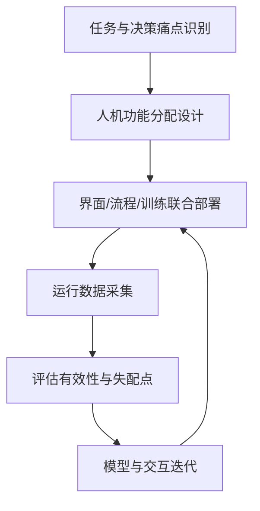

# Decision-making under uncertainty（Chapter 12）

> 主题：自动化系统与人的集成（Integrating Automation with Humans）

## 一句话理解

这一章的核心是：再强的决策算法，如果不与人的注意力、信任、流程和组织机制匹配，就很难在真实场景中产生稳定价值。

---

## 本章核心问题

- 为什么“算法正确”不等于“系统有效”？
- 人类在注意力（Attention）、记忆（Memory）、认知加工（Cognition）上有哪些约束？
- 决策支持系统（Decision Support System）如何设计透明性与信任校准（Trust Calibration）？
- 如何用“系统工程闭环”持续改进工具、流程、训练与组织协同？

---

## 1. 人的能力与限制：设计的起点

章节指出，许多系统失败并不是因为算法差，而是因为忽视了人的处理边界：

- 注意力是有限资源，无法同时稳定处理过多信息源；
- 工作记忆容量有限，复杂信息需结构化外部化；
- 经验驱动的“自上而下加工”在高压场景很常见。

对设计者的直接启发是：减少不必要信息负荷，优先突出行动相关线索（Actionable Cues）。

---

## 2. 人类决策不是“全局最优”，而是“可用且及时”

章节区分了经典决策理论与自然决策（Naturalistic Decision Making）：

- 经典范式强调效用最大化；
- 真实一线更常见“满意解（Satisficing）”和启发式（Heuristics）。

常见启发式包括可得性（Availability）、代表性（Representativeness）、锚定（Anchoring）。  
这并非“错误决策”，而是在时间压力和不完全信息下的适应性策略。

可用一个简化表达说明其本质：

  $$
  \text{Human Choice}
  \approx
  \arg\max_{a\in \mathcal A_{\text{considered}}}
  \text{SatisficingScore}(a),
  \quad
  \mathcal A_{\text{considered}} \subseteq \mathcal A
  $$

---

## 3. 信任与透明性：系统采纳的关键

系统价值不仅取决于“客观性能”，还取决于用户是否愿意正确使用：

- 过度信任（Over-trust）：盲从自动化；
- 信任不足（Under-trust）：拒绝使用有效建议。

章节强调“决策逻辑透明性（Transparency）”的重要性：  
用户需要知道建议来源、适用边界和不确定性，才能形成校准后的信任。

可用概念关系写为：

  $$
  \text{Effective Impact}
  =
  \text{Model Quality}
  \times
  \text{Calibrated Trust}
  \times
  \text{Operational Fit}
  $$

---

## 4. 面向不确定性的设计：不同时间尺度，不同支持方式

章节以空管场景说明：预测越远，不确定性通常越大。  
因此决策支持应随时间推进动态调整：

- 早期：强调趋势与风险范围，避免给出过度精确指令；
- 中期：提供可比较方案与触发阈值；
- 临近执行：给出明确、可操作建议。

一句话：不是“始终给同一种建议”，而是“在合适时机给合适粒度的建议”。

---

## 5. 系统实施视角：从工具交付到组织闭环

Chapter 12 给出“系统实施不是一次性交付”的观点，强调以下闭环：

- 接口设计（Interface）
- 训练体系（Training）
- 程序与规章（Procedures）
- 运行评估（Operational Metrics）
- 组织因素（Organization Influences）

只有把这些环节串起来，决策支持系统才会持续有效。

---

## 实施闭环图

---

## 常见误区

### 误区 1：模型准确率高，系统自然会被接受

不对。若解释性不足或流程不匹配，用户仍可能低频使用或误用。

### 误区 2：把更多信息都展示给用户更安全

不对。信息过载会挤占注意力，反而降低关键决策质量。

### 误区 3：上线后只需监控算法指标

不对。还必须监控训练效果、流程执行偏差与组织协同问题。

---

## 本章小结

- 本章把“决策算法”扩展到“人机组织系统”层面，强调真实部署中的人因约束。
- 有效系统需要同时优化：算法质量、信任校准、流程融合与组织支持。
- 决策支持的长期价值来自持续迭代，而不是一次性功能上线。
