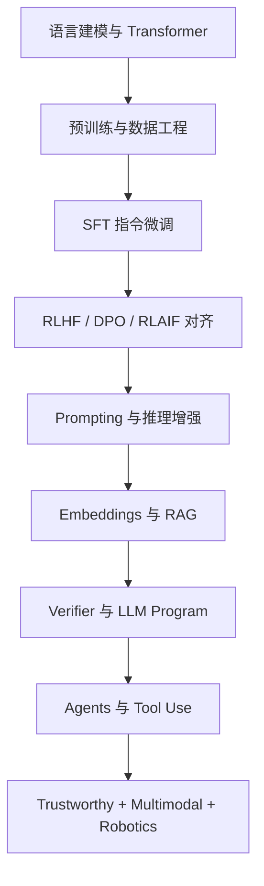

# LLM（Chapter 1）

> 主题：大语言模型全景导论（Large Language Models: Theory and Practice）

## 一句话理解

这一讲不是单点技术，而是建立整门课的知识地图：从语言建模（Language Modeling）与 Transformer 基础出发，逐步走到 SFT、RLHF、RAG、Agent、可信与多模态系统。

---

## 本讲核心问题

- LLM（Large Language Model）到底解决什么问题？
- 一门完整的 LLM 课程应覆盖哪些“能力层”？
- 从模型训练到应用落地，关键技术链路是什么？
- 哪些问题是 LLM 擅长的，哪些是系统性短板？

---

## 1. 课程知识主线：从“模型”到“系统”

从课件规划可以看出，LLM 学习主线分为四层：

- 基础建模层：语言建模、分词（Tokenization）、Transformer 结构。
- 对齐训练层：预训练、指令微调（SFT）、偏好优化（RLHF / DPO）。
- 检索与推理层：Prompt Engineering、Embeddings、RAG、Verifier。
- 代理与落地层：Tools、Agents、多智能体、可信与多模态。

一句话：前两层解决“模型会说话”，后两层解决“模型说得对、用得上”。

---

## 2. 基础层：语言建模、分词、Transformer

### 2.1 语言建模（Language Modeling）

核心目标是“预测下一个 token”，常见目标函数可写为：

  $$
  \max_{\theta}\sum_{t=1}^{T}\log p_{\theta}(x_t\mid x_{<t})
  $$

这是 GPT 类模型训练的统计基础。

### 2.2 分词（Tokenization）

分词决定了文本如何映射到离散符号空间，直接影响：

- 词表大小与上下文长度利用率；
- 多语言泛化能力；
- 训练效率与推理成本。

### 2.3 Transformer（GPT Backbone）

课件强调 GPT 基于 Transformer。关键机制包括：

- 注意力（Attention）建模长程依赖；
- 位置编码（Position Encoding）注入顺序信息；
- 现代结构改进：RoPE、ALiBi、RMSNorm 等。

---

## 3. 对齐层：从预训练到偏好优化

### 3.1 预训练与数据工程

预训练不仅是“喂更多数据”，还包括：

- 数据清洗（Data Cleaning）；
- 数据增强（Data Augmentation）；
- 采样策略（Top-K、Temperature、Repetition Penalty）。

### 3.2 指令微调（Supervised Fine-Tuning, SFT）

SFT 的目标是把“续写能力”转成“遵循指令能力”。  
关键在于高质量指令数据：覆盖任务多样性、答案规范性、风格一致性。

### 3.3 偏好优化（RLHF / DPO / RLAIF）

这一步处理“有用但不一定符合人类偏好”的问题：

- RLHF：基于人类反馈的强化学习（Reinforcement Learning from Human Feedback）；
- DPO：直接偏好优化（Direct Preference Optimization）；
- RLAIF：用 AI 反馈替代部分人工偏好标注。

---

## 4. 提示与检索层：降低幻觉、提升可控性

### 4.1 Prompt 与推理增强

课件路线包括 ICL、Few-shot、CoT、自动提示优化。  
核心思想：不改参数，也能显著改变模型行为。

### 4.2 Embeddings 与 RAG

RAG（Retrieval-Augmented Generation）通过外部知识注入降低幻觉（Hallucination）：

1. 把文档向量化（Embeddings）
2. 检索相关片段
3. 以“检索证据 + 用户问题”联合生成答案

这让系统从“记忆驱动”转向“证据驱动”。

### 4.3 Verifier 与程序化 LLM（如 DSPy）

“一次生成”风险高，Verifier 引入二次校验。  
程序化框架（programming, not prompting）强调：先定义任务、指标和结构，再让系统自动优化流程。

---

## 5. Agent 层：从问答模型到任务执行体

课件中的 Agent 主线包括：

- 规划-执行-反思（plan-execute-revise）循环；
- 工具调用（搜索、代码执行、数据库、图像分析）；
- 多 Agent 协作（Multi-agent Collaboration）。

一句话：LLM 从“回答问题”升级为“完成任务”。

---

## 6. 可信与未来方向

课件最后聚焦可信 LLM（Trustworthy LLM）与未来趋势：

- 数据采集与治理；
- 训练后处理与安全防护；
- 对抗攻击与伦理边界；
- 多模态 LLM 与 LLM+机器人。

这意味着系统评估标准将从“能不能答”转向“能否可靠、可控、可审计”。

---

## 本讲知识地图

---

## 常见误区

### 误区 1：LLM 课程就是“学会调用 API”

不对。核心是理解“模型能力形成机制 + 系统可靠性工程”。

### 误区 2：模型参数越大，应用一定越好

不对。数据质量、对齐策略、检索架构和评估体系同样决定上限。

### 误区 3：RAG 能彻底消除幻觉

不对。RAG 可以显著缓解，但仍需检索质量控制与答案校验机制。

---

## 本讲小结

- 第 1 讲完成了 LLM 课程的全局框架搭建。
- 核心学习路径是：模型基础 → 对齐训练 → 检索推理 → Agent 系统 → 可信落地。
- 后续 11 讲可以按这条链路逐层深入并形成可部署的 LLM 应用能力。
