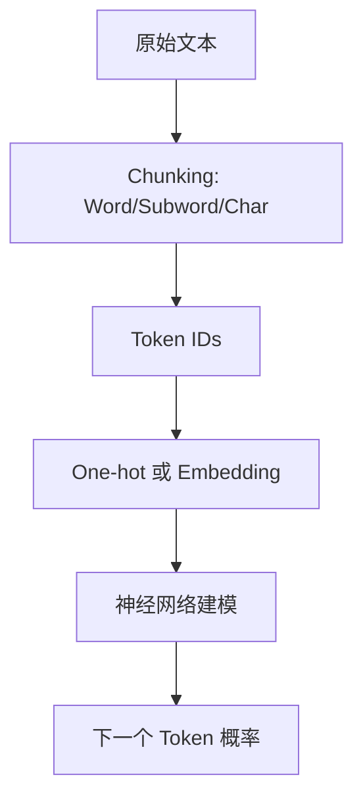

# LLM（Chapter 2）

> 主题：深度学习基础与 Tokenization（Deep Learning Fundamentals and Tokenization）

## 一句话理解

这一讲回答了一个基础但关键的问题：文本为什么必须先经过 tokenization 才能进入神经网络，以及从 token 到 embedding 的表示选择如何直接影响 LLM 的训练效率和泛化能力。

---

## 本讲核心问题

- 深度学习在 LLM 中本质上在做什么？
- Tokenization 为什么是 NLP 管线第一步？
- BPE（Byte Pair Encoding）和 WordPiece 的核心差异是什么？
- 为什么 token id 不能直接输入模型，必须用 embedding？

---

## 1. 深度学习视角：LLM 是函数近似系统

课件先回顾了深度学习三要素：

- 数据表示（Data Representation）
- 参数化模型（Model Parameters）
- 目标函数（Objective / Loss）

在语言任务中，模型学习的是条件分布：

  $$
  p_{\theta}(x_t\mid x_{<t})
  $$

训练目标通常是最大似然（或等价的交叉熵最小化）：

  $$
  \min_{\theta}\;
  \mathcal L
  =
  -\sum_{t=1}^{T}\log p_{\theta}(x_t\mid x_{<t}).
  $$

---

## 2. Tokenization：把字符串变成模型可计算对象

神经网络只能处理数值输入，因此文本必须先离散化为 token 序列。  
Token 可以是词、子词、字符，甚至字节。

本讲把 tokenization 分成两个层次：

- Part 1：如何切分（chunking）
- Part 2：如何表示（representation）

---

## 3. Part 1 切分策略：词、子词、字符

### 3.1 Word-level

- 直接按词切分，直观但 OOV（Out-of-Vocabulary）问题严重。

### 3.2 Subword-level

- 在词与字符之间折中，兼顾词表大小与未登录词处理。

#### BPE（Byte Pair Encoding）

- 课件指出 GPT-2 使用 byte-level + BPE。
- 思想：从基础符号开始，反复合并高频相邻单元。
- 常见词表规模约 $32\text{K}\sim 64\text{K}$。

#### WordPiece

- 与 BPE 类似，但合并评分机制不同。
- 往往更偏好较长子词，对形态丰富语言较友好。

### 3.3 Character-level

- 优点：词表小；
- 缺点：序列长，计算与建模负担更高。

---

## 4. Part 2 表示策略：ID、One-hot、Embedding

### 4.1 Token-to-ID

每个 token 映射唯一整数 id。  
但 id 本身会引入伪序关系（如“3 比 2 大”），不适合直接当特征。

### 4.2 One-hot

One-hot 消除了伪序关系，但在大词表下非常稀疏、高维、低效。

### 4.3 Embedding Table（核心）

embedding 层把离散 token 映射到稠密向量空间：

  $$
  e_i = E[i],\quad E\in\mathbb R^{|V|\times d},
  $$

其中 $|V|$ 是词表大小，$d$ 是嵌入维度。  
优势：

- 降维（计算友好）
- 语义表达（相似词可在向量空间靠近）

---

## 5. 工程细节：OOV、Padding、Special Tokens

课件强调了 tokenization 的常见落地点：

- OOV 处理：子词方法可缓解未登录词问题；
- Padding：批量训练时需统一长度；
- 特殊符号：如分隔、边界、占位等控制 token。

这些步骤直接影响训练稳定性与推理一致性。

---

## 6. 这一讲与后续 LLM 模块的关系

本讲是后续所有主题的输入层基础：

- 预训练（Pretraining）依赖 token 分布质量；
- SFT / RLHF 依赖 prompt 序列的稳定编码；
- RAG 依赖检索文本切分与 chunk 设计；
- Agent 工具调用依赖结构化 token 模板。

一句话：tokenization 看似前处理，实则是 LLM 系统性能上限的一部分。

---

## 概念流程图

---

## 常见误区

### 误区 1：Tokenization 只是预处理小细节

不对。它会影响序列长度、词表覆盖、训练成本和模型泛化。

### 误区 2：One-hot 一定比 embedding 更“准确”

不对。One-hot 信息表达过于稀疏，embedding 更适合语义学习与规模化训练。

### 误区 3：BPE 和 WordPiece 基本一样，不必区分

不对。二者合并策略不同，会影响词表结构与下游表现。

---

## 本讲小结

- 第 2 讲完成了 LLM 输入层与训练基础的关键铺垫。
- 从“如何切分文本”到“如何表示 token”，每一步都影响模型质量与效率。
- 这为下一步进入语言建模与 Transformer 细节提供了必要前提。
