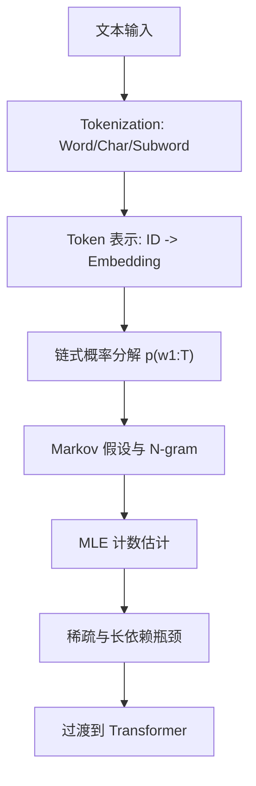

# LLM（Chapter 3）

> 主题：Tokenization 进阶与统计语言建模（Tokenization and Statistical Language Modeling）

## 一句话理解

这一讲把“文本进入模型之前”和“早期语言建模如何预测下一个词”两条线打通：前半讲 tokenization 细节，后半讲 Markov / N-gram 语言模型与最大似然估计（MLE）。

---

## 本讲核心问题

- 文本切分粒度如何影响 LLM 输入质量？
- BPE 与 WordPiece 的合并准则有何本质区别？
- 语言模型为什么可写成链式分解（Chain Rule）？
- N-gram 与 Markov 假设的优势和瓶颈是什么？

---

## 1. Tokenization 进阶：切分策略的工程权衡

本讲继续强调 tokenization 的两步结构：

1. 如何切分（chunking）
2. 如何表示（representation）

### 1.1 Word-level

- 优点：直观；
- 缺点：OOV（Out-of-Vocabulary）严重，词形变化（open/opened/opening）共享性差。

### 1.2 Character-level

- 优点：词表极小；
- 缺点：序列显著变长，长程依赖建模更难、计算成本更高。

### 1.3 Sentence-level

- 可保留句级语义结构；
- 但粒度粗，不利于词级语义建模与通用 NLP 任务。

### 1.4 Subword-level（主流）

兼顾 OOV 处理与词表规模，是现代 LLM 的主流选择。

---

## 2. BPE 与 WordPiece：两种合并逻辑

### 2.1 BPE（Byte Pair Encoding）

- 从基础符号（如 byte）出发；
- 反复合并高频相邻子串；
- GPT-2 采用 byte-level + BPE，词表常见 $32\text{K}\sim 64\text{K}$。

### 2.2 WordPiece

WordPiece 不是简单看频次，而看“相对共现”得分，课件给出的典型形式可写为：

  $$
  \text{score}(A,B)\propto \frac{\text{Count}(AB)}{\text{Count}(A)\,\text{Count}(B)}.
  $$

直觉：优先合并“统计上更有粘性”的片段，常得到更稳定、语义更一致的子词单元。

---

## 3. 从 Token ID 到可学习表示

课件重申了表示层逻辑：

- Token ID 仅是索引，不应直接作为大小有序特征；
- One-hot 避免伪序关系，但高维稀疏；
- Embedding 表把离散 token 投影到稠密向量空间，更适合语义学习与大规模训练。

---

## 4. 语言建模：链式分解与 Markov 假设

语言模型核心是下一个词概率：

  $$
  p(w_{1:T})=\prod_{t=1}^{T} p(w_t\mid w_{<t}).
  $$

为降低复杂度，引入 Markov 假设：

- 一阶：$p(w_t\mid w_{<t})\approx p(w_t\mid w_{t-1})$
- 二阶：$p(w_t\mid w_{<t})\approx p(w_t\mid w_{t-2},w_{t-1})$

推广即 N-gram 模型。

---

## 5. N-gram 估计：最大似然（MLE）

N-gram 参数通常由计数估计，典型形式：

  $$
  \hat p(w_t\mid w_{t-n+1:t-1})
  =
  \frac{c(w_{t-n+1:t})}{c(w_{t-n+1:t-1})}.
  $$

从优化角度，MLE 等价于最大化训练语料对数似然：

  $$
  \max_{\theta}\sum_{t}\log p_{\theta}(w_t\mid w_{<t}).
  $$

---

## 6. 统计语言模型的局限

课件在 “Limitations” 部分的主旨可以归纳为：

- 稀疏性：高阶 N-gram 组合爆炸，未见上下文概率估计不稳；
- 上下文窗口固定：难覆盖长依赖；
- 泛化能力有限：难处理复杂语义与推理需求。

这也是课程下一步过渡到 Transformer 的核心原因。

---

## 本讲与下一讲衔接

本讲完成了“统计语言模型”的终点，也开启“神经语言模型”的起点：  
从计数驱动（count-based）过渡到表示驱动（representation-based），Transformer 将成为解决长依赖与泛化问题的主框架。

---

## 概念流程图

---

## 常见误区

### 误区 1：N-gram 只是过时内容

不对。它是理解“下一个词预测”与概率分解的最直接教学基线。

### 误区 2：BPE 一定优于 WordPiece

不对。两者合并准则不同，优劣与语料、语言类型和任务有关。

### 误区 3：Tokenization 对模型性能影响很小

不对。切分策略直接影响序列长度、词表覆盖率和训练稳定性。

---

## 本讲小结

- 第 3 讲把 tokenization 工程细节与统计语言建模方法系统串联。
- 通过 Markov/N-gram/MLE 建立了“下一个词预测”的概率基础。
- 也明确了统计方法瓶颈，为 Transformer 学习做好铺垫。
