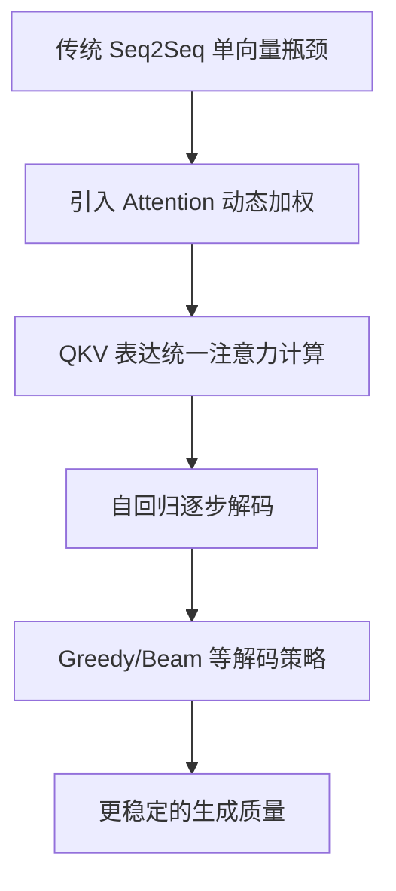

# LLM（Chapter 4）

> 主题：注意力机制、Transformer 解码与现代 GPT 核心直觉（Attention, Transformer, and Decoding）

## 一句话理解

这一讲回答了“为什么要 Attention”：传统 encoder-decoder 把整句信息压成单向量会丢信息，Attention 通过对输入位置动态加权，让每个输出词都能“看见”最相关的上下文。

---

## 本讲核心问题

- 传统 Seq2Seq（RNN encoder-decoder）的瓶颈是什么？
- Attention 权重为什么必须是概率分布？
- Query-Key-Value（QKV）如何统一注意力计算？
- 解码时为什么需要 Beam Search 而不是只贪心选最大概率词？

---

## 1. 从 Seq2Seq 到 Attention：问题驱动的演化

课件先回顾了早期翻译范式：

- 输入序列经 encoder 得到最终隐藏状态；
- decoder 以该状态为初始条件逐步生成输出。

核心问题：

- 把整句信息压缩到单个向量，长句信息易丢失；
- 每个输出词与输入不同位置的对应关系无法显式建模。

这直接催生了“每一步输出都重新对输入做加权读取”的 Attention 思路。

---

## 2. Attention：每个输出有自己的上下文向量

对第 $t$ 个输出，构造上下文向量（context）：

  $$
  c_t=\sum_{i=1}^{N}\alpha_{t,i}h_i,
  $$

其中 $h_i$ 是输入侧表示，$\alpha_{t,i}$ 是注意力权重。

权重约束：

  $$
  \alpha_{t,i}\ge 0,\qquad \sum_{i=1}^{N}\alpha_{t,i}=1.
  $$

实现方式是“先算原始分数，再 softmax 归一化”，保证其成为分布。

---

## 3. QKV 视角：Attention 的标准化表达

课件给出从“通用加权”到 QKV 的过渡：

- Query：当前输出位置“想找什么”；
- Key：每个输入位置“提供什么索引信息”；
- Value：每个输入位置“可被读取的内容”。

可抽象为：

  $$
  \alpha_{t,i}
  =
  \operatorname{softmax}_i\big(s(q_t,k_i)\big),
  \qquad
  c_t=\sum_i \alpha_{t,i}v_i.
  $$

这就是 Transformer 注意力的核心计算模板。

---

## 4. 推理（Inference）流程：自回归生成

课件展示了标准生成流程：

1. 编码输入得到表示
2. 以 `<sos>` 启动解码
3. 每步根据已生成前缀和注意力上下文预测下一个 token
4. 直到采样出 `<eos>` 终止

一句话：输出是逐步构造的，后一步依赖前一步生成结果。

---

## 5. 解码策略：Beam Search 的必要性

如果每步都贪心选最大概率 token，容易陷入局部最优。  
课件引入 Beam Search：

- 保留 top-$K$ 条部分路径；
- 每步扩展并按累计分数排序再截断；
- 输出单个最优序列或 N-best 候选。

可写成近似目标：

  $$
  \hat y
  =
  \arg\max_{y_{1:T}}
  \prod_{t=1}^{T}p(y_t\mid y_{<t},x),
  $$

Beam Search 是对该组合优化问题的可计算近似。

---

## 6. 与现代 GPT 的关系

本讲虽然从翻译型 Seq2Seq 讲起，但核心思想直接迁移到 GPT：

- 动态关注上下文（Attention）；
- 概率建模驱动自回归生成；
- 解码策略决定输出质量与多样性。

这也是后续“现代 GPT 架构改进”章节的基础。

---

## 概念流程图

---

## 常见误区

### 误区 1：Attention 只是“可视化工具”

不对。它是核心计算机制，直接改变信息流路径。

### 误区 2：把整句压成一个向量就足够

不对。长序列中会产生严重信息瓶颈，尤其在对齐任务中更明显。

### 误区 3：Beam Search 一定优于其他解码方法

不对。它通常更稳，但也可能牺牲多样性，需结合任务选择。

---

## 本讲小结

- 第 4 讲用问题驱动方式解释了 Attention 的必要性。
- QKV 提供了统一可扩展的注意力计算框架。
- 解码策略（尤其 Beam Search）是从“会生成”到“生成得好”的关键环节。
